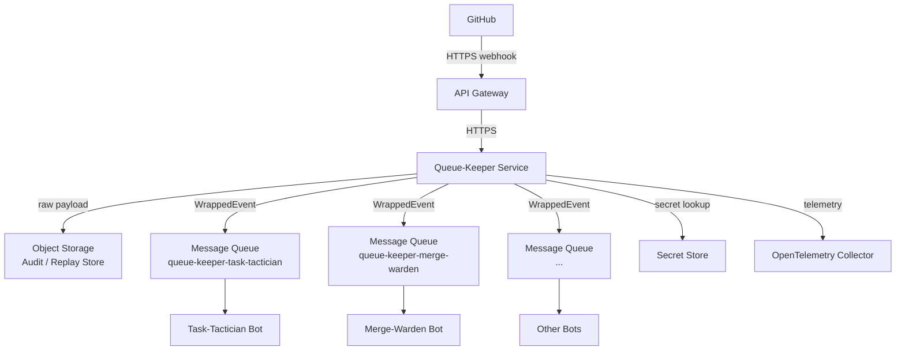
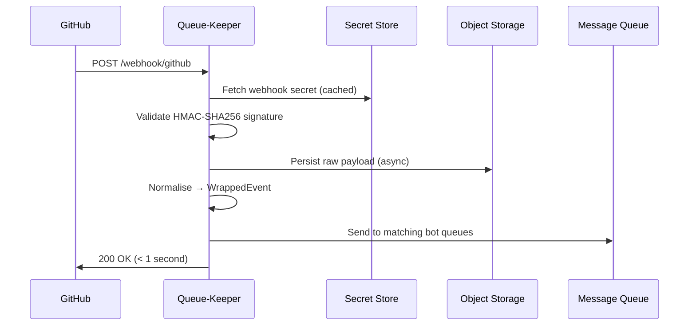

# Architecture

Queue-Keeper is a webhook intake and routing service. Its job is to sit between GitHub (or other webhook providers) and your downstream automation bots, handling the reliability and ordering concerns so your bots do not have to.

---

## System context

!!! important "GitHub webhook target"
    GitHub webhooks are configured to call **Queue-Keeper's** endpoint — not the individual bots. Each bot only sees events that Queue-Keeper routes to its queue. You configure **one webhook per repository (or organisation)** pointing at `https://your-queue-keeper-host/webhook/github`. Bots have no public HTTP endpoints for webhook delivery.

**API Gateway** terminates TLS, enforces DDoS protection, and forwards traffic to Queue-Keeper. Examples: Azure Front Door, AWS CloudFront, Cloudflare.

**Queue-Keeper** validates, normalises, and routes each event. It contains no GitHub-integration-specific business logic — that belongs in the bots.

**Object Storage** holds every raw webhook payload as an immutable record. This enables replay, auditing, and debugging without needing to re-trigger GitHub. Examples: Azure Blob Storage, AWS S3.

**Message Queue** delivers normalised events to bots. Session-based FIFO ordering is used within a bot's queue for events that share the same entity (PR, issue, branch). Examples: Azure Service Bus, AWS SQS FIFO.

**Secret Store** holds webhook secrets so they never touch disk or environment variables in production. Examples: Azure Key Vault, AWS Secrets Manager, HashiCorp Vault.

---

## Processing pipeline

Every webhook goes through this pipeline synchronously within the HTTP request handler:

**Target response time: < 1 second.** GitHub's webhook delivery timeout is 10 seconds, but fast acknowledgement is important because GitHub will retry delivery if it does not hear back quickly.

Object storage writes are best-effort: if the write fails, processing continues and the full route to the message queue still completes. The failure is logged and counted in metrics.

---

## Internal components

### Provider registry

Holds the registered webhook providers (GitHub built-in + generic providers from `service.yaml`). On startup, each provider is initialised with its secret source and validation rules. Unknown provider IDs return 404.

### Signature validator

For each incoming request, retrieves the webhook secret from the provider's configured source (secret store or literal) and verifies the HMAC-SHA256 signature in constant time. Secret store lookups are cached.

### Event normaliser

Translates provider-specific webhook payloads into the common `WrappedEvent` schema. For GitHub events, this includes:

- Extracting `event_type` from the `X-GitHub-Event` header
- Extracting `action` from the payload `action` field
- Computing the `session_id` from repository owner, name, entity type, and entity ID
- Generating a stable `event_id` (ULID)
- Stamping `received_at` and `processed_at` timestamps

### Router

Reads the bot subscriptions from `bot-config.yaml`. For each received event, the router evaluates every bot's event patterns and optional repository filter, then delivers the `WrappedEvent` to every matching queue. Delivery is attempted for all matching queues even if one fails — partial failure is logged and counted.

### Circuit breaker

Wraps the queue client and blob storage client with a circuit breaker. After a configurable number of consecutive failures the circuit opens, fast-failing requests until the service recovers. See [Reliability](reliability.md) for thresholds and behaviour.

---

## Key design decisions

**Static configuration**: Bot subscriptions do not change at runtime. This simplifies the system — there is no distributed configuration store to keep consistent, no race conditions between config changes and in-flight requests.

**Synchronous response, async persistence**: Queue-Keeper responds to GitHub before blob storage writes complete. This guarantees the < 1 s SLA even when storage latency spikes, at the cost of occasional missed audit records.

**No GitHub API calls at request time**: Queue-Keeper processes webhooks from their payloads alone. It never calls the GitHub REST API during the request path, which would add latency and a new failure mode.

**Separate `event_id` from delivery ID**: Queue-Keeper generates its own stable `event_id` (ULID). GitHub's `X-GitHub-Delivery` is recorded and logged but is not used as the primary event identifier, because different bots receiving the same event get messages with the same `event_id` — useful for deduplication across retry scenarios.
