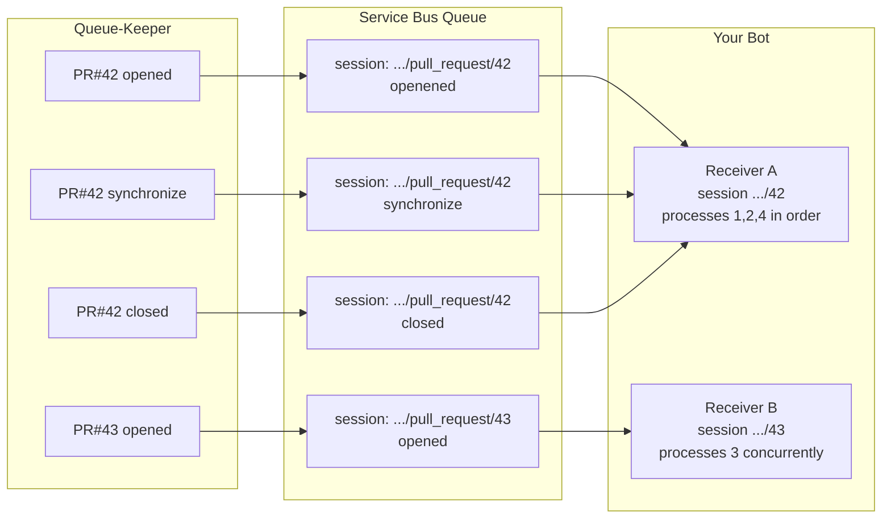

# Ordering and Sessions

Queue-Keeper guarantees that events for the same entity (PR, issue, branch) arrive at your bot in the order they were received. This page explains why that guarantee is needed, how it is implemented, and the trade-offs involved.

---

## Why ordering matters

Consider a bot that tracks the lifecycle of a pull request and updates a ticket in a project management tool. If `pull_request.closed` arrives before `pull_request.opened`, the bot creates a closed ticket with no prior state — or worse, crashes because the PR it was asked to close does not yet exist in its data store.

GitHub delivers webhooks with best-effort ordering at the source, but network paths, retries, and processing latency mean that the order in which webhooks reach your service is not guaranteed. Without an ordering layer, your bot must handle out-of-order delivery defensively, which is complex and error-prone.

Queue-Keeper removes this burden by ensuring that all events for a given entity are delivered to your bot in arrival order.

---

## How sessions work

The ordering mechanism is Azure Service Bus **sessions** (equivalent to FIFO message groups in AWS SQS).

### Session IDs

For every event, Queue-Keeper computes a `session_id` string that identifies the entity the event relates to:

```
{owner}/{repo}/{entity_type}/{entity_id}
```

Examples:

| Event | `session_id` |
|---|---|
| `pull_request.opened` on PR #42 | `myorg/myrepo/pull_request/42` |
| `issues.labeled` on issue #7 | `myorg/myrepo/issue/7` |
| `push` to `main` | `myorg/myrepo/branch/main` |
| `release.published` for `v2.0.0` | `myorg/myrepo/release/v2.0.0` |

### How Service Bus uses session IDs

When Queue-Keeper sends a message to a bot queue with `ordered: true`, it sets the Azure Service Bus `SessionId` property on the message to the event's `session_id`.

Azure Service Bus guarantees that:

1. All messages with the same `SessionId` are delivered to **one consumer at a time** — no parallel processing of the same entity
2. Messages within a session are delivered in the order they entered the queue (FIFO)
3. Messages in **different** sessions (different entities) can be consumed **in parallel** by different session receivers

Your bot holds a **session lock** while processing each session. Only one receiver can hold the lock at a time. If the lock expires (default: 5 minutes), Azure releases the session and allows another receiver to pick it up.



PR #42's events are always handled by one receiver in order. PR #43's events can be processed simultaneously by a different receiver.

---

## When not to use ordering

`ordered: false` is the right choice when:

- Your bot is stateless and treats each event independently (notification senders, metric collectors, audit loggers)
- You need maximum throughput and can tolerate any delivery order
- Your events have no causal relationship to each other

Unordered delivery uses a standard (non-session) queue consumer. In Azure Service Bus terms, you use a regular `ServiceBusReceiver` rather than a session-aware one. Multiple consumer instances can process messages in parallel without any coordination, giving significantly higher throughput at the cost of ordering guarantees.

---

## Trade-offs and limitations

**Throughput**: Session-based delivery limits throughput per session to one message at a time. For very high-volume entities (a repository with thousands of events per second) this can create a backlog. Consider whether your bot truly needs strict ordering or whether approximate ordering is sufficient.

**Session lock expiry**: If your bot takes longer than the lock duration to process a message, Azure releases the session and may deliver subsequent messages to a different receiver. The previous receiver's in-progress message will be retried. Design your processing to complete within the lock duration, or renew the lock explicitly.

**Unordered events within a single entity**: Queue-Keeper orders events in the order they arrive at Queue-Keeper. If GitHub delivers two events for the same PR in the wrong order due to a network anomaly, Queue-Keeper will faithfully deliver them in that wrong order. This is an inherent limitation of webhook delivery — Queue-Keeper cannot know the intended event sequence, only the received sequence.

**Generic providers**: `session_id` is not computed for generic providers in wrap mode (it is `null`). Ordered delivery for generic providers requires a custom session ID derivation that is not yet supported.
