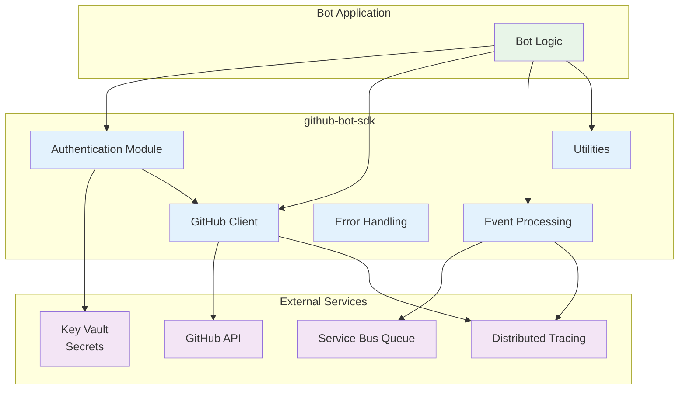

# GitHub Bot SDK - Functional Specification

**Version**: 1.0
**Date**: September 2025
**Status**: Initial Specification

## Overview

The `github-bot-sdk` is a Rust crate that provides a comprehensive foundation for building GitHub bots at OffAxis Dynamics. It abstracts the complexity of GitHub App authentication, webhook validation, API interactions, and event processing into a clean, type-safe interface.

## System Architecture



## Core Design Principles

1. **Type Safety**: Leverage Rust's type system to prevent common integration errors
2. **Zero-Copy**: Minimize allocations and data copying where possible
3. **Async-First**: Built for async/await with tokio runtime
4. **Observability**: Integrated tracing and metrics collection
5. **Testability**: Mockable interfaces for comprehensive testing
6. **Extensibility**: Plugin architecture for custom authentication and API endpoints

## Key Features

### 🔐 **Authentication Management**

- GitHub App JWT signing and validation
- Installation token exchange and automatic refresh
- Token caching with configurable TTL
- Support for GitHub Enterprise Server
- PAT fallback for local development

### 📨 **Event Processing**

- Normalized event envelope format
- Type-safe webhook payload parsing
- HMAC signature validation
- Event deduplication and idempotency
- Session ID correlation for ordered processing

### 🌐 **GitHub API Client**

- Authenticated REST API wrapper
- Built-in rate limiting and retry logic
- Request/response tracing
- Pagination helpers
- GraphQL query support

### 🛠️ **Developer Experience**

- Comprehensive error types with context
- Structured logging integration
- OpenTelemetry tracing support
- Configuration management
- Testing utilities and mocks

## Module Structure

This specification is organized into the following modules:

### Core Modules

- [Authentication](./modules/auth.md) - GitHub App authentication and token management
- [Client](./modules/client.md) - GitHub API client with built-in authentication
- [Events](./modules/events.md) - Event schema and processing utilities
- [Errors](./modules/errors.md) - Comprehensive error handling and types

### Supporting Modules

- [Configuration](./modules/config.md) - Configuration management and environment handling
- [Utilities](./modules/utils.md) - Common utilities for bots (retry, idempotency, etc.)
- [Testing](./modules/testing.md) - Test utilities and mock implementations
- [Tracing](./modules/tracing.md) - Observability and distributed tracing integration

### Architecture Documents

- [Architecture Overview](./architecture.md) - SDK architecture and hexagonal design
- [Security Model](./architecture/security.md) - Authentication, secrets, and security considerations
- [Performance](./architecture/performance.md) - Caching, rate limiting, and optimization strategies
- [Extensibility](./architecture/extensibility.md) - Plugin system and customization points
- [Integration Patterns](./architecture/integration.md) - Common bot implementation patterns

### Domain Foundation

- [Vocabulary](./vocabulary.md) - SDK domain concepts and terminology
- [Responsibilities](./responsibilities.md) - Module responsibilities and collaboration patterns
- [Constraints](./constraints.md) - Security requirements and API contract rules
- [Assertions](./assertions.md) - Behavioral specifications for authentication and API usage

## Quick Start Example

**Basic Bot Implementation Pattern**:

- Initialize GitHub App authentication with app ID and private key
- Create authenticated GitHub client with proper user agent
- Process events from Service Bus queue in async loop
- Handle authentication, rate limiting, and error scenarios automatically

**Required Configuration**:

- GitHub App ID (from GitHub App settings)
- Private key (stored in environment variables or Key Vault)
- User agent string (for GitHub API identification)
- Installation ID (for repository-specific operations)

**Event Processing Flow**:

1. Receive event envelope from queue
2. Authenticate with GitHub using installation token
3. Process event with type-safe API operations
4. Handle errors with appropriate retry/abort logic
    client: &GitHubClient,
    envelope: EventEnvelope
) -> Result<(), github_bot_sdk::Error> {
    info!(
        event_id = %envelope.event_id,
        repo = %envelope.repository,
        "Processing event"
    );

    match envelope.event_type.as_str() {
        "pull_request" => {
            // Get installation client for this repository
            let installation = client.installation(&envelope.repository).await?;

            // Process pull request event
            let pr_data = envelope.payload.parse_pull_request()?;
            handle_pull_request(&installation, pr_data).await?;
        }
        _ => {
            info!("Ignoring event type: {}", envelope.event_type);
        }
    }

    Ok(())
}

```

## Target Environments

### Primary: Azure Functions

- Runtime: Azure Functions with Custom Handler
- Authentication: Azure Key Vault integration
- Observability: Application Insights + Azure Monitor
- Queue Integration: Azure Service Bus

### Secondary: AWS Lambda (Future)

- Runtime: AWS Lambda with Rust runtime
- Authentication: AWS Secrets Manager integration
- Observability: CloudWatch + X-Ray tracing
- Queue Integration: Amazon SQS

### Development: Local/Docker

- Authentication: Environment variables or local files
- Observability: Console logging + Jaeger tracing
- Queue Integration: Local Redis or in-memory queues

## Status and Roadmap

**Current Phase**: Initial Specification
**Target Release**: Q4 2025

### Phase 1: Core Foundation (MVP)

- [ ] Authentication module with GitHub App support
- [ ] Basic GitHub API client with REST endpoints
- [ ] Event schema and envelope format
- [ ] Error handling and logging integration

### Phase 2: Production Features

- [ ] Token caching and refresh mechanisms
- [ ] Rate limiting and retry logic
- [ ] Comprehensive testing utilities
- [ ] Performance optimizations

### Phase 3: Advanced Features

- [ ] GraphQL client support
- [ ] GitHub Enterprise Server compatibility
- [ ] Plugin architecture for extensibility
- [ ] Advanced observability features

## Behavioral Assertions

The following assertions define the expected behavior of the `github-bot-sdk`:

### Authentication Assertions

1. **JWT Signing**: GitHub App JWTs MUST be signed with RS256 algorithm and include required claims (iss, iat, exp)
2. **Token Refresh**: Installation tokens MUST be automatically refreshed before expiration with 5-minute safety margin
3. **Token Caching**: Valid installation tokens MUST be cached to avoid unnecessary GitHub API calls
4. **Secret Security**: Private keys MUST never be logged or included in error messages
5. **Expiration Handling**: Expired tokens MUST trigger automatic refresh without failing the current operation

### API Client Assertions

6. **Rate Limit Respect**: Client MUST respect GitHub API rate limits and implement exponential backoff
7. **Authentication Headers**: All API requests MUST include proper authentication headers (Authorization: Bearer/token)
8. **User Agent**: All requests MUST include a descriptive User-Agent header identifying the bot
9. **Request Tracing**: Every API request MUST be traced with correlation IDs for debugging
10. **Error Propagation**: API errors MUST be properly typed and include relevant context

### Event Processing Assertions

11. **Signature Validation**: Webhook payloads MUST be validated using HMAC-SHA256 before processing
12. **Event Deduplication**: Duplicate events with same event_id MUST be detected and handled idempotently
13. **Type Safety**: Event payloads MUST be parsed into strongly-typed structs with validation
14. **Session Correlation**: Events MUST maintain session_id for ordered processing when required
15. **Envelope Integrity**: EventEnvelope format MUST be backward compatible and versioned

### Error Handling Assertions

16. **Error Context**: All errors MUST include sufficient context for debugging and monitoring
17. **Retry Logic**: Transient errors MUST trigger configurable retry with exponential backoff
18. **Circuit Breaking**: Repeated failures MUST trigger circuit breaker to prevent cascade failures
19. **Error Classification**: Errors MUST be classified as permanent vs transient for proper handling
20. **Telemetry**: All errors MUST be tracked in telemetry with appropriate severity levels
