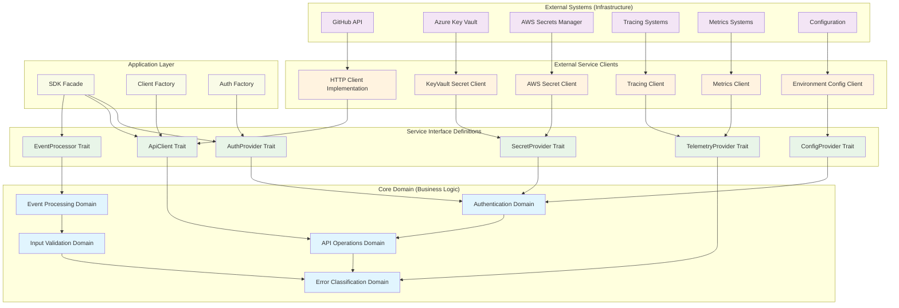
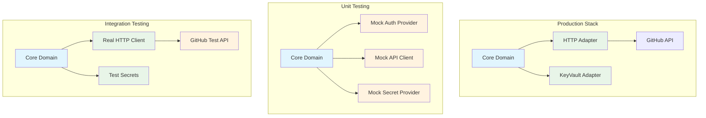

# GitHub Bot SDK Architecture

This document defines the architecture of the github-bot-sdk library, establishing clear boundaries between core business logic and external service implementations for GitHub integration.

## Architecture Overview



## Core Domain Layer

The core domain contains the essential business logic for GitHub integration, independent of any specific infrastructure or external service details.

### Authentication Domain

**Purpose**: Manages GitHub App authentication lifecycle including JWT generation, installation token exchange, and token caching.

**Core Concepts**:

- GitHub App identity verification through JWT signing
- Installation-scoped token acquisition and refresh
- Token lifecycle management with proactive renewal
- Authentication state validation and error handling

**Domain Rules**:

- JWTs must expire within 10 minutes (GitHub requirement)
- Installation tokens must be refreshed before expiration
- Private keys must never be exposed in logs or errors
- Token caching must respect security and performance balance
- Authentication failures must be classified for retry decisions

**Key Operations**:

```rust
// Core authentication operations
pub trait AuthenticationService {
    async fn generate_jwt(&self) -> Result<JsonWebToken, AuthError>;
    async fn exchange_for_installation_token(&self, installation_id: u64) -> Result<InstallationToken, AuthError>;
    async fn refresh_token_if_needed(&self, token: &InstallationToken) -> Result<InstallationToken, AuthError>;
    fn validate_token_freshness(&self, token: &InstallationToken) -> bool;
}
```

### Event Processing Domain

**Purpose**: Handles conversion and validation of GitHub webhook events into strongly-typed domain objects.

**Core Concepts**:

- GitHub webhook signature validation
- Event payload parsing and type safety
- Event correlation and session management
- Event metadata extraction and enrichment

**Domain Rules**:

- All webhook signatures must be validated before processing
- Unknown event types should be handled gracefully
- Event parsing must preserve original payload for debugging
- Session IDs must be deterministic for related events
- Trace context must be propagated for observability

**Key Operations**:

```rust
// Core event processing operations
pub trait EventProcessingService {
    async fn validate_webhook_signature(&self, payload: &[u8], signature: &str) -> Result<(), ValidationError>;
    async fn parse_event(&self, event_type: &str, payload: &[u8]) -> Result<GitHubEvent, ParseError>;
    fn extract_session_id(&self, event: &GitHubEvent) -> Option<SessionId>;
    fn enrich_with_metadata(&self, event: GitHubEvent) -> EnrichedEvent;
}
```

### API Operations Domain

**Purpose**: Provides type-safe, authenticated access to GitHub's REST API with built-in error handling and rate limiting at both app and installation levels.

**Core Concepts**:

- Authenticated API request construction (app-level or installation-level)
- Response parsing and error handling
- Rate limit awareness and backoff
- Request/response correlation for tracing
- Automatic authentication context selection

**Domain Rules**:

- All API requests must include proper authentication (JWT for app operations, installation token for repository operations)
- Rate limits must be respected with exponential backoff
- Request failures must be classified for retry decisions
- API responses must be validated before use
- Large result sets must support pagination
- App-level operations use JWT authentication
- Installation-level operations use installation token authentication

**Key Operations**:

```rust
// Core API operations
pub trait ApiOperationsService {
    // Generic request execution
    async fn execute_request<T>(&self, request: ApiRequest) -> Result<T, ApiError>
    where T: DeserializeOwned;

    // App-level operations (authenticated with JWT)
    async fn list_installations(&self) -> Result<Vec<Installation>, ApiError>;
    async fn get_app(&self) -> Result<App, ApiError>;
    async fn get_installation(&self, installation_id: u64) -> Result<Installation, ApiError>;

    // Installation-level operations (authenticated with installation token)
    async fn get_installation_repos(&self, installation_id: u64) -> Result<Vec<Repository>, ApiError>;
    async fn create_issue_comment(&self, repo: &Repository, issue: u32, body: &str) -> Result<Comment, ApiError>;
    async fn update_pull_request_status(&self, repo: &Repository, pr: u32, status: PrStatus) -> Result<(), ApiError>;
}
```

### Error Classification Domain

**Purpose**: Categorizes errors from GitHub integration for appropriate handling, retry, and monitoring strategies.

**Core Concepts**:

- Transient vs permanent error classification
- GitHub-specific error code interpretation
- Error context preservation for debugging
- Error severity assessment for alerting

**Domain Rules**:

- Error classification must be consistent across operations
- Sensitive information must never appear in error messages
- Error context must include sufficient debugging information
- Unknown errors should default to transient with limited retries
- Security-related errors must be logged for monitoring

### Input Validation Domain

**Purpose**: Validates all external inputs to ensure data integrity and security before processing.

**Core Concepts**:

- GitHub webhook payload validation
- Configuration parameter validation
- API request parameter validation
- Security constraint enforcement

**Domain Rules**:

- All external input must be validated before use
- Validation failures must provide clear error messages
- Security constraints must be enforced consistently
- Invalid input must never cause panics or undefined behavior
- Validation logic must be centralized and reusable

## Service Interface Definitions

Trait definitions establish contracts between the core domain and external services, enabling dependency inversion and comprehensive testing.

### AuthProvider Port

```rust
#[async_trait]
pub trait AuthProvider: Send + Sync {
    type Token: Clone + Send + Sync;
    type Error: std::error::Error + Send + Sync + 'static;

    async fn app_token(&self) -> Result<Self::Token, Self::Error>;
    async fn installation_token(&self, installation_id: u64) -> Result<Self::Token, Self::Error>;
    async fn refresh_token(&self, token: &Self::Token) -> Result<Self::Token, Self::Error>;
    fn token_expires_soon(&self, token: &Self::Token) -> bool;
}
```

**Contract Requirements**:

- All token operations must be thread-safe and async
- Tokens must be immutable after creation
- Refresh operations must preserve token metadata
- Expiration checks must account for clock skew and refresh margins

### ApiClient Port

```rust
#[async_trait]
pub trait ApiClient: Send + Sync {
    type Response: Send + Sync;
    type Error: std::error::Error + Send + Sync + 'static;

    async fn execute(&self, request: ApiRequest) -> Result<Self::Response, Self::Error>;
    async fn execute_paginated(&self, request: ApiRequest) -> Result<Vec<Self::Response>, Self::Error>;
    fn rate_limit_status(&self) -> RateLimitStatus;
}
```

**Contract Requirements**:

- HTTP operations must handle timeouts and network failures gracefully
- Rate limiting must be transparent to callers
- Response parsing must be type-safe and validated
- Pagination must be handled automatically when requested

### SecretProvider Port

```rust
#[async_trait]
pub trait SecretProvider: Send + Sync {
    type Error: std::error::Error + Send + Sync + 'static;

    async fn get_secret(&self, key: &str) -> Result<SecretValue, Self::Error>;
    async fn refresh_secret(&self, key: &str) -> Result<SecretValue, Self::Error>;
    fn cache_duration(&self) -> Duration;
}
```

**Contract Requirements**:

- Secrets must be securely stored and never logged
- Cache duration must balance security and performance
- Secret retrieval must be resilient to service outages
- Secret rotation must be supported without service restart

### EventProcessor Port

```rust
pub trait EventProcessor: Send + Sync {
    type Event: Clone + Send + Sync;
    type Error: std::error::Error + Send + Sync + 'static;

    fn process_webhook(&self, event_type: &str, payload: &[u8], signature: &str) -> Result<Self::Event, Self::Error>;
    fn validate_signature(&self, payload: &[u8], signature: &str, secret: &str) -> Result<(), Self::Error>;
    fn extract_metadata(&self, event: &Self::Event) -> EventMetadata;
}
```

**Contract Requirements**:

- Webhook processing must be deterministic and idempotent
- Signature validation must use constant-time comparison
- Event parsing must preserve unknown fields for forward compatibility
- Metadata extraction must be consistent across event types

## External Service Client Implementations

Client implementations handle the specific details of integrating with external services like GitHub API, secret management, and observability systems.

### HTTP Client Adapter

**Implementation Focus**:

- GitHub API HTTP client integration
- Request/response serialization handling
- Network error handling and retry logic
- Rate limiting and throttling implementation

**GitHub Integration Features**:

- GitHub API authentication header injection
- GitHub-specific error code interpretation
- Request/response logging and tracing
- User-Agent header management for API identification

### Secret Management Adapters

**Azure Key Vault Adapter**:

- Azure Key Vault SDK integration
- Managed Identity authentication
- Secret caching with TTL management
- Azure-specific error handling

**AWS Secrets Manager Adapter**:

- AWS Secrets Manager SDK integration
- IAM role-based authentication
- Secret rotation event handling
- AWS-specific error handling

**Environment Variable Adapter**:

- Environment variable secret loading
- Development and testing support
- Secure string handling for in-memory secrets
- Configuration validation

### Configuration Adapters

**Environment Configuration Adapter**:

- Environment variable parsing and validation
- Type-safe configuration conversion
- Default value handling
- Configuration completeness validation

**File Configuration Adapter**:

- TOML/YAML configuration file parsing
- Hot-reload capability for development
- Configuration schema validation
- Multi-environment configuration support

## Dependency Flow Rules

### Strict Inward Dependencies

```
```

External Systems → Client Implementations → Service Traits → Core Domain → Application Layer

```

**Enforcement Rules**:
- Core domain modules cannot import from client implementation modules
- Service traits are defined alongside core domain logic
- Client implementations provide concrete functionality but contain no domain logic
- Application layer orchestrates but delegates to domain

### Interface Segregation

Service traits are focused on specific responsibilities:
```

**Enforcement Rules**:

- Core domain modules cannot import from adapter modules
- Ports (traits) are defined alongside core domain logic
- Adapters implement ports but contain no domain logic
- Application layer orchestrates but delegates to domain

### Interface Segregation

Ports are focused on specific responsibilities:

- **AuthProvider**: Authentication and token management only
- **ApiClient**: HTTP operations and GitHub API integration only
- **SecretProvider**: Secret retrieval and management only
- **EventProcessor**: Webhook processing and validation only

### Dependency Injection Pattern

```rust
// Application layer assembles dependencies
pub struct GitHubBotSDK {
    auth_provider: Arc<dyn AuthProvider>,
    api_client: Arc<dyn ApiClient>,
    event_processor: Arc<dyn EventProcessor>,
    telemetry: Arc<dyn TelemetryProvider>,
}

impl GitHubBotSDK {
    pub fn new(
        auth_provider: Arc<dyn AuthProvider>,
        api_client: Arc<dyn ApiClient>,
        event_processor: Arc<dyn EventProcessor>,
        telemetry: Arc<dyn TelemetryProvider>,
    ) -> Self {
        Self {
            auth_provider,
            api_client,
            event_processor,
            telemetry,
        }
    }

    pub async fn process_webhook(&self, payload: &[u8], signature: &str) -> Result<ProcessedEvent, SdkError> {
        // Domain operations orchestrated through injected dependencies
        let event = self.event_processor
            .process_webhook("pull_request", payload, signature)?;

        let installation_token = self.auth_provider
            .installation_token(event.installation_id)
            .await?;

        // Additional processing...
        Ok(ProcessedEvent::new(event))
    }
}
```

## Testing Architecture

### Hexagonal Testing Strategy



### Test Double Strategy

**Mock Implementations for Unit Tests**:

```rust
pub struct MockAuthProvider {
    tokens: HashMap<u64, InstallationToken>,
    token_responses: Vec<Result<InstallationToken, AuthError>>,
}

impl MockAuthProvider {
    pub fn with_token_response(mut self, response: Result<InstallationToken, AuthError>) -> Self {
        self.token_responses.push(response);
        self
    }
}

#[async_trait]
impl AuthProvider for MockAuthProvider {
    async fn installation_token(&self, installation_id: u64) -> Result<InstallationToken, AuthError> {
        self.token_responses
            .get(0)
            .cloned()
            .unwrap_or_else(|| Ok(InstallationToken::test_token()))
    }
}
```

**In-Memory Implementations for Integration Tests**:

```rust
pub struct InMemorySecretProvider {
    secrets: HashMap<String, SecretValue>,
}

impl InMemorySecretProvider {
    pub fn with_secret(mut self, key: &str, value: &str) -> Self {
        self.secrets.insert(key.to_string(), SecretValue::new(value));
        self
    }
}
```

## Error Handling Architecture

### Layered Error Design

```rust
// Domain-level errors
#[derive(Debug, thiserror::Error)]
pub enum AuthError {
    #[error("Invalid GitHub App credentials")]
    InvalidCredentials,

    #[error("Installation token expired")]
    TokenExpired,

    #[error("Insufficient permissions for installation {installation_id}")]
    InsufficientPermissions { installation_id: u64 },
}

// Infrastructure-level errors
#[derive(Debug, thiserror::Error)]
pub enum HttpError {
    #[error("Request timeout: {0}")]
    Timeout(#[from] tokio::time::error::Elapsed),

    #[error("Network error: {0}")]
    Network(#[from] reqwest::Error),
}

// Top-level SDK errors
#[derive(Debug, thiserror::Error)]
pub enum SdkError {
    #[error("Authentication failed: {0}")]
    Auth(#[from] AuthError),

    #[error("HTTP request failed: {0}")]
    Http(#[from] HttpError),

    #[error("Event processing failed: {0}")]
    EventProcessing(#[from] EventError),
}
```

### Error Classification for Retry Logic

```rust
impl SdkError {
    pub fn is_transient(&self) -> bool {
        match self {
            SdkError::Auth(AuthError::TokenExpired) => true,
            SdkError::Http(HttpError::Timeout(_)) => true,
            SdkError::Http(HttpError::Network(_)) => true,
            SdkError::Auth(AuthError::InvalidCredentials) => false,
            _ => false,
        }
    }

    pub fn retry_after(&self) -> Option<Duration> {
        match self {
            SdkError::Http(_) => Some(Duration::from_secs(1)),
            SdkError::Auth(AuthError::TokenExpired) => Some(Duration::from_secs(5)),
            _ => None,
        }
    }
}
```

This hexagonal architecture ensures:

1. **GitHub Integration Independence**: Core domain logic works regardless of infrastructure choices
2. **Comprehensive Testability**: Easy to test with mock implementations at any layer
3. **Security by Design**: Authentication and secret management properly abstracted
4. **Maintainability**: Clear separation between GitHub integration logic and infrastructure
5. **Extensibility**: New GitHub features or infrastructure can be added without core changes
6. **Configuration Flexibility**: Runtime selection of secret providers and configuration sources
