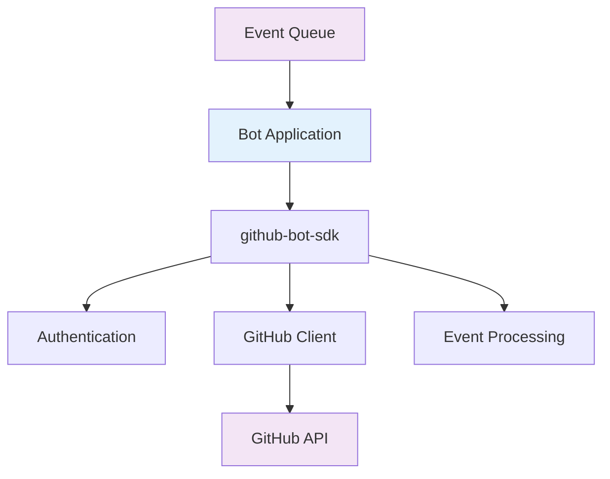
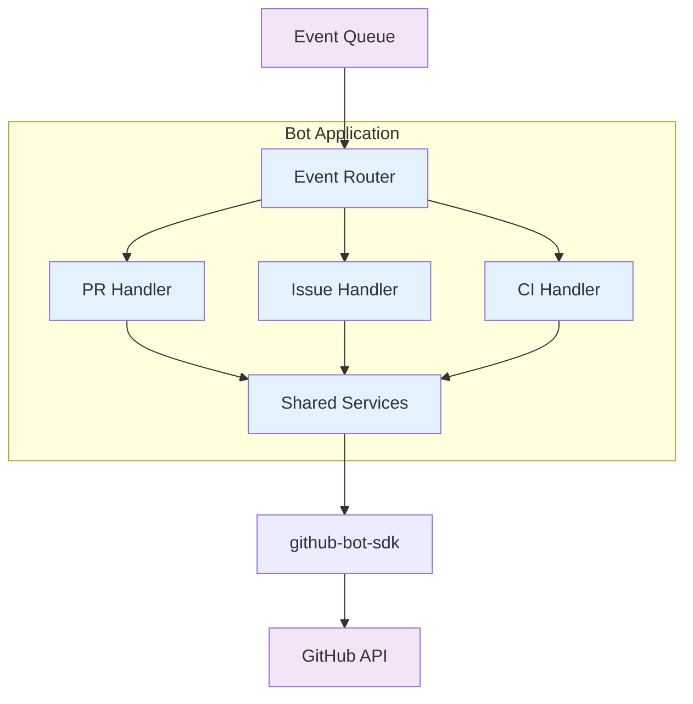
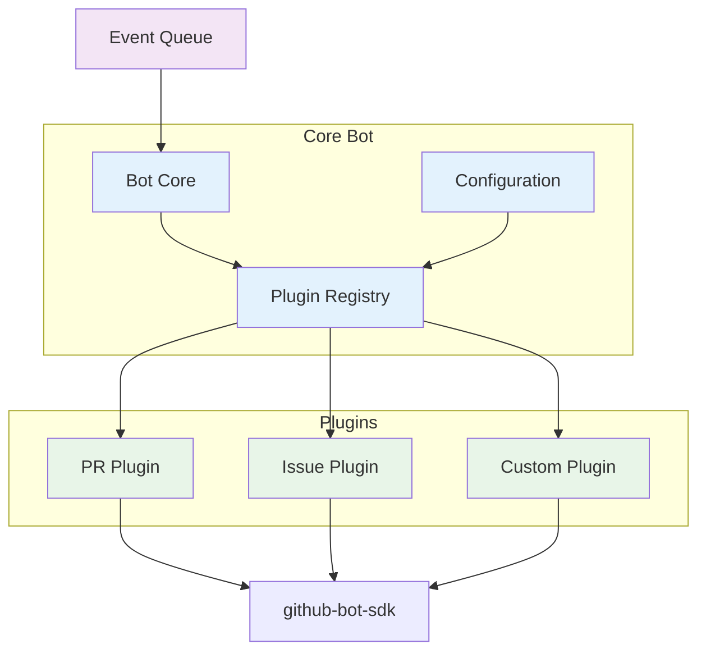
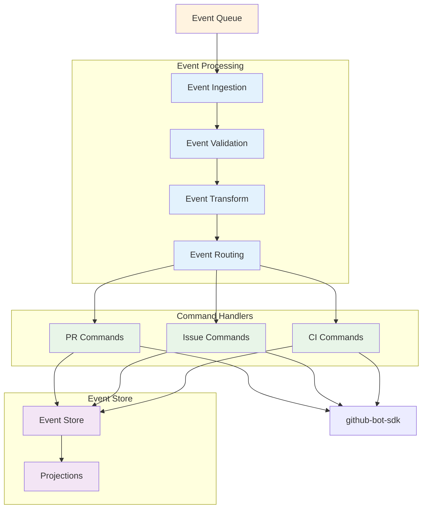

# Integration Patterns

This document outlines common patterns and best practices for integrating the `github-bot-sdk` into bot applications. It provides proven architectural approaches and implementation examples.

## Overview

The `github-bot-sdk` is designed to support various integration patterns, from simple single-purpose bots to complex multi-function automation systems. This document provides guidance on how to structure your bot applications for maximum effectiveness.

## Basic Bot Pattern

The foundational pattern for a simple GitHub bot that processes events from a queue.

### Architecture



### Implementation

```rust
use github_bot_sdk::{GitHubAppAuth, GitHubClient, EventEnvelope};
use tokio_stream::StreamExt;
use tracing::{info, error};

pub struct BasicBot {
    client: GitHubClient,
    handlers: Vec<Box<dyn EventHandler>>,
}

impl BasicBot {
    pub async fn new() -> Result<Self, BotError> {
        // Initialize authentication
        let auth = GitHubAppAuth::new()
            .app_id(std::env::var("GITHUB_APP_ID")?.parse()?)
            .private_key_from_env("GITHUB_PRIVATE_KEY")?
            .build()?;

        // Create GitHub client
        let client = GitHubClient::new(auth)
            .user_agent("basic-bot/1.0")
            .build();

        // Register event handlers
        let handlers = vec![
            Box::new(PullRequestHandler::new()) as Box<dyn EventHandler>,
            Box::new(IssueHandler::new()) as Box<dyn EventHandler>,
        ];

        Ok(Self { client, handlers })
    }

    pub async fn run(&self) -> Result<(), BotError> {
        let mut event_stream = self.receive_events().await?;

        while let Some(event) = event_stream.next().await {
            match event {
                Ok(envelope) => {
                    if let Err(e) = self.process_event(envelope).await {
                        error!("Event processing failed: {}", e);
                    }
                }
                Err(e) => {
                    error!("Event reception failed: {}", e);
                }
            }
        }

        Ok(())
    }

    async fn process_event(&self, envelope: EventEnvelope) -> Result<(), BotError> {
        let span = tracing::span!(
            tracing::Level::INFO,
            "process_event",
            event_id = %envelope.event_id,
            event_type = %envelope.event_type,
            repository = %envelope.repository.full_name
        );

        let _enter = span.enter();

        // Get installation client
        let installation = self.client.installation(&envelope.repository).await?;

        // Process with all applicable handlers
        for handler in &self.handlers {
            if handler.can_handle(&envelope) {
                handler.handle(&installation, &envelope).await?;
            }
        }

        Ok(())
    }
}

#[async_trait]
pub trait EventHandler: Send + Sync {
    fn can_handle(&self, envelope: &EventEnvelope) -> bool;
    async fn handle(&self, client: &InstallationClient, envelope: &EventEnvelope) -> Result<(), HandlerError>;
}
```

## Multi-Function Bot Pattern

A more sophisticated pattern for bots that handle multiple types of operations with different processing strategies.

### Architecture



### Implementation

```rust
use std::collections::HashMap;
use std::sync::Arc;

pub struct MultiFunctionBot {
    router: EventRouter,
    handlers: HashMap<String, Arc<dyn EventHandler>>,
    services: Arc<SharedServices>,
}

impl MultiFunctionBot {
    pub async fn new() -> Result<Self, BotError> {
        let services = Arc::new(SharedServices::new().await?);

        let mut handlers = HashMap::new();
        handlers.insert("pull_request".to_string(), Arc::new(PullRequestHandler::new(services.clone())) as Arc<dyn EventHandler>);
        handlers.insert("issues".to_string(), Arc::new(IssueHandler::new(services.clone())) as Arc<dyn EventHandler>);
        handlers.insert("check_run".to_string(), Arc::new(CIHandler::new(services.clone())) as Arc<dyn EventHandler>);

        let router = EventRouter::new(handlers.keys().cloned().collect());

        Ok(Self { router, handlers, services })
    }

    pub async fn run(&self) -> Result<(), BotError> {
        let mut event_stream = self.receive_events().await?;

        while let Some(event) = event_stream.next().await {
            match event {
                Ok(envelope) => {
                    tokio::spawn({
                        let handlers = self.handlers.clone();
                        let services = self.services.clone();
                        async move {
                            if let Err(e) = Self::process_event_concurrent(envelope, handlers, services).await {
                                error!("Event processing failed: {}", e);
                            }
                        }
                    });
                }
                Err(e) => {
                    error!("Event reception failed: {}", e);
                }
            }
        }

        Ok(())
    }

    async fn process_event_concurrent(
        envelope: EventEnvelope,
        handlers: HashMap<String, Arc<dyn EventHandler>>,
        services: Arc<SharedServices>,
    ) -> Result<(), BotError> {
        if let Some(handler) = handlers.get(&envelope.event_type) {
            let installation = services.client.installation(&envelope.repository).await?;
            handler.handle(&installation, &envelope).await?;
        }

        Ok(())
    }
}

pub struct SharedServices {
    pub client: GitHubClient,
    pub config: BotConfig,
    pub metrics: MetricsCollector,
    pub storage: Box<dyn Storage>,
}

impl SharedServices {
    pub async fn new() -> Result<Self, BotError> {
        let auth = GitHubAppAuth::new()
            .app_id(std::env::var("GITHUB_APP_ID")?.parse()?)
            .private_key_from_env("GITHUB_PRIVATE_KEY")?
            .build()?;

        let client = GitHubClient::new(auth)
            .user_agent("multi-function-bot/1.0")
            .build();

        let config = BotConfig::from_env()?;
        let metrics = MetricsCollector::new();
        let storage = Box::new(create_storage(&config).await?);

        Ok(Self { client, config, metrics, storage })
    }
}
```

## Plugin Architecture Pattern

An extensible pattern that allows for dynamic loading of handlers and custom functionality.

### Architecture



### Implementation

```rust
use async_trait::async_trait;
use std::collections::HashMap;
use std::sync::Arc;

#[async_trait]
pub trait Plugin: Send + Sync {
    fn name(&self) -> &str;
    fn version(&self) -> &str;
    fn supported_events(&self) -> Vec<String>;

    async fn initialize(&mut self, context: PluginContext) -> Result<(), PluginError>;
    async fn handle_event(&self, envelope: &EventEnvelope) -> Result<(), PluginError>;
    async fn shutdown(&self) -> Result<(), PluginError>;
}

pub struct PluginContext {
    pub client: Arc<GitHubClient>,
    pub config: serde_json::Value,
    pub logger: tracing::Span,
}

pub struct PluginRegistry {
    plugins: HashMap<String, Box<dyn Plugin>>,
    event_mappings: HashMap<String, Vec<String>>, // event_type -> plugin names
}

impl PluginRegistry {
    pub fn new() -> Self {
        Self {
            plugins: HashMap::new(),
            event_mappings: HashMap::new(),
        }
    }

    pub async fn register_plugin(&mut self, mut plugin: Box<dyn Plugin>, context: PluginContext) -> Result<(), PluginError> {
        let name = plugin.name().to_string();

        // Initialize plugin
        plugin.initialize(context).await?;

        // Register event mappings
        for event_type in plugin.supported_events() {
            self.event_mappings
                .entry(event_type)
                .or_insert_with(Vec::new)
                .push(name.clone());
        }

        // Store plugin
        self.plugins.insert(name, plugin);

        Ok(())
    }

    pub async fn handle_event(&self, envelope: &EventEnvelope) -> Result<(), PluginError> {
        if let Some(plugin_names) = self.event_mappings.get(&envelope.event_type) {
            let mut tasks = Vec::new();

            for plugin_name in plugin_names {
                if let Some(plugin) = self.plugins.get(plugin_name) {
                    let envelope_clone = envelope.clone();
                    let plugin_ref = plugin.as_ref();

                    tasks.push(tokio::spawn(async move {
                        plugin_ref.handle_event(&envelope_clone).await
                    }));
                }
            }

            // Wait for all plugins to complete
            for task in tasks {
                if let Err(e) = task.await? {
                    error!("Plugin execution failed: {}", e);
                }
            }
        }

        Ok(())
    }
}

// Example plugin implementation
pub struct PullRequestPlugin {
    name: String,
    client: Option<Arc<GitHubClient>>,
    config: PullRequestConfig,
}

#[async_trait]
impl Plugin for PullRequestPlugin {
    fn name(&self) -> &str { &self.name }
    fn version(&self) -> &str { "1.0.0" }
    fn supported_events(&self) -> Vec<String> {
        vec!["pull_request".to_string()]
    }

    async fn initialize(&mut self, context: PluginContext) -> Result<(), PluginError> {
        self.client = Some(context.client);
        self.config = serde_json::from_value(context.config)?;
        Ok(())
    }

    async fn handle_event(&self, envelope: &EventEnvelope) -> Result<(), PluginError> {
        let client = self.client.as_ref().unwrap();
        let installation = client.installation(&envelope.repository).await?;

        let pr_event = envelope.payload.parse_pull_request()?;

        match pr_event.action {
            PullRequestAction::Opened => {
                self.handle_pr_opened(&installation, &pr_event).await?;
            }
            PullRequestAction::Synchronize => {
                self.handle_pr_updated(&installation, &pr_event).await?;
            }
            _ => {}
        }

        Ok(())
    }

    async fn shutdown(&self) -> Result<(), PluginError> {
        // Cleanup resources
        Ok(())
    }
}
```

## Event-Driven Architecture Pattern

A pattern optimized for high-throughput scenarios with event sourcing and CQRS principles.

### Architecture



### Implementation

```rust
use tokio_stream::StreamExt;
use uuid::Uuid;

pub struct EventDrivenBot {
    processor: EventProcessor,
    command_bus: CommandBus,
    event_store: Arc<dyn EventStore>,
}

impl EventDrivenBot {
    pub async fn new() -> Result<Self, BotError> {
        let event_store = Arc::new(create_event_store().await?);
        let processor = EventProcessor::new();
        let command_bus = CommandBus::new(event_store.clone());

        Ok(Self { processor, command_bus, event_store })
    }

    pub async fn run(&self) -> Result<(), BotError> {
        let mut event_stream = self.receive_events().await?;

        while let Some(event) = event_stream.next().await {
            match event {
                Ok(envelope) => {
                    // Process event through pipeline
                    let commands = self.processor.process(envelope).await?;

                    // Execute commands
                    for command in commands {
                        self.command_bus.execute(command).await?;
                    }
                }
                Err(e) => {
                    error!("Event reception failed: {}", e);
                }
            }
        }

        Ok(())
    }
}

#[derive(Debug, Clone)]
pub enum Command {
    CreateComment { pr_number: u32, body: String },
    UpdateStatus { sha: String, status: Status },
    MergePullRequest { pr_number: u32 },
    CloseIssue { issue_number: u32 },
}

pub struct CommandBus {
    handlers: HashMap<String, Box<dyn CommandHandler>>,
    event_store: Arc<dyn EventStore>,
}

impl CommandBus {
    pub async fn execute(&self, command: Command) -> Result<(), CommandError> {
        let command_id = Uuid::new_v4().to_string();
        let command_type = self.get_command_type(&command);

        // Store command event
        let event = DomainEvent {
            id: command_id.clone(),
            event_type: format!("command_{}", command_type),
            aggregate_id: self.get_aggregate_id(&command),
            data: serde_json::to_value(&command)?,
            timestamp: Utc::now(),
        };

        self.event_store.append_event(&event).await?;

        // Execute command
        if let Some(handler) = self.handlers.get(&command_type) {
            handler.execute(command).await?;

            // Store completion event
            let completion_event = DomainEvent {
                id: Uuid::new_v4().to_string(),
                event_type: format!("command_completed_{}", command_type),
                aggregate_id: event.aggregate_id.clone(),
                data: json!({ "command_id": command_id }),
                timestamp: Utc::now(),
            };

            self.event_store.append_event(&completion_event).await?;
        }

        Ok(())
    }
}

#[async_trait]
pub trait CommandHandler: Send + Sync {
    async fn execute(&self, command: Command) -> Result<(), CommandError>;
}

// Example command handler
pub struct PullRequestCommandHandler {
    client: Arc<GitHubClient>,
}

#[async_trait]
impl CommandHandler for PullRequestCommandHandler {
    async fn execute(&self, command: Command) -> Result<(), CommandError> {
        match command {
            Command::CreateComment { pr_number, body } => {
                // Implementation would get repository from context
                // and create the comment
                Ok(())
            }
            Command::MergePullRequest { pr_number } => {
                // Implementation would merge the PR
                Ok(())
            }
            _ => Err(CommandError::UnsupportedCommand),
        }
    }
}
```

## Testing Patterns

### Unit Testing with Mocks

```rust
#[cfg(test)]
mod tests {
    use super::*;
    use github_bot_sdk::testing::{MockGitHubClient, MockInstallationClient};

    #[tokio::test]
    async fn test_pull_request_handler() {
        // Create mock client
        let mut mock_client = MockGitHubClient::new();
        mock_client.expect_installation()
            .returning(|_| Ok(MockInstallationClient::new()));

        let handler = PullRequestHandler::new();
        let envelope = EventBuilder::pull_request()
            .with_action("opened")
            .with_number(123)
            .build();

        let result = handler.handle(&mock_client, &envelope).await;
        assert!(result.is_ok());
    }
}
```

### Integration Testing

```rust
#[cfg(test)]
mod integration_tests {
    use super::*;
    use testcontainers::*;

    #[tokio::test]
    async fn test_end_to_end_processing() {
        // Start test containers
        let docker = clients::Cli::default();
        let redis_container = docker.run(images::redis::Redis::default());

        // Configure bot with test environment
        let bot = BasicBot::new_with_config(TestConfig {
            redis_url: format!("redis://localhost:{}", redis_container.get_host_port(6379)),
            github_api_url: "http://localhost:8080".to_string(),
        }).await?;

        // Send test event
        let test_event = create_test_pull_request_event();
        send_test_event(&test_event).await?;

        // Verify processing
        tokio::time::timeout(Duration::from_secs(5), async {
            bot.run_once().await
        }).await??;

        // Assert expected outcomes
        assert_comment_created(&test_event).await?;
    }
}
```

## Configuration Patterns

### Environment-Based Configuration

```rust
#[derive(Debug, Clone, Deserialize)]
pub struct BotConfig {
    pub github: GitHubConfig,
    pub storage: StorageConfig,
    pub observability: ObservabilityConfig,
    pub features: FeatureFlags,
}

impl BotConfig {
    pub fn from_env() -> Result<Self, ConfigError> {
        envy::from_env().map_err(ConfigError::from)
    }

    pub fn from_file<P: AsRef<Path>>(path: P) -> Result<Self, ConfigError> {
        let content = std::fs::read_to_string(path)?;
        toml::from_str(&content).map_err(ConfigError::from)
    }
}

#[derive(Debug, Clone, Deserialize)]
pub struct GitHubConfig {
    pub app_id: u64,
    pub private_key_source: PrivateKeySource,
    pub api_url: Option<String>,
    pub user_agent: String,
}

#[derive(Debug, Clone, Deserialize)]
pub enum PrivateKeySource {
    Environment { var_name: String },
    File { path: String },
    KeyVault { vault_url: String, secret_name: String },
}
```

### Feature Flags

```rust
#[derive(Debug, Clone, Deserialize)]
pub struct FeatureFlags {
    pub auto_merge: bool,
    pub status_checks: bool,
    pub issue_triage: bool,
    pub performance_monitoring: bool,
}

impl Default for FeatureFlags {
    fn default() -> Self {
        Self {
            auto_merge: false,
            status_checks: true,
            issue_triage: true,
            performance_monitoring: true,
        }
    }
}
```

## Performance Patterns

### Batching and Bulk Operations

```rust
pub struct BatchProcessor {
    client: Arc<GitHubClient>,
    batch_size: usize,
    batch_timeout: Duration,
}

impl BatchProcessor {
    pub async fn process_events(&self, mut events: Vec<EventEnvelope>) -> Result<(), BotError> {
        // Group events by repository for efficient processing
        let mut repo_groups: HashMap<String, Vec<EventEnvelope>> = HashMap::new();

        for event in events {
            repo_groups
                .entry(event.repository.full_name.clone())
                .or_insert_with(Vec::new)
                .push(event);
        }

        // Process each repository's events in parallel
        let tasks: Vec<_> = repo_groups
            .into_iter()
            .map(|(repo, events)| {
                let client = self.client.clone();
                tokio::spawn(async move {
                    Self::process_repository_events(client, repo, events).await
                })
            })
            .collect();

        // Wait for all tasks to complete
        for task in tasks {
            task.await??;
        }

        Ok(())
    }

    async fn process_repository_events(
        client: Arc<GitHubClient>,
        repo_name: String,
        events: Vec<EventEnvelope>,
    ) -> Result<(), BotError> {
        let repository = Repository::from_full_name(&repo_name)?;
        let installation = client.installation(&repository).await?;

        // Batch similar operations
        let mut comments_to_create = Vec::new();
        let mut statuses_to_update = Vec::new();

        for event in events {
            match event.event_type.as_str() {
                "pull_request" => {
                    // Collect comment operations
                    if let Some(comment) = self.generate_pr_comment(&event)? {
                        comments_to_create.push(comment);
                    }
                }
                "push" => {
                    // Collect status operations
                    if let Some(status) = self.generate_status_update(&event)? {
                        statuses_to_update.push(status);
                    }
                }
                _ => {}
            }
        }

        // Execute batched operations
        self.create_comments_batch(&installation, comments_to_create).await?;
        self.update_statuses_batch(&installation, statuses_to_update).await?;

        Ok(())
    }
}
```

## Best Practices Summary

1. **Use appropriate patterns**: Choose the pattern that matches your bot's complexity and requirements
2. **Implement proper error handling**: Use typed errors and comprehensive logging
3. **Design for testability**: Use dependency injection and mockable interfaces
4. **Consider performance**: Implement batching, caching, and concurrent processing where appropriate
5. **Plan for extensibility**: Use plugin architectures for complex bots
6. **Monitor and observe**: Implement comprehensive metrics and tracing
7. **Configure externally**: Use environment variables and configuration files
8. **Handle failures gracefully**: Implement retries, circuit breakers, and degraded modes
