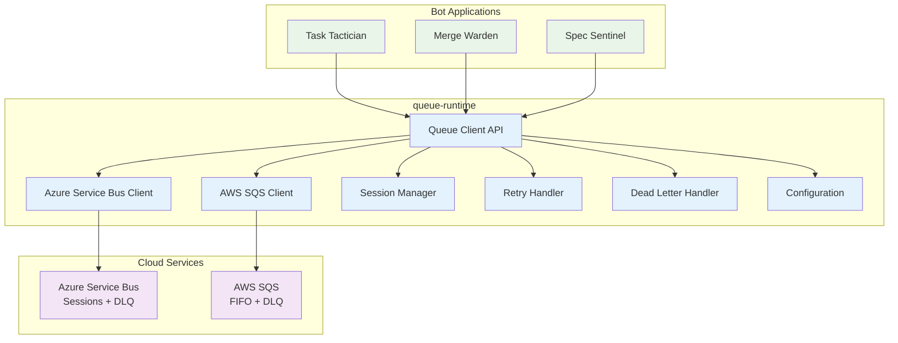

# Queue Runtime - Functional Specification

**Version**: 1.0
**Date**: September 2025
**Status**: Initial Specification

## Overview

The `queue-runtime` is a Rust crate that provides a unified abstraction layer over cloud message queues, specifically Azure Service Bus (with sessions) and AWS SQS (with FIFO). It enables GitHub bots to consume normalized events with consistent APIs regardless of the underlying queue implementation.

## System Architecture



## Core Design Principles

1. **Provider Agnostic**: Seamless switching between Azure and AWS
2. **Session Aware**: Built-in support for ordered message processing
3. **Resilient**: Comprehensive retry, DLQ, and error handling
4. **Observable**: Integrated metrics and distributed tracing
5. **Type Safe**: Strongly-typed message handling with serde
6. **Performance**: Optimized for high-throughput bot workloads

## Key Features

### 🔄 **Unified Queue Operations**

- Send, receive, acknowledge, and requeue messages
- Consistent API across Azure Service Bus and AWS SQS
- Automatic connection management and retries
- Batch operations for improved performance

### 📋 **Session Management**

- Ordered message processing per PR/Issue/Repository
- Session-based delivery for Azure Service Bus
- FIFO queue support for AWS SQS
- Configurable session strategies and key generation

### 🔁 **Retry and Error Handling**

- Exponential backoff retry strategies
- Dead letter queue integration
- Automatic poison message detection
- Circuit breaker patterns for fault tolerance

### 📊 **Message Templates**

- Standardized event envelope format
- GitHub event payload structures
- Metadata and correlation tracking
- Serialization and deserialization helpers

## Module Structure

This specification is organized into the following modules:

### Core Modules

- [Queue Client](./modules/client.md) - Main queue client API and trait definitions
- [Message Types](./modules/messages.md) - Event envelopes, payloads, and serialization
- [Session Management](./modules/sessions.md) - Ordered processing and session strategies
- [Retry Logic](./modules/retry.md) - Retry policies, backoff strategies, and error handling

### Provider Modules

- [Azure Service Bus](./modules/azure.md) - Azure Service Bus implementation with sessions
- [AWS SQS](./modules/aws.md) - AWS SQS implementation with FIFO queues
- [Configuration](./modules/config.md) - Provider configuration and connection management

### Supporting Modules

- [Dead Letter Queues](./modules/dlq.md) - DLQ handling and message replay
- [Observability](./modules/observability.md) - Metrics, tracing, and monitoring
- [Testing](./modules/testing.md) - Comprehensive testing framework and utilities

### Architecture Documents

- [Queue Naming Strategy](./architecture/naming.md) - Queue naming conventions and patterns
- [Session Strategies](./architecture/sessions.md) - Ordered processing strategies and key generation
- [Provider Differences](./architecture/providers.md) - Azure vs AWS implementation differences
- [Performance Optimization](./architecture/performance.md) - Throughput and latency optimization

## Core API

### QueueClient Trait Requirements

**Core Queue Operations**:

- Send individual and batch messages to queues with configurable options
- Receive messages with timeout, batch size, and session filtering
- Acknowledge successful message processing
- Reject messages with reason tracking for dead letter queues
- Requeue messages for retry with configurable delay

**Type Safety Requirements**:

- Generic over message and receipt types for provider flexibility
- Associated error types implementing standard error traits
- Send + Sync bounds for async multi-threaded usage

**Session Support**:

- Optional session-based message ordering
- Session acceptance for exclusive session processing
- Session correlation across message lifecycle

```

### Message Types

```rust
/// Core message trait for queue operations
pub trait QueueMessage: Send + Sync + Clone {
    fn message_id(&self) -> &str;
    fn session_id(&self) -> Option<&str>;
    fn correlation_id(&self) -> Option<&str>;
    fn content_type(&self) -> &str;
    fn body(&self) -> &[u8];
    fn properties(&self) -> &HashMap<String, String>;
}

/// Received message with processing receipt
pub struct ReceivedMessage<M, R> {
    pub message: M,
    pub receipt: R,
    pub delivery_count: u32,
    pub enqueued_at: DateTime<Utc>,
    pub received_at: DateTime<Utc>,
}

/// Options for sending messages
#[derive(Debug, Clone, Default)]
pub struct SendOptions {
    pub session_id: Option<String>,
    pub scheduled_enqueue_time: Option<DateTime<Utc>>,
    pub time_to_live: Option<Duration>,
    pub properties: HashMap<String, String>,
}

/// Options for receiving messages
#[derive(Debug, Clone, Default)]
pub struct ReceiveOptions {
    pub max_messages: Option<u32>,
    pub timeout: Option<Duration>,
    pub session_id: Option<String>,
    pub accept_session: bool,
}
```

## Quick Start Example

```rust
use queue_runtime::{QueueClient, EventEnvelope, QueueConfig, AzureServiceBusClient};
use tracing::info;

#[tokio::main]
async fn main() -> Result<(), Box<dyn std::error::Error>> {
    // Initialize queue client
    let config = QueueConfig::from_env()?;
    let client = AzureServiceBusClient::new(config).await?;

    // Start processing messages
    let queue_name = "task-tactician";

    loop {
        // Receive messages
        let messages = client.receive(queue_name, ReceiveOptions {
            max_messages: Some(10),
            timeout: Some(Duration::from_secs(30)),
            accept_session: true,
            ..Default::default()
        }).await?;

        for received in messages {
            // Process the event
            match process_event(&received.message).await {
                Ok(_) => {
                    // Acknowledge successful processing
                    client.acknowledge(received.receipt).await?;
                    info!(
                        message_id = %received.message.message_id(),
                        "Message processed successfully"
                    );
                }
                Err(e) => {
                    // Handle processing error
                    if received.delivery_count >= 3 {
                        // Send to dead letter queue after 3 attempts
                        client.reject(received.receipt, &e.to_string()).await?;
                    } else {
                        // Requeue for retry with exponential backoff
                        let delay = Duration::from_secs(2_u64.pow(received.delivery_count));
                        client.requeue(received.receipt, Some(delay)).await?;
                    }
                }
            }
        }
    }
}

async fn process_event(message: &EventEnvelope) -> Result<(), ProcessingError> {
    info!(
        event_id = %message.event_id,
        event_type = %message.event_type,
        repository = %message.repository.full_name,
        "Processing GitHub event"
    );

    // Process the event based on type
    match message.event_type.as_str() {
        "pull_request" => handle_pull_request(message).await?,
        "issues" => handle_issue(message).await?,
        _ => {
            info!("Ignoring unsupported event type: {}", message.event_type);
        }
    }

    Ok(())
}
```

## Event Message Format

### EventEnvelope Structure

The standard message format for GitHub events:

```rust
#[derive(Debug, Clone, Serialize, Deserialize)]
pub struct EventEnvelope {
    pub event_id: String,
    pub event_type: String,
    pub repository: Repository,
    pub entity_type: EntityType,
    pub entity_id: Option<String>,
    pub session_id: Option<String>,
    pub payload: serde_json::Value,
    pub metadata: EventMetadata,
    pub trace_context: Option<TraceContext>,
}

#[derive(Debug, Clone, Serialize, Deserialize)]
pub struct Repository {
    pub owner: String,
    pub name: String,
    pub full_name: String,
    pub id: u64,
}

#[derive(Debug, Clone, Serialize, Deserialize)]
pub struct EventMetadata {
    pub received_at: DateTime<Utc>,
    pub processed_at: Option<DateTime<Utc>>,
    pub source: String,
    pub delivery_id: Option<String>,
    pub signature_valid: bool,
    pub retry_count: u32,
}

#[derive(Debug, Clone, Serialize, Deserialize)]
pub struct TraceContext {
    pub trace_id: String,
    pub span_id: String,
    pub trace_flags: u8,
}
```

## Queue Naming Strategy

### Naming Conventions

```rust
pub struct QueueNaming {
    pub prefix: Option<String>,
    pub environment: String,
    pub bot_name: String,
}

impl QueueNaming {
    pub fn queue_name(&self, bot_name: &str) -> String {
        match &self.prefix {
            Some(prefix) => format!("{}-{}-{}", prefix, self.environment, bot_name),
            None => format!("{}-{}", self.environment, bot_name),
        }
    }

    pub fn dlq_name(&self, bot_name: &str) -> String {
        format!("{}-dlq", self.queue_name(bot_name))
    }
}

// Standard bot queue names
pub const TASK_TACTICIAN_QUEUE: &str = "task-tactician";
pub const MERGE_WARDEN_QUEUE: &str = "merge-warden";
pub const SPEC_SENTINEL_QUEUE: &str = "spec-sentinel";
```

### Queue Configuration

```rust
#[derive(Debug, Clone, Serialize, Deserialize)]
pub struct QueueDefinition {
    pub name: String,
    pub max_delivery_count: u32,
    pub message_ttl: Duration,
    pub enable_sessions: bool,
    pub enable_dead_lettering: bool,
    pub max_size_in_mb: u32,
}

impl Default for QueueDefinition {
    fn default() -> Self {
        Self {
            name: String::new(),
            max_delivery_count: 3,
            message_ttl: Duration::from_hours(24),
            enable_sessions: true,
            enable_dead_lettering: true,
            max_size_in_mb: 1024, // 1GB
        }
    }
}
```

## Session Strategy

### Session Key Generation

```rust
pub trait SessionKeyGenerator: Send + Sync {
    fn generate_key(&self, envelope: &EventEnvelope) -> Option<String>;
}

pub struct EntitySessionKeyGenerator;

impl SessionKeyGenerator for EntitySessionKeyGenerator {
    fn generate_key(&self, envelope: &EventEnvelope) -> Option<String> {
        match (&envelope.entity_type, &envelope.entity_id) {
            (EntityType::PullRequest, Some(id)) => {
                Some(format!("pr-{}-{}", envelope.repository.full_name, id))
            }
            (EntityType::Issue, Some(id)) => {
                Some(format!("issue-{}-{}", envelope.repository.full_name, id))
            }
            (EntityType::Branch, Some(id)) => {
                Some(format!("branch-{}-{}", envelope.repository.full_name, id))
            }
            _ => None,
        }
    }
}

pub struct RepositorySessionKeyGenerator;

impl SessionKeyGenerator for RepositorySessionKeyGenerator {
    fn generate_key(&self, envelope: &EventEnvelope) -> Option<String> {
        Some(format!("repo-{}", envelope.repository.full_name))
    }
}
```

## Target Environments

### Primary: Azure Service Bus

- **Sessions**: Native session support for ordered processing
- **Dead Letter Queues**: Automatic DLQ handling
- **Authentication**: Azure AD integration with managed identity
- **Scaling**: Auto-scaling with premium tier

### Secondary: AWS SQS

- **FIFO Queues**: Ordered processing with message group IDs
- **Dead Letter Queues**: Redrive policies and replay capabilities
- **Authentication**: IAM roles and AWS credentials
- **Scaling**: Auto-scaling with visibility timeout management

### Development: Local/Testing

- **In-Memory Queues**: Fast local development and testing
- **File-Based Persistence**: Durable local message storage
- **Docker Containers**: Containerized queue services for integration testing

## Status and Roadmap

**Current Phase**: Initial Specification
**Target Release**: Q4 2025

### Phase 1: Core Foundation (MVP)

- [ ] Queue client trait and basic implementations
- [ ] Azure Service Bus client with session support
- [ ] Event envelope message format
- [ ] Basic retry and error handling

### Phase 2: Production Features

- [ ] AWS SQS client with FIFO support
- [ ] Dead letter queue handling and replay
- [ ] Comprehensive observability and metrics
- [ ] Performance optimizations and batching

### Phase 3: Advanced Features

- [ ] Advanced session strategies and key generation
- [ ] Circuit breaker and fault tolerance patterns
- [ ] Message transformation and routing
- [ ] Advanced testing utilities and chaos engineering

## Behavioral Assertions

The following assertions define the expected behavior of the `queue-runtime`:

### Message Processing Assertions

1. **Ordered Delivery**: Messages with the same session ID MUST be processed in FIFO order
2. **At-Least-Once Delivery**: Every message MUST be delivered at least once, but duplicates are possible
3. **Acknowledgment Required**: Messages MUST be explicitly acknowledged to prevent redelivery
4. **Retry Limits**: Messages MUST be moved to DLQ after exceeding max delivery count
5. **Session Affinity**: Session-enabled queues MUST deliver all messages for a session to the same receiver

### Error Handling Assertions

6. **Transient Retry**: Transient errors MUST trigger automatic retry with exponential backoff
7. **Permanent Failure**: Permanent errors MUST immediately send messages to DLQ
8. **Circuit Breaking**: Repeated failures MUST trigger circuit breaker to prevent cascade failures
9. **Graceful Degradation**: Service unavailability MUST not cause message loss
10. **Error Context**: All errors MUST include sufficient context for debugging and monitoring

### Performance Assertions

11. **Batch Operations**: Clients MUST support batch send and receive operations for efficiency
12. **Connection Pooling**: Clients MUST reuse connections and manage connection pools
13. **Backpressure**: Clients MUST implement backpressure when downstream processing is slow
14. **Timeout Handling**: All operations MUST respect configured timeout values
15. **Resource Cleanup**: Clients MUST properly cleanup resources and close connections

### Observability Assertions

16. **Metrics Collection**: All queue operations MUST emit standardized metrics
17. **Trace Propagation**: Messages MUST carry trace context for distributed tracing
18. **Structured Logging**: All significant events MUST be logged with structured data
19. **Health Monitoring**: Clients MUST provide health check capabilities
20. **Performance Monitoring**: Clients MUST track latency, throughput, and error rates
