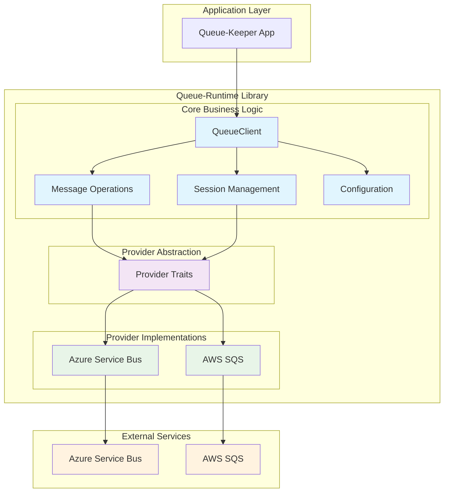

# Queue-Runtime Library Architecture

## Overview

The queue-runtime library provides a provider-agnostic abstraction over cloud queue services (Azure Service Bus, AWS SQS) with consistent behavior and session management. The architecture organizes code around business concepts while maintaining clear separation between core logic and provider implementations.

## Core Architecture Pattern



## Module Organization

### Core Business Modules

#### client.rs - Queue Client Interface

**Purpose**: Primary interface for queue operations
**Responsibilities**:

- Defines the main `QueueClient` trait
- Coordinates between message operations and session management
- Handles provider selection and configuration

```rust
pub trait QueueClient: Send + Sync {
    async fn send_message(&self, queue: &QueueName, message: Message) -> Result<MessageId, QueueError>;
    async fn receive_message(&self, queue: &QueueName) -> Result<Option<ReceivedMessage>, QueueError>;
    async fn complete_message(&self, receipt: ReceiptHandle) -> Result<(), QueueError>;
    async fn accept_session(&self, queue: &QueueName, session_id: Option<SessionId>) -> Result<SessionClient, QueueError>;
}
```

#### message.rs - Message Types and Operations

**Purpose**: Message handling and transformation
**Responsibilities**:

- Defines message types and metadata
- Handles message serialization/deserialization
- Manages message attributes and properties

```rust
pub struct Message {
    pub body: Bytes,
    pub attributes: HashMap<String, String>,
    pub session_id: Option<SessionId>,
}

pub struct ReceivedMessage {
    pub message: Message,
    pub receipt_handle: ReceiptHandle,
    pub delivery_count: u32,
}
```

#### session.rs - Session Management

**Purpose**: FIFO ordering and session handling
**Responsibilities**:

- Manages session-based message ordering
- Handles session locks and timeouts
- Provides session client interface

```rust
pub trait SessionClient: Send + Sync {
    async fn receive_message(&self) -> Result<Option<ReceivedMessage>, QueueError>;
    async fn complete_message(&self, receipt: ReceiptHandle) -> Result<(), QueueError>;
    async fn abandon_session(&self) -> Result<(), QueueError>;
}
```

#### config.rs - Configuration Management

**Purpose**: Provider configuration and validation
**Responsibilities**:

- Loads and validates configuration
- Handles provider-specific settings
- Manages connection strings and secrets

```rust
pub enum ProviderConfig {
    Azure(AzureServiceBusConfig),
    Aws(AwsSqsConfig),
}

pub struct QueueRuntimeConfig {
    pub provider: ProviderConfig,
    pub timeouts: QueueTimeouts,
    pub retry_policy: RetryPolicy,
}
```

### Provider Abstraction Layer

#### providers/mod.rs - Provider Traits

**Purpose**: Define contracts for provider implementations
**Responsibilities**:

- Abstract provider-specific behavior
- Define common operations across all providers
- Handle provider capability detection

```rust
pub trait QueueProvider: Send + Sync {
    async fn send_message(&self, queue: &QueueName, message: &Message) -> Result<MessageId, QueueError>;
    async fn receive_message(&self, queue: &QueueName, timeout: Duration) -> Result<Option<ReceivedMessage>, QueueError>;
    async fn complete_message(&self, receipt: &ReceiptHandle) -> Result<(), QueueError>;

    fn supports_sessions(&self) -> SessionSupport;
    async fn create_session_client(&self, queue: &QueueName, session_id: Option<SessionId>) -> Result<Box<dyn SessionProvider>, QueueError>;
}

pub trait SessionProvider: Send + Sync {
    async fn receive_message(&self, timeout: Duration) -> Result<Option<ReceivedMessage>, QueueError>;
    async fn complete_message(&self, receipt: &ReceiptHandle) -> Result<(), QueueError>;
    async fn release_session(&self) -> Result<(), QueueError>;
}
```

### Provider Implementations

#### providers/azure.rs - Azure Service Bus Implementation

**Purpose**: Azure Service Bus specific implementation
**Responsibilities**:

- Implements QueueProvider trait for Azure Service Bus
- Handles Azure-specific authentication and configuration
- Maps Azure Service Bus concepts to common abstractions

```rust
pub struct AzureServiceBusProvider {
    client: ServiceBusClient,
    config: AzureServiceBusConfig,
}

impl QueueProvider for AzureServiceBusProvider {
    async fn send_message(&self, queue: &QueueName, message: &Message) -> Result<MessageId, QueueError> {
        // Azure Service Bus specific implementation
        let service_bus_message = self.convert_to_azure_message(message)?;
        let sender = self.client.create_sender(queue.as_str()).await?;
        let message_id = sender.send_message(service_bus_message).await?;
        Ok(MessageId::from(message_id))
    }

    fn supports_sessions(&self) -> SessionSupport {
        SessionSupport::Native
    }
}
```

#### providers/aws.rs - AWS SQS Implementation

**Purpose**: AWS SQS specific implementation (future)
**Responsibilities**:

- Implements QueueProvider trait for AWS SQS
- Handles AWS-specific authentication and configuration
- Emulates session behavior using message groups

```rust
pub struct AwsSqsProvider {
    client: SqsClient,
    config: AwsSqsConfig,
}

impl QueueProvider for AwsSqsProvider {
    fn supports_sessions(&self) -> SessionSupport {
        // SQS uses FIFO queues with message groups for session emulation
        SessionSupport::Emulated
    }
}
```

## Dependency Flow

### Core Module Dependencies

The core business logic depends only on trait abstractions, never on concrete implementations:

```
client.rs ──→ providers/mod.rs (traits only)
   ↓
message.rs ──→ providers/mod.rs (traits only)
   ↓
session.rs ──→ providers/mod.rs (traits only)
   ↓
config.rs ──→ providers/mod.rs (traits only)
```

### Outward Dependencies (Infrastructure)

Provider implementations depend on both core abstractions and external SDKs:

```
providers/azure.rs ──→ providers/mod.rs + azure-service-bus crate
providers/aws.rs ──→ providers/mod.rs + aws-sdk-sqs crate
```

## Error Boundary Management

### Error Classification

```rust
pub enum QueueError {
    // Provider-agnostic errors
    QueueNotFound { queue_name: String },
    MessageNotFound { receipt_handle: String },
    SessionLocked { session_id: String, locked_until: Instant },

    // Operational errors
    ConnectionFailed { source: Box<dyn Error + Send + Sync> },
    Timeout { operation: String, duration: Duration },

    // Configuration errors
    InvalidConfiguration { field: String, message: String },

    // Provider-specific errors (mapped to common types)
    ProviderError { provider: String, code: String, message: String },
}
```

### Error Mapping Strategy

Each provider implementation maps its specific errors to the common `QueueError` enum:

```rust
impl From<ServiceBusError> for QueueError {
    fn from(error: ServiceBusError) -> Self {
        match error {
            ServiceBusError::EntityNotFound(entity) => QueueError::QueueNotFound {
                queue_name: entity
            },
            ServiceBusError::MessageLockLost => QueueError::MessageNotFound {
                receipt_handle: "lock_lost".to_string()
            },
            _ => QueueError::ProviderError {
                provider: "azure".to_string(),
                code: error.error_code(),
                message: error.to_string(),
            }
        }
    }
}
```

## Session Management Strategy

### Provider Capability Matrix

| Provider | Native Sessions | Session Emulation | FIFO Ordering |
|----------|----------------|-------------------|---------------|
| Azure Service Bus | ✅ Yes | N/A | ✅ Per Session |
| AWS SQS | ❌ No | ✅ Message Groups | ✅ FIFO Queues |

### Session Abstraction Pattern

```rust
pub enum SessionSupport {
    Native,      // Provider has built-in session support
    Emulated,    // Provider emulates sessions via other mechanisms
    Unsupported, // Provider cannot support session ordering
}

// Session client abstracts over different implementations
pub trait SessionClient: Send + Sync {
    async fn receive_message(&self) -> Result<Option<ReceivedMessage>, QueueError>;
    async fn complete_message(&self, receipt: ReceiptHandle) -> Result<(), QueueError>;
    async fn abandon_session(&self) -> Result<(), QueueError>;
}
```

## Configuration Strategy

### Provider Selection

```rust
// Runtime provider selection based on configuration
pub fn create_queue_client(config: QueueRuntimeConfig) -> Result<Box<dyn QueueClient>, QueueError> {
    match config.provider {
        ProviderConfig::Azure(azure_config) => {
            let provider = AzureServiceBusProvider::new(azure_config)?;
            Ok(Box::new(StandardQueueClient::new(provider)))
        },
        ProviderConfig::Aws(aws_config) => {
            let provider = AwsSqsProvider::new(aws_config)?;
            Ok(Box::new(StandardQueueClient::new(provider)))
        }
    }
}
```

### Environment-Based Configuration

```rust
// Support different configuration sources
impl QueueRuntimeConfig {
    pub fn from_environment() -> Result<Self, ConfigError> {
        // Load from environment variables
    }

    pub fn from_file(path: &Path) -> Result<Self, ConfigError> {
        // Load from configuration file
    }

    pub fn from_azure_key_vault(vault_url: &str) -> Result<Self, ConfigError> {
        // Load from Azure Key Vault
    }
}
```

## Testing Strategy

### Unit Testing Approach

- Core business logic tested with mock providers
- Provider implementations tested with integration tests
- Contract tests ensure all providers behave consistently

### Test Structure

```
tests/
├── unit/
│   ├── client_tests.rs      # QueueClient behavior tests
│   ├── message_tests.rs     # Message handling tests
│   └── session_tests.rs     # Session management tests
├── integration/
│   ├── azure_tests.rs       # Azure Service Bus integration
│   └── aws_tests.rs         # AWS SQS integration (future)
└── contract/
    └── provider_contract.rs  # Contract tests for all providers
```

## Performance Considerations

### Connection Management

- Connection pooling handled at provider level
- Reusable connections across queue operations
- Graceful connection cleanup on shutdown

### Batch Operations

- Provider-specific batching where supported
- Automatic batching for efficiency
- Fallback to individual operations when batching unavailable

### Memory Management

- Bounded message buffers
- Efficient message serialization
- No memory leaks in long-running operations
