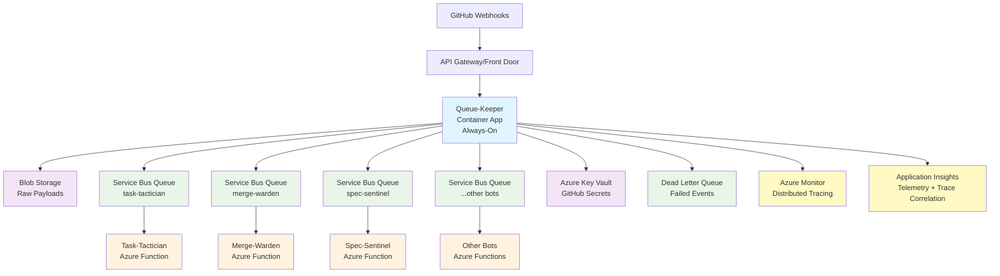

# Queue-Keeper Specification

## Overview

Queue-Keeper is a Rust-based webhook intake and routing service that serves as the central entrypoint for all GitHub webhooks. It validates, normalizes, persists, and routes webhook events to downstream automation bots with guaranteed ordering and reliability.

## System Architecture

## Core Responsibilities

1. **Webhook Validation** - Verify GitHub webhook signatures (HMAC-SHA256)
2. **Event Persistence** - Store raw payloads in Azure Blob Storage for audit/replay
3. **Event Normalization** - Transform GitHub webhooks into standardized event schema
4. **Routing & Distribution** - Send events to configured bot queues with proper ordering
5. **Reliability** - Implement retries, dead letter queues, and replay mechanisms
6. **Observability** - Comprehensive logging, metrics, and alerting

## Performance Requirements

- **Response Time**: < 1 second to GitHub (within 10s timeout limit)
- **Throughput**: Handle webhook bursts from active repositories
- **Availability**: 99.9% uptime with automatic failover
- **Scalability**: Auto-scale based on queue depth and CPU/memory utilization

## Document Structure

This specification is organized into the following sections:

### Architecture

- [Architecture Overview](architecture/
README.md) - High-level system design and component interactions
- [Container Deployment](./architecture/container-deployment.md) - Always-on container architecture vs Function Apps
- [Session Management](./architecture/session-management.md) - Flexible ordering strategies per bot

### Requirements

- [Functional Requirements](./requirements/functional-requirements.md) - Core system capabilities
- [Platform Requirements](./requirements/platform-requirements.md) - Azure service dependencies
- [Performance Requirements](./requirements/performance-requirements.md) - SLA and scalability targets
- [Scalability Requirements](./requirements/scalability-requirements.md) - Burst handling and auto-scaling

### Design

- [Event Schema](./design/event-schema.md) - Normalized event structure and payload format
- [Configuration Management](./design/configuration.md) - Container-based config with flexible ordering control
- [Error Handling](./design/error-handling.md) - Retry policies and failure recovery

### Security

- [Security Model](./security/README.md) - Authentication, authorization, and secret management
- [Rate Limiting](./security/rate-limiting.md) - DDoS protection and abuse prevention

### Operations

- [Deployment](./operations/deployment.md) - Container Apps infrastructure and CI/CD
- [Observability](./operations/observability.md) - Distributed tracing and correlation across bots
- [Monitoring](./operations/monitoring.md) - Alerting, dashboards, and performance tracking
- [Scalability Operations](./operations/scalability.md) - Auto-scaling and load management

### Testing

- [Testing Strategy](./testing/README.md) - Comprehensive unit, integration, and end-to-end testing
- [Performance Testing](./testing/performance-testing.md) - Load testing and capacity planning
- [Chaos Engineering](./testing/chaos-engineering.md) - Resilience testing and failure injection

## Status

**Current Phase**: Initial Specification\
**Target Deployment**: Azure (Primary), AWS (Future Alternative) \
**Implementation Language**: Rust \
**Infrastructure**: Terraform (External Repository)

## Behavioral Assertions

The following assertions define testable behaviors and constraints that must be validated during implementation and testing:

### Webhook Processing Assertions

1. **Signature Validation**: All incoming webhooks MUST be validated using HMAC-SHA256 with the GitHub webhook secret before any processing occurs.

2. **Response Time SLA**: Queue-Keeper MUST respond to GitHub within 1 second for 95% of requests under normal load conditions.

3. **Payload Persistence**: Every valid webhook payload MUST be persisted to blob storage before normalization, ensuring no data loss even if downstream processing fails.

4. **Event ID Uniqueness**: Generated event IDs MUST be globally unique and sortable, preventing duplicate processing across system restarts.

5. **Session ID Consistency**: Events for the same GitHub entity (PR/issue) MUST generate identical session IDs to ensure ordered processing.

### Queue Routing Assertions

6. **One-to-Many Routing**: A single webhook event MUST be successfully delivered to all configured bot queues based on static subscription configuration.

7. **Ordering Guarantee**: Events with identical session IDs MUST be processed sequentially by the same bot instance, while events with different session IDs MAY be processed in parallel.

8. **Routing Atomicity**: Either all configured bot queues receive the event, or the entire operation fails and gets retried.

9. **Dead Letter Handling**: Events that fail delivery after maximum retry attempts MUST be routed to the dead letter queue with failure metadata.

### Error Handling Assertions

10. **Retry Behavior**: Transient failures MUST trigger exponential backoff retry with increasing delays (1s, 2s, 4s, 8s, 16s maximum).

11. **Circuit Breaker**: After 5 consecutive failures to any downstream service, the circuit breaker MUST open and fail fast for 30 seconds.

12. **Graceful Degradation**: If blob storage is unavailable, webhook processing MUST continue but log warnings about missing audit trail.

13. **Invalid Signature Response**: Webhooks with invalid signatures MUST receive HTTP 401 responses without any processing or storage.

### Configuration Assertions

14. **Static Configuration**: Bot subscription configuration MUST be loaded at application startup and remain immutable until restart.

15. **Configuration Validation**: Invalid configuration (duplicate bot names, invalid event types, malformed queue names) MUST prevent application startup with clear error messages.

16. **Secret Caching**: GitHub webhook secrets MUST be cached for maximum 5 minutes to balance performance and security.

### Security Assertions

17. **Secret Rotation**: Webhook secret rotation MUST be supported without system downtime, with new secrets taking effect within 5 minutes.

18. **Audit Logging**: All webhook processing activities MUST generate structured audit logs with correlation IDs for end-to-end tracing.

19. **Rate Limiting**: Repeated authentication failures from the same IP address MUST trigger rate limiting after 10 failures in 5 minutes.

### Performance Assertions

20. **Memory Usage**: Queue-Keeper MUST operate within 512MB memory limit per function instance under normal load.

21. **Concurrent Processing**: System MUST support minimum 1000 concurrent webhook requests without degradation.

22. **Auto-scaling**: Function instances MUST auto-scale based on queue depth (>100 messages) and resource utilization (>80% CPU/memory).

### Data Integrity Assertions

23. **Payload Immutability**: Raw webhook payloads stored in blob storage MUST be immutable and tamper-evident.

24. **Event Schema Validation**: Normalized events MUST conform to the defined schema version and pass validation before queue delivery.

25. **Replay Idempotency**: Replaying the same webhook multiple times MUST produce identical normalized events with the same event ID.

## Edge Cases

### GitHub Behavior Edge Cases

- **Webhook Retries**: GitHub may retry webhook delivery up to 5 times; system MUST handle duplicate deliveries gracefully using event ID deduplication.
- **Large Payloads**: Webhooks approaching 1MB size limit MUST be processed without memory issues or timeouts.
- **Malformed JSON**: Invalid JSON payloads MUST be rejected with HTTP 400 and logged for investigation.
- **Missing Headers**: Webhooks missing required headers (X-GitHub-Event, X-Hub-Signature-256) MUST be rejected with HTTP 400.

### Azure Service Edge Cases

- **Service Bus Throttling**: When Service Bus returns throttling errors (429), Queue-Keeper MUST implement exponential backoff and circuit breaker protection.
- **Key Vault Unavailability**: If Key Vault is temporarily unavailable, cached secrets MUST continue to work until cache expiry.
- **Blob Storage Consistency**: New blob writes MUST be immediately readable for replay scenarios (strong consistency required).
- **Function Cold Start**: Cold start latency MUST NOT exceed 3 seconds and MUST NOT cause webhook timeouts.

### Network and Connectivity Edge Cases

- **Network Partitions**: Partial network failures affecting only some Azure services MUST trigger appropriate circuit breakers without total system failure.
- **DNS Resolution Failures**: DNS issues MUST be handled with retries and fallback mechanisms where possible.
- **TLS Certificate Rotation**: Azure service certificate rotations MUST NOT disrupt Queue-Keeper operations.

## Next Steps

1. Review and approve this specification
2. Implement core webhook validation and normalization logic
3. Set up Azure infrastructure via Terraform
4. Develop bot queue routing and session management
5. Implement comprehensive testing and monitoring
6. Deploy to staging environment for integration testing
