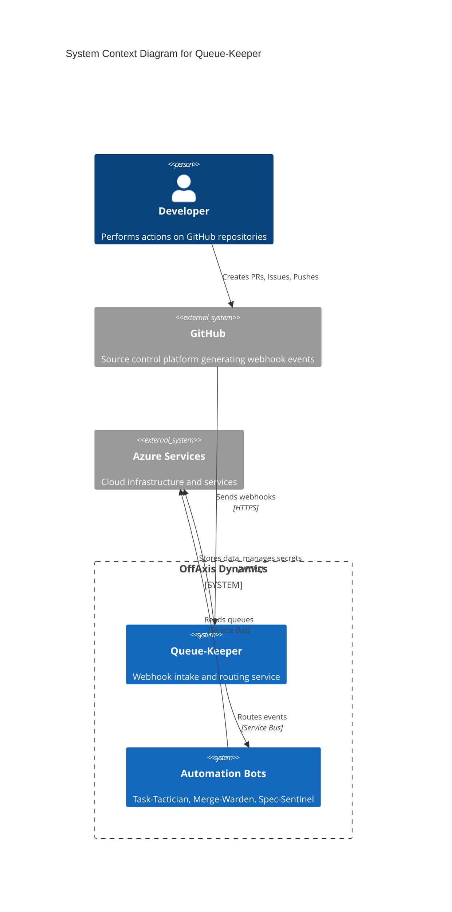
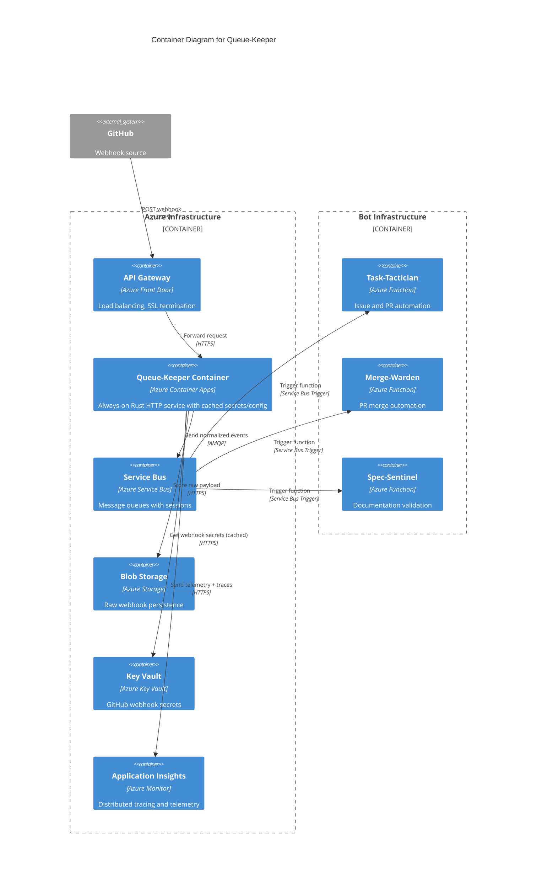
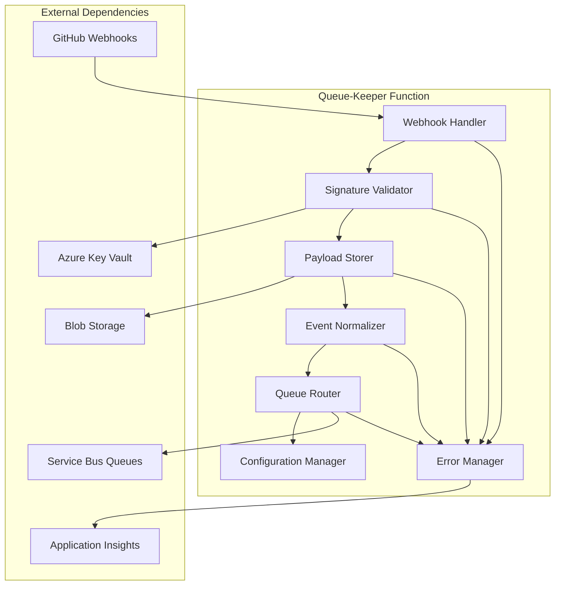
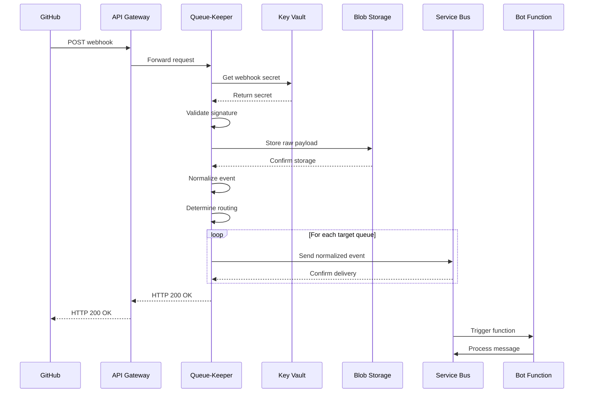
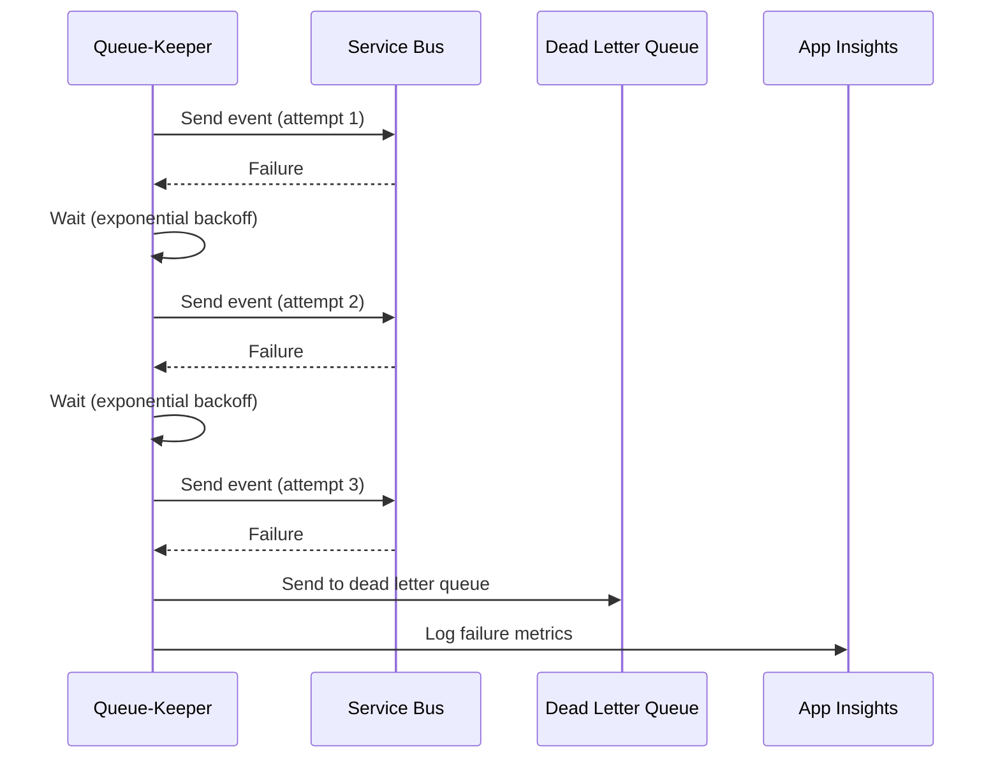
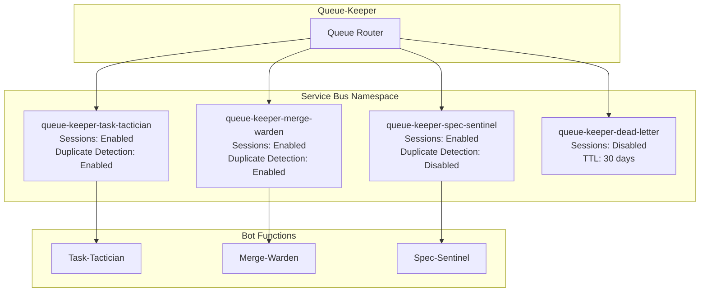
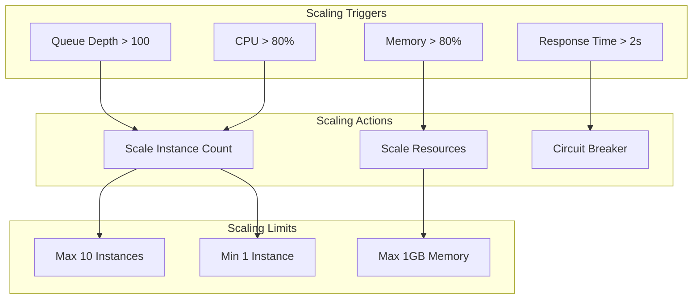
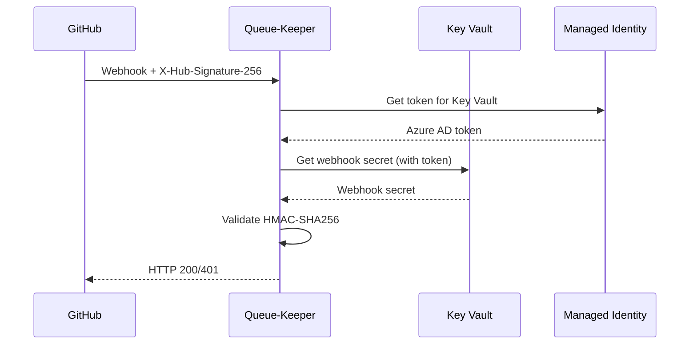
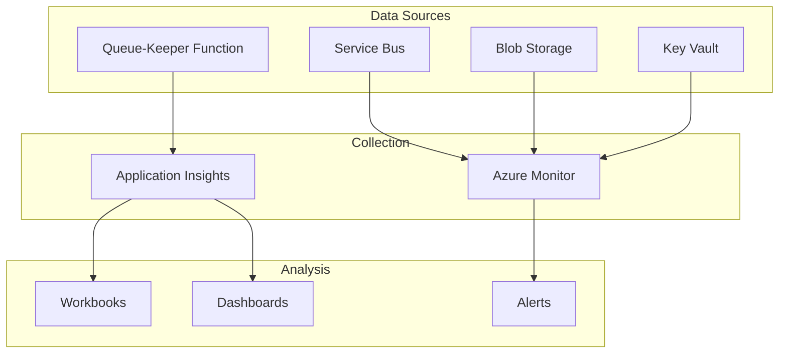

# Architecture Overview

## System Context

Queue-Keeper serves as the central nervous system for OffAxis Dynamics' GitHub automation infrastructure. It acts as a reliable, ordered message broker between GitHub webhooks and downstream automation bots.



## Container Architecture



## Component Architecture

### Core Components



## Component Responsibilities

### Webhook Handler

- **Purpose**: HTTP endpoint for GitHub webhook delivery
- **Responsibilities**:
  - Accept HTTP POST requests from GitHub
  - Extract webhook headers and payload
  - Route to signature validation
  - Return appropriate HTTP responses
  - Handle GitHub retry behavior

### Signature Validator

- **Purpose**: Verify webhook authenticity
- **Responsibilities**:
  - Retrieve GitHub webhook secrets from Key Vault
  - Validate HMAC-SHA256 signatures
  - Cache secrets for performance
  - Log validation failures for security monitoring

### Payload Storer

- **Purpose**: Persist raw webhook data
- **Responsibilities**:
  - Store complete webhook payload to Blob Storage
  - Generate immutable blob paths with timestamps
  - Include metadata (headers, validation status)
  - Support replay scenarios

### Event Normalizer

- **Purpose**: Transform webhooks to standard schema
- **Responsibilities**:
  - Parse GitHub webhook payloads
  - Extract repository, entity, and event information
  - Generate unique event IDs and session IDs
  - Create normalized event objects
  - Handle unknown event types gracefully

### Queue Router

- **Purpose**: Distribute events to bot queues
- **Responsibilities**:
  - Read bot subscription configuration
  - Determine target queues for each event type
  - Send messages to Service Bus with session IDs
  - Handle routing failures and retries
  - Track routing metrics

### Configuration Manager

- **Purpose**: Manage bot subscription configuration
- **Responsibilities**:
  - Load static configuration at startup
  - Validate configuration format and content
  - Provide configuration access to other components
  - Support configuration updates via restart

### Error Manager

- **Purpose**: Handle failures and observability
- **Responsibilities**:
  - Implement retry logic with exponential backoff
  - Route failed events to dead letter queues
  - Generate structured logs and metrics
  - Support manual replay operations

## Data Flow Architecture

### Normal Processing Flow



### Error Handling Flow



## Queue Architecture

### Service Bus Topology



### Session Management Strategy

**Session ID Pattern**: `{repo_owner}/{repo_name}/{entity_type}/{entity_id}`

**Benefits**:

- Guarantees ordered processing per entity
- Enables parallel processing of different entities
- Prevents concurrent processing of same entity
- Supports bot scaling without ordering violations

**Configuration**:

- Session timeout: 5 minutes (auto-complete if bot doesn't acknowledge)
- Max concurrent sessions per queue: 100
- Duplicate detection window: 10 minutes

## Scalability Architecture

### Auto-Scaling Strategy



### Performance Characteristics

| Metric | Target | Monitoring |
|--------|--------|------------|
| Response Time | < 1s (95th percentile) | Application Insights |
| Throughput | 1000 req/min sustained | Service Bus metrics |
| Error Rate | < 0.1% | Application Insights |
| Queue Depth | < 100 messages | Service Bus metrics |
| Memory Usage | < 512MB per instance | Azure Monitor |
| CPU Usage | < 80% per instance | Azure Monitor |

## Security Architecture

### Authentication Flow



### Security Boundaries

1. **Network Security**: API Gateway with DDoS protection
2. **Application Security**: Signature validation, input sanitization
3. **Data Security**: Encryption at rest and in transit
4. **Identity Security**: Managed Identity for service-to-service auth
5. **Secret Security**: Key Vault with access policies and rotation

## Deployment Architecture

### Infrastructure Components

```yaml
# High-level Terraform resources (managed externally)
resource_groups:
  - queue-keeper-prod
  - queue-keeper-staging

azure_functions:
  - name: queue-keeper-prod
    runtime: custom (Rust)
    plan: Premium (EP1)

service_bus:
  - namespace: offaxis-automation-prod
    queues: [task-tactician, merge-warden, spec-sentinel, dead-letter]

storage_accounts:
  - name: queuekeeperblobs
    containers: [webhooks, dead-letters]

key_vault:
  - name: queue-keeper-secrets
    secrets: [github-webhook-secret]
```

### Deployment Pipeline

1. **Build**: Rust compilation with cargo
2. **Test**: Unit and integration tests
3. **Package**: Create container image for Azure Container Apps
4. **Deploy**: Blue-green deployment with health checks
5. **Verify**: Smoke tests and monitoring validation

## Monitoring Architecture

### Observability Stack



### Key Metrics

- **Business Metrics**: Events processed, routing success rate, processing latency
- **Technical Metrics**: Function invocations, memory usage, error rates
- **Infrastructure Metrics**: Service Bus queue depth, blob storage usage
- **Security Metrics**: Signature validation failures, unauthorized requests

## Disaster Recovery Architecture

### Backup Strategy

- **Configuration**: Source control (Git)
- **Secrets**: Key Vault with soft delete enabled
- **Data**: Blob storage with geo-redundancy
- **Queues**: Service Bus geo-disaster recovery pairing

### Recovery Procedures

- **RTO**: 5 minutes for automated failover
- **RPO**: 0 (no data loss acceptable)
- **Runbooks**: Automated recovery scripts and manual procedures
- **Testing**: Monthly disaster recovery drills
