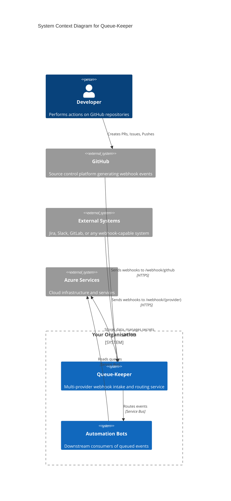
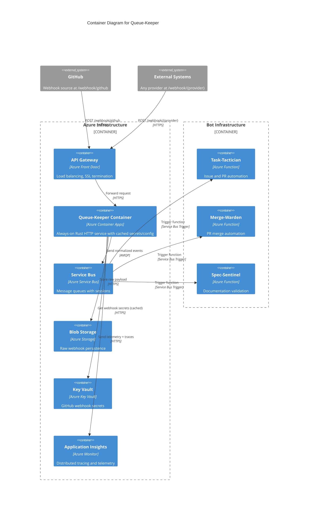
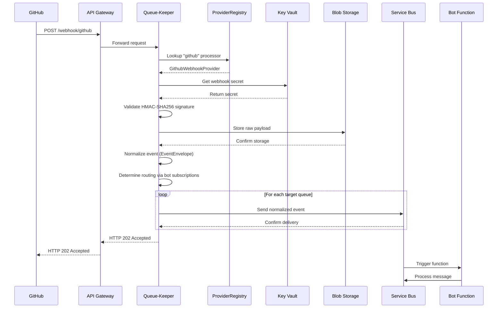
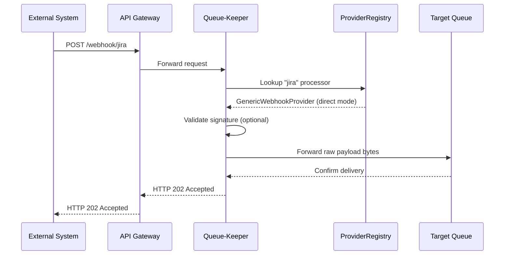
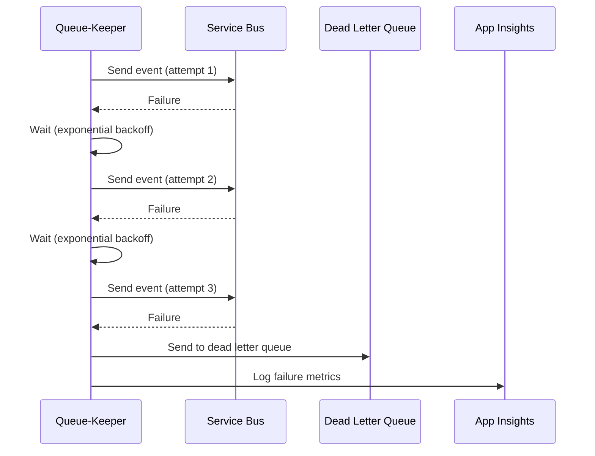
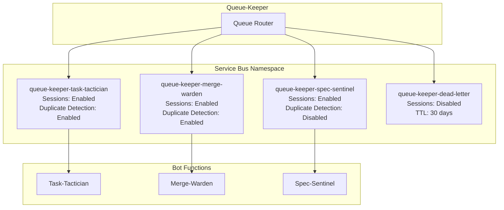
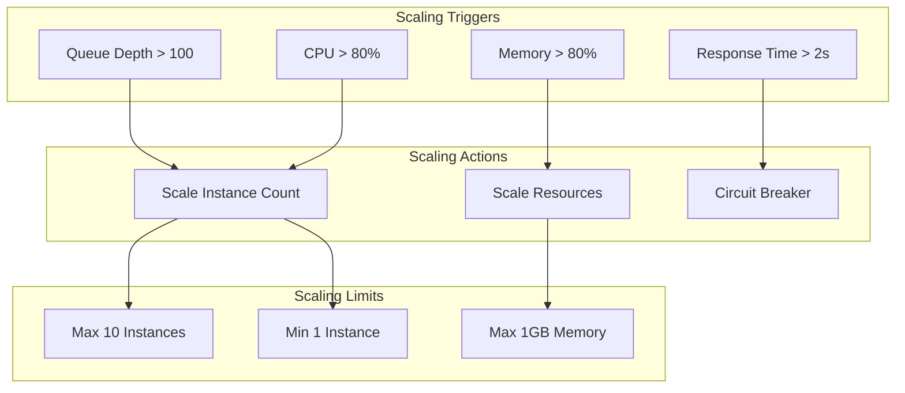
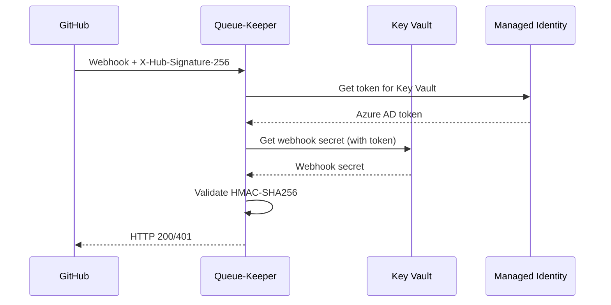
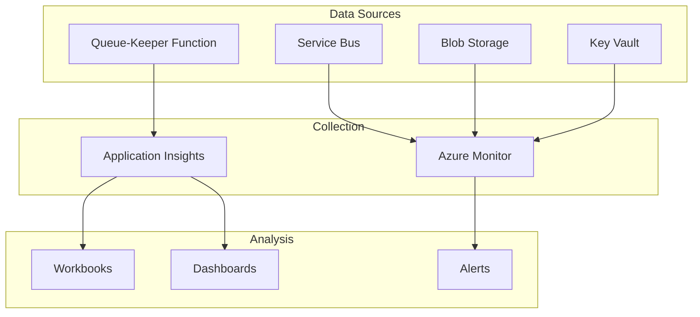

# Architecture Overview

## System Context

Queue-Keeper is a standalone, reliable message broker between **multiple webhook sources** (GitHub and any other HTTP webhook provider) and downstream automation bots.


```mermaid
C4Context
    title System Context Diagram for Queue-Keeper

    Person(dev, "Developer", "Performs actions on GitHub repositories")
    System_Ext(github, "GitHub", "Source control platform generating webhook events")
    System_Ext(external, "External Systems", "Jira, Slack, GitLab, or any webhook-capable system")

    System_Boundary(boundary, "Your Organisation") {
        System(qk, "Queue-Keeper", "Multi-provider webhook intake and routing service")
        System(bots, "Automation Bots", "Downstream consumers of queued events")
    }

    System_Ext(azure, "Azure Services", "Cloud infrastructure and services")

    Rel(dev, github, "Creates PRs, Issues, Pushes")
    Rel(github, qk, "Sends webhooks to /webhook/github", "HTTPS")
    Rel(external, qk, "Sends webhooks to /webhook/{provider}", "HTTPS")
    Rel(qk, bots, "Routes events", "Service Bus")
    Rel(qk, azure, "Stores data, manages secrets", "HTTPS")
    Rel(bots, azure, "Reads queues", "Service Bus")
```

## Multi-Provider Architecture

Queue-Keeper supports webhooks from multiple sources through a provider abstraction layer.
Each provider registers at its own URL path (`POST /webhook/{provider}`) and is processed
by an independent handler. This allows new webhook sources to be added without modifying
existing providers.

### Provider Types

| Provider Type | Description | Configuration |
|---------------|-------------|---------------|
| **GitHub Provider** | Built-in handler for GitHub webhooks with full event normalization into `EventEnvelope` | `providers:` list in service config |
| **Generic Direct Provider** | Forwards raw payload bytes to a configured Azure Service Bus queue without transformation | `generic_providers:` with `processing_mode: direct` |
| **Generic Wrap Provider** | Parses JSON payload, extracts fields via JSON paths, and produces a `WrappedEvent` for standard bot routing | `generic_providers:` with `processing_mode: wrap` |

### URL Routing Strategy

All incoming webhooks arrive at `POST /webhook/{provider}`:

- The `{provider}` segment is a URL-safe ASCII identifier (`[a-z0-9\-_]+`).
- The `ProviderRegistry` maps provider IDs to `WebhookProcessor` implementations.
- Unknown provider IDs return `404 Not Found` immediately, before any processing.
- The GitHub provider is always registered at `/webhook/github`.

See [ADR-0001](../../docs/adr/ADR-0001-provider-routing-strategy.md) for the routing strategy decision and
[ADR-0002](../../docs/adr/ADR-0002-generic-provider-abstraction.md) for the generic provider abstraction decision.

## Container Architecture


```mermaid
C4Container
    title Container Diagram for Queue-Keeper

    System_Ext(github, "GitHub", "Webhook source at /webhook/github")
    System_Ext(external, "External Systems", "Any provider at /webhook/{provider}")

    Container_Boundary(azure_infra, "Azure Infrastructure") {
        Container(apim, "API Gateway", "Azure Front Door", "Load balancing, SSL termination")
        Container(app, "Queue-Keeper Container", "Azure Container Apps", "Always-on Rust HTTP service with cached secrets/config")
        Container(sb, "Service Bus", "Azure Service Bus", "Message queues with sessions")
        Container(blob, "Blob Storage", "Azure Storage", "Raw webhook persistence")
        Container(kv, "Key Vault", "Azure Key Vault", "GitHub webhook secrets")
        Container(insights, "Application Insights", "Azure Monitor", "Distributed tracing and telemetry")
    }

    Container_Boundary(bot_infra, "Bot Infrastructure") {
        Container(bot1, "Task-Tactician", "Azure Function", "Issue and PR automation")
        Container(bot2, "Merge-Warden", "Azure Function", "PR merge automation")
        Container(bot3, "Spec-Sentinel", "Azure Function", "Documentation validation")
    }

    Rel(github, apim, "POST /webhook/github", "HTTPS")
    Rel(external, apim, "POST /webhook/{provider}", "HTTPS")
    Rel(apim, app, "Forward request", "HTTPS")
    Rel(app, blob, "Store raw payload", "HTTPS")
    Rel(app, kv, "Get webhook secrets (cached)", "HTTPS")
    Rel(app, sb, "Send normalized events", "AMQP")
    Rel(app, insights, "Send telemetry + traces", "HTTPS")

    Rel(sb, bot1, "Trigger function", "Service Bus Trigger")
    Rel(sb, bot2, "Trigger function", "Service Bus Trigger")
    Rel(sb, bot3, "Trigger function", "Service Bus Trigger")
```

## Component Architecture

### Core Components

```mermaid
graph TB
    subgraph "Queue-Keeper Service"
        WH[Webhook Handler<br/>POST /webhook/{provider}]
        PR[Provider Registry<br/>ProviderRegistry]
        GP[GitHub Provider<br/>GithubWebhookProvider]
        GN[Generic Provider<br/>GenericWebhookProvider]
        SV[Signature Validator]
        PS[Payload Storer]
        EN[Event Normalizer]
        QR[Queue Router]
        CM[Configuration Manager]
        EM[Error Manager]
    end

    subgraph "External Dependencies"
        GH[GitHub Webhooks]
        EXT[Other Providers]
        KV[Azure Key Vault]
        BS[Blob Storage]
        SB[Service Bus Queues]
        AI[Application Insights]
    end

    GH --> WH
    EXT --> WH
    WH --> PR
    PR --> GP
    PR --> GN
    GP --> SV
    GN --> SV
    SV --> KV
    SV --> PS
    PS --> BS
    PS --> EN
    EN --> QR
    QR --> CM
    QR --> SB

    WH --> EM
    SV --> EM
    PS --> EM
    EN --> EM
    QR --> EM
    EM --> AI
```

    QR --> EM
    EM --> AI

```

## Component Responsibilities

### Webhook Handler

- **Purpose**: HTTP endpoint for webhook delivery from any configured provider
- **Responsibilities**:
  - Accept `POST /webhook/{provider}` requests
  - Extract the provider identifier from the URL path
  - Dispatch to the correct `WebhookProcessor` via the `ProviderRegistry`
  - Return `404 Not Found` for unknown provider IDs
  - Return appropriate HTTP responses (202, 400, 401, 500)
  - Handle GitHub retry behavior

### Provider Registry

- **Purpose**: Map provider identifiers to `WebhookProcessor` implementations
- **Responsibilities**:
  - Hold a `HashMap<ProviderId, Arc<dyn WebhookProcessor>>` built at startup
  - Validate provider IDs against the `[a-z0-9\-_]+` character set
  - Ensure provider IDs are unique across `providers` and `generic_providers` lists
  - Always register the GitHub provider at `"github"` regardless of configuration

### GitHub Provider (`GithubWebhookProvider`)

- **Purpose**: Process GitHub-specific webhook payloads
- **Responsibilities**:
  - Validate `X-GitHub-Event` and `X-GitHub-Delivery` headers
  - Perform HMAC-SHA256 signature validation using the configured secret
  - Normalize the GitHub payload into a standard `EventEnvelope`
  - Extract entity information (`Issue`, `PullRequest`, `Repository`, etc.)

### Generic Provider (`GenericWebhookProvider`)

- **Purpose**: Configuration-driven processing for non-GitHub webhook sources
- **Responsibilities**:
  - Support **direct mode**: forward raw payload bytes to a configured queue
  - Support **wrap mode**: extract fields via JSON paths and produce a `WrappedEvent`
  - Perform optional HMAC-SHA256 or bearer-token signature validation
  - Read event type, delivery ID, and entity fields from configurable sources (header, JSON path, static value, auto-generated)

### Signature Validator

- **Purpose**: Verify webhook authenticity
- **Responsibilities**:
  - Retrieve GitHub webhook secrets from Key Vault
  - Validate HMAC-SHA256 signatures
  - Cache secrets for performance
  - Log validation failures for security monitoring

### Payload Storer

- **Purpose**: Persist raw webhook data
- **Responsibilities**:
  - Store complete webhook payload to Blob Storage
  - Generate immutable blob paths with timestamps
  - Include metadata (headers, validation status)
  - Support replay scenarios

### Event Normalizer

- **Purpose**: Transform webhooks to standard schema
- **Responsibilities**:
  - Parse GitHub webhook payloads
  - Extract repository, entity, and event information
  - Generate unique event IDs and session IDs
  - Create normalized event objects
  - Handle unknown event types gracefully

### Queue Router

- **Purpose**: Distribute events to bot queues
- **Responsibilities**:
  - Read bot subscription configuration
  - Determine target queues for each event type
  - Send messages to Service Bus with session IDs
  - Handle routing failures and retries
  - Track routing metrics

### Configuration Manager

- **Purpose**: Manage bot subscription configuration
- **Responsibilities**:
  - Load static configuration at startup
  - Validate configuration format and content
  - Provide configuration access to other components
  - Support configuration updates via restart

### Error Manager

- **Purpose**: Handle failures and observability
- **Responsibilities**:
  - Implement retry logic with exponential backoff
  - Route failed events to dead letter queues
  - Generate structured logs and metrics
  - Support manual replay operations

## Data Flow Architecture

### Normal Processing Flow (GitHub Provider)


```mermaid
sequenceDiagram
    participant GH as GitHub
    participant AG as API Gateway
    participant QK as Queue-Keeper
    participant PR as ProviderRegistry
    participant KV as Key Vault
    participant BS as Blob Storage
    participant SB as Service Bus
    participant BOT as Bot Function

    GH->>AG: POST /webhook/github
    AG->>QK: Forward request

    QK->>PR: Lookup "github" processor
    PR-->>QK: GithubWebhookProvider
    QK->>KV: Get webhook secret
    KV-->>QK: Return secret
    QK->>QK: Validate HMAC-SHA256 signature

    QK->>BS: Store raw payload
    BS-->>QK: Confirm storage

    QK->>QK: Normalize event (EventEnvelope)
    QK->>QK: Determine routing via bot subscriptions

    loop For each target queue
        QK->>SB: Send normalized event
        SB-->>QK: Confirm delivery
    end

    QK-->>AG: HTTP 202 Accepted
    AG-->>GH: HTTP 202 Accepted

    SB->>BOT: Trigger function
    BOT->>SB: Process message
```

### Normal Processing Flow (Generic Direct Provider)


```mermaid
sequenceDiagram
    participant EXT as External System
    participant AG as API Gateway
    participant QK as Queue-Keeper
    participant PR as ProviderRegistry
    participant SB as Target Queue

    EXT->>AG: POST /webhook/jira
    AG->>QK: Forward request

    QK->>PR: Lookup "jira" processor
    PR-->>QK: GenericWebhookProvider (direct mode)
    QK->>QK: Validate signature (optional)

    QK->>SB: Forward raw payload bytes
    SB-->>QK: Confirm delivery

    QK-->>AG: HTTP 202 Accepted
    AG-->>EXT: HTTP 202 Accepted
```

### Error Handling Flow


```mermaid
sequenceDiagram
    participant QK as Queue-Keeper
    participant SB as Service Bus
    participant DLQ as Dead Letter Queue
    participant AI as App Insights

    QK->>SB: Send event (attempt 1)
    SB-->>QK: Failure

    QK->>QK: Wait (exponential backoff)
    QK->>SB: Send event (attempt 2)
    SB-->>QK: Failure

    QK->>QK: Wait (exponential backoff)
    QK->>SB: Send event (attempt 3)
    SB-->>QK: Failure

    QK->>DLQ: Send to dead letter queue
    QK->>AI: Log failure metrics
```

## Queue Architecture

### Service Bus Topology


```mermaid
graph TB
    subgraph "Service Bus Namespace"
        Q1[queue-keeper-task-tactician<br/>Sessions: Enabled<br/>Duplicate Detection: Enabled]
        Q2[queue-keeper-merge-warden<br/>Sessions: Enabled<br/>Duplicate Detection: Enabled]
        Q3[queue-keeper-spec-sentinel<br/>Sessions: Enabled<br/>Duplicate Detection: Disabled]
        DLQ[queue-keeper-dead-letter<br/>Sessions: Disabled<br/>TTL: 30 days]
    end

    subgraph "Queue-Keeper"
        QR[Queue Router]
    end

    subgraph "Bot Functions"
        B1[Task-Tactician]
        B2[Merge-Warden]
        B3[Spec-Sentinel]
    end

    QR --> Q1
    QR --> Q2
    QR --> Q3
    QR --> DLQ

    Q1 --> B1
    Q2 --> B2
    Q3 --> B3
```

### Session Management Strategy

**Session ID Pattern**: `{repo_owner}/{repo_name}/{entity_type}/{entity_id}`

**Benefits**:

- Guarantees ordered processing per entity
- Enables parallel processing of different entities
- Prevents concurrent processing of same entity
- Supports bot scaling without ordering violations

**Configuration**:

- Session timeout: 5 minutes (auto-complete if bot doesn't acknowledge)
- Max concurrent sessions per queue: 100
- Duplicate detection window: 10 minutes

## Scalability Architecture

### Auto-Scaling Strategy


```mermaid
graph TB
    subgraph "Scaling Triggers"
        QD[Queue Depth > 100]
        CPU[CPU > 80%]
        MEM[Memory > 80%]
        LAT[Response Time > 2s]
    end

    subgraph "Scaling Actions"
        SI[Scale Instance Count]
        SR[Scale Resources]
        CB[Circuit Breaker]
    end

    subgraph "Scaling Limits"
        MAX[Max 10 Instances]
        MIN[Min 1 Instance]
        RES[Max 1GB Memory]
    end

    QD --> SI
    CPU --> SI
    MEM --> SR
    LAT --> CB

    SI --> MAX
    SI --> MIN
    SR --> RES
```

### Performance Characteristics

| Metric | Target | Monitoring |
|--------|--------|------------|
| Response Time | < 1s (95th percentile) | Application Insights |
| Throughput | 1000 req/min sustained | Service Bus metrics |
| Error Rate | < 0.1% | Application Insights |
| Queue Depth | < 100 messages | Service Bus metrics |
| Memory Usage | < 512MB per instance | Azure Monitor |
| CPU Usage | < 80% per instance | Azure Monitor |

## Security Architecture

### Authentication Flow


```mermaid
sequenceDiagram
    participant GH as GitHub
    participant QK as Queue-Keeper
    participant KV as Key Vault
    participant MSI as Managed Identity

    GH->>QK: Webhook + X-Hub-Signature-256
    QK->>MSI: Get token for Key Vault
    MSI-->>QK: Azure AD token
    QK->>KV: Get webhook secret (with token)
    KV-->>QK: Webhook secret
    QK->>QK: Validate HMAC-SHA256
    QK-->>GH: HTTP 200/401
```

### Security Boundaries

1. **Network Security**: API Gateway with DDoS protection
2. **Application Security**: Signature validation, input sanitization
3. **Data Security**: Encryption at rest and in transit
4. **Identity Security**: Managed Identity for service-to-service auth
5. **Secret Security**: Key Vault with access policies and rotation

## Deployment Architecture

### Infrastructure Components

```yaml
# High-level Terraform resources (managed externally)
resource_groups:
  - queue-keeper-prod
  - queue-keeper-staging

azure_functions:
  - name: queue-keeper-prod
    runtime: custom (Rust)
    plan: Premium (EP1)

service_bus:
  - namespace: your-servicebus-namespace
    queues: [queue-keeper-bot-a, queue-keeper-bot-b, queue-keeper-dead-letter]

storage_accounts:
  - name: queuekeeperblobs
    containers: [webhooks, dead-letters]

key_vault:
  - name: queue-keeper-secrets
    secrets: [github-webhook-secret]
```

### Deployment Pipeline

1. **Build**: Rust compilation with cargo
2. **Test**: Unit and integration tests
3. **Package**: Create container image for Azure Container Apps
4. **Deploy**: Blue-green deployment with health checks
5. **Verify**: Smoke tests and monitoring validation

## Monitoring Architecture

### Observability Stack


```mermaid
graph TB
    subgraph "Data Sources"
        QK[Queue-Keeper Function]
        SB[Service Bus]
        BS[Blob Storage]
        KV[Key Vault]
    end

    subgraph "Collection"
        AI[Application Insights]
        AM[Azure Monitor]
    end

    subgraph "Analysis"
        WB[Workbooks]
        AL[Alerts]
        DB[Dashboards]
    end

    QK --> AI
    SB --> AM
    BS --> AM
    KV --> AM

    AI --> WB
    AM --> AL
    AI --> DB
```

### Key Metrics

- **Business Metrics**: Events processed, routing success rate, processing latency
- **Technical Metrics**: Function invocations, memory usage, error rates
- **Infrastructure Metrics**: Service Bus queue depth, blob storage usage
- **Security Metrics**: Signature validation failures, unauthorized requests

## Disaster Recovery Architecture

### Backup Strategy

- **Configuration**: Source control (Git)
- **Secrets**: Key Vault with soft delete enabled
- **Data**: Blob storage with geo-redundancy
- **Queues**: Service Bus geo-disaster recovery pairing

### Recovery Procedures

- **RTO**: 5 minutes for automated failover
- **RPO**: 0 (no data loss acceptable)
- **Runbooks**: Automated recovery scripts and manual procedures
- **Testing**: Monthly disaster recovery drills
