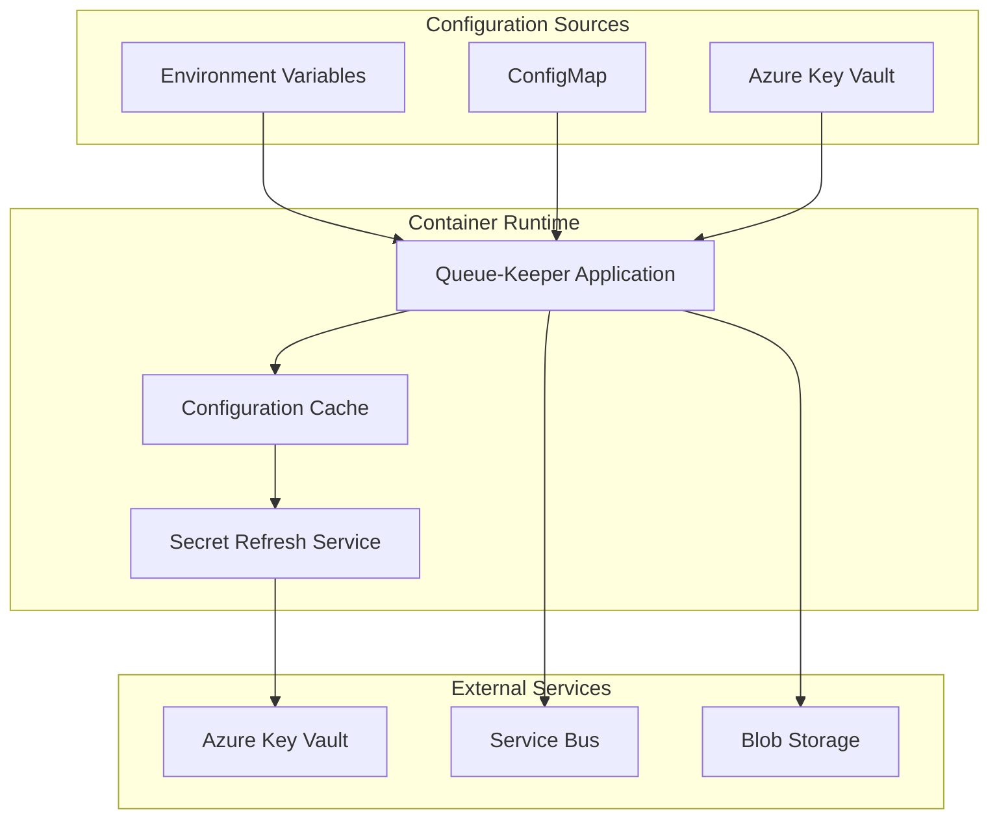

# Container Deployment Strategy

## Overview

Queue-Keeper uses Azure Container Apps as the deployment target, providing an always-on container architecture that offers superior performance, predictable scaling, and simplified configuration management compared to Azure Functions.

## Architecture Decision: Container Apps vs Azure Functions

### Decision Matrix

| Criteria | Azure Functions | Azure Container Apps | Winner | Rationale |
|----------|----------------|---------------------|---------|-----------|
| **Cold Start Latency** | 1-5 seconds | 0 seconds (always-on) | Container Apps | Webhook SLA requires <1s response |
| **Concurrent Requests** | 200 per instance | 1000+ per replica | Container Apps | Higher webhook throughput needed |
| **Configuration Management** | Environment variables + files | ConfigMap + secrets | Container Apps | Better separation of concerns |
| **Secret Caching** | Manual with expiry | Built-in with refresh | Container Apps | Automatic secret rotation support |
| **Scaling Granularity** | Instance-based | Replica-based | Container Apps | More predictable resource usage |
| **Development Experience** | Function-specific tooling | Standard container tooling | Tie | Both well-supported |
| **Cost (Steady State)** | Pay-per-execution | Pay-per-replica-hour | Functions | Container Apps cost more at low volume |
| **Cost (High Volume)** | Per-execution + compute | Predictable replica cost | Container Apps | More cost-effective at scale |
| **Observability** | Built-in App Insights | Manual OpenTelemetry setup | Functions | Functions have better defaults |

### **Decision: Azure Container Apps**

**Primary Rationales:**

1. **SLA Compliance**: Webhook processing SLA of <1 second requires elimination of cold start latency
2. **Predictable Performance**: Always-on containers provide consistent response times
3. **Configuration Flexibility**: Better support for complex configuration and secret management
4. **Scaling Characteristics**: More predictable scaling behavior for webhook burst scenarios

**Trade-offs Accepted:**

- **Higher Baseline Cost**: Minimum 1 replica running 24/7 vs zero cost when idle
- **Complexity**: Manual OpenTelemetry configuration vs built-in Functions observability
- **Less Azure-Native**: Functions integrate more deeply with Azure services

### Alternative Considered: Hybrid Approach

**Hybrid Functions + Always-On**: Functions with Always Ready instances was considered but rejected due to:

- Limited always-ready instance count (max 20)
- Still subject to Function runtime overhead
- More complex configuration than pure Container Apps approach
- No significant cost savings over Container Apps at target scale

## Container Architecture

### Container Design

```dockerfile
# Multi-stage build optimized for production
FROM rust:1.90-slim as builder
WORKDIR /app
COPY . .
RUN cargo build --release --target x86_64-unknown-linux-gnu

FROM debian:bullseye-slim
RUN apt-get update && apt-get install -y \
    ca-certificates \
    && rm -rf /var/lib/apt/lists/*

# Create non-root user for security
RUN useradd --create-home --shell /bin/bash queuekeeper
USER queuekeeper
WORKDIR /home/queuekeeper

COPY --from=builder /app/target/x86_64-unknown-linux-gnu/release/queue-keeper ./
COPY --from=builder /app/config ./config

EXPOSE 8080
HEALTHCHECK --interval=30s --timeout=3s --start-period=5s --retries=3 \
  CMD curl -f http://localhost:8080/health || exit 1

ENTRYPOINT ["./queue-keeper"]
```

### Resource Configuration

**Container Specifications:**

```yaml
resources:
  requests:
    cpu: 250m      # 0.25 vCPU baseline
    memory: 256Mi  # 256MB baseline
  limits:
    cpu: 1000m     # 1 vCPU burst capacity
    memory: 512Mi  # 512MB maximum (per assertions)

replicas:
  min: 1          # Always-on requirement
  max: 10         # Cost control and Service Bus limits
```

**Scaling Configuration:**

```yaml
scale:
  rules:
    - name: "http-scaling"
      type: "http"
      metadata:
        concurrentRequests: "100"  # Scale at 100 concurrent requests

    - name: "cpu-scaling"
      type: "cpu"
      metadata:
        value: "80"               # Scale at 80% CPU utilization

    - name: "memory-scaling"
      type: "memory"
      metadata:
        value: "80"               # Scale at 80% memory utilization

behavior:
  scaleUp:
    stabilizationWindowSeconds: 60    # Wait 1 minute before scaling up
    policies:
      - type: "Pods"
        value: 2                     # Add max 2 replicas at once
        periodSeconds: 60

  scaleDown:
    stabilizationWindowSeconds: 300   # Wait 5 minutes before scaling down
    policies:
      - type: "Pods"
        value: 1                     # Remove max 1 replica at once
        periodSeconds: 300
```

## Configuration Management Strategy

### Configuration Architecture



### Configuration Loading Strategy

**Startup Configuration:**

1. **Environment Variables**: Basic runtime settings (log level, port, environment)
2. **ConfigMap**: Bot subscription configuration and routing rules
3. **Key Vault Integration**: GitHub webhook secrets and service connection strings
4. **Validation**: Complete configuration validation before accepting traffic

**Runtime Configuration:**

- **Static Configuration**: Bot subscriptions remain immutable until restart
- **Secret Refresh**: Automatic secret renewal every 5 minutes
- **Health Monitoring**: Configuration health checks in readiness probe

### Configuration Schema

```yaml
# Container environment variables
environment:
  QUEUE_KEEPER_LOG_LEVEL: "info"
  QUEUE_KEEPER_PORT: "8080"
  QUEUE_KEEPER_ENVIRONMENT: "production"
  AZURE_CLIENT_ID: "${managed-identity-client-id}"

# ConfigMap: bot-subscriptions.yaml
bots:
  - name: "task-tactician"
    queue: "queue-keeper-task-tactician"
    events: ["issues.opened", "issues.closed", "issues.labeled"]
    ordering_scope: "entity"
    max_concurrent_sessions: 50

  - name: "merge-warden"
    queue: "queue-keeper-merge-warden"
    events: ["pull_request.opened", "pull_request.synchronize", "pull_request.closed"]
    ordering_scope: "entity"
    max_concurrent_sessions: 100

  - name: "spec-sentinel"
    queue: "queue-keeper-spec-sentinel"
    events: ["push", "pull_request.opened"]
    ordering_scope: "none"
    max_concurrent_sessions: 200

# Key Vault secrets (accessed via Managed Identity)
secrets:
  - name: "github-webhook-secret"
    vault: "queue-keeper-kv"
    version: "latest"
  - name: "servicebus-connection-string"
    vault: "queue-keeper-kv"
    version: "latest"
```

## Deployment Pipeline

### Build and Deploy Strategy

**CI/CD Pipeline Stages:**

```yaml
stages:
  - build:
      steps:
        - cargo_check: "cargo check --all-targets --all-features"
        - cargo_test: "cargo test --workspace --all-features"
        - cargo_clippy: "cargo clippy -- -D warnings"
        - cargo_fmt: "cargo fmt -- --check"

  - security:
      steps:
        - cargo_audit: "cargo audit"
        - container_scan: "trivy image scan"
        - secret_scan: "detect-secrets scan"

  - package:
      steps:
        - docker_build: "docker build -t queue-keeper:${BUILD_ID} ."
        - container_push: "docker push ${REGISTRY}/queue-keeper:${BUILD_ID}"

  - deploy:
      environments: ["staging", "production"]
      strategy: "blue-green"
      steps:
        - deploy_container: "az containerapp update"
        - health_check: "wait for /health endpoint"
        - traffic_shift: "gradual traffic migration"
        - smoke_tests: "validate core functionality"
```

### Blue-Green Deployment

**Deployment Strategy:**

1. **Green Deployment**: Deploy new container version alongside existing (blue)
2. **Health Validation**: Verify green environment health and configuration
3. **Traffic Shift**: Gradually shift traffic from blue to green (10% → 50% → 100%)
4. **Monitoring**: Monitor error rates and response times during shift
5. **Rollback**: Automatic rollback if error rate exceeds 0.5% or latency > 2s
6. **Cleanup**: Remove blue environment after successful deployment

**Traffic Shifting Configuration:**

```yaml
revisions:
  activeRevisionsMode: "multiple"

traffic:
  - revisionName: "queue-keeper-v1"
    weight: 90
  - revisionName: "queue-keeper-v2"
    weight: 10

# Automated traffic shifting
trafficShifting:
  enabled: true
  intervals:
    - weight: 10
      duration: "5m"
    - weight: 50
      duration: "10m"
    - weight: 100
      duration: "steady-state"

  rollbackTriggers:
    - metric: "error_rate"
      threshold: 0.005    # 0.5%
    - metric: "p95_latency"
      threshold: "2000ms"
```

## Operational Characteristics

### Performance Characteristics

**Resource Utilization Targets:**

- **CPU**: < 60% average, < 80% p95 under normal load
- **Memory**: < 60% average, < 80% p95 under normal load
- **Network**: < 100 Mbps average, 1 Gbps burst capacity
- **Storage**: Minimal (configuration only, no persistent data)

**Scaling Behavior:**

- **Scale-Out Trigger**: 100 concurrent requests OR 80% CPU/memory
- **Scale-Up Time**: 30-60 seconds for new replica availability
- **Scale-Down Delay**: 5 minutes stabilization period
- **Maximum Replicas**: 10 (cost control and Service Bus session limits)

### High Availability Design

**Multi-Replica Strategy:**

- **Minimum 2 Replicas**: Ensure availability during rolling updates
- **Anti-Affinity**: Distribute replicas across availability zones
- **Health Checks**: Aggressive health monitoring for fast failure detection
- **Circuit Breakers**: Automatic traffic isolation for unhealthy replicas

**Failure Recovery:**

```yaml
healthCheck:
  liveness:
    httpGet:
      path: "/health"
      port: 8080
    initialDelaySeconds: 10
    periodSeconds: 30
    timeoutSeconds: 5
    failureThreshold: 3

  readiness:
    httpGet:
      path: "/ready"
      port: 8080
    initialDelaySeconds: 5
    periodSeconds: 10
    timeoutSeconds: 3
    failureThreshold: 2
```

### Cost Optimization

**Cost Structure Analysis:**

```yaml
cost_analysis:
  baseline_cost:
    replicas: 1
    cpu: "250m"
    memory: "256Mi"
    monthly_cost: "$15-25 USD"

  scale_out_cost:
    max_replicas: 10
    peak_monthly_cost: "$150-250 USD"
    typical_monthly_cost: "$30-50 USD"

  comparison_functions:
    low_volume: "Functions cheaper"
    medium_volume: "Container Apps competitive"
    high_volume: "Container Apps significantly cheaper"
```

**Cost Controls:**

- **Replica Limits**: Maximum 10 replicas to prevent cost runaway
- **Resource Limits**: CPU and memory caps prevent resource overconsumption
- **Auto-scaling**: Aggressive scale-down to minimize idle resource costs
- **Reserved Capacity**: Consider reserved instances for predictable workloads

## Security Considerations

### Container Security

**Security Hardening:**

- **Non-Root User**: Application runs as unprivileged user
- **Minimal Base Image**: Debian slim with only necessary packages
- **No Shell Access**: Production containers don't include shell or debugging tools
- **Read-Only Filesystem**: Application files mounted read-only where possible

**Secret Management:**

```yaml
secrets:
  volume_mounts:
    - name: "github-secrets"
      mount_path: "/etc/secrets/github"
      read_only: true
      source: "azure-keyvault"

managed_identity:
  enabled: true
  client_id: "${queue-keeper-identity}"

key_vault_access:
  secrets: ["get", "list"]
  permissions: "minimal-required"
```

### Network Security

**Network Isolation:**

- **Private Endpoints**: Service Bus and Storage accessed via private endpoints
- **VNet Integration**: Container Apps integrated with dedicated subnet
- **Network Policies**: Restrict egress to only required services
- **TLS Everywhere**: All communications encrypted in transit

This container-based deployment strategy provides the performance, scalability, and operational characteristics required for Queue-Keeper's webhook processing SLA while maintaining cost-effectiveness and security.
