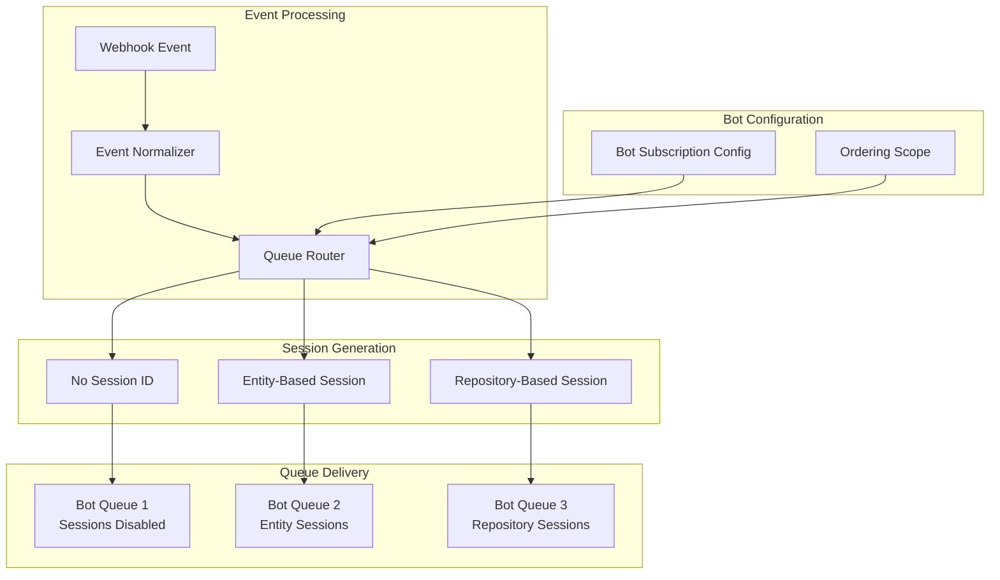

# Session Management Strategy

## Overview

Queue-Keeper implements flexible session-based ordering that allows per-bot configuration of ordering requirements. This enables optimal performance by applying ordering only where needed while maintaining strong consistency guarantees for bots that require sequential processing.

## Session Architecture

### Session ID Strategy

Session IDs provide the foundation for ordered message processing in Azure Service Bus. The session ID determines which messages must be processed sequentially by the same consumer instance.



### Ordering Scope Options

#### None (Unordered Processing)

**Use Case**: Stateless bots that don't require ordered processing

- **Examples**: Notification bots, metric collectors, audit loggers
- **Session ID**: No session ID assigned (null/empty)
- **Performance**: Maximum throughput and parallel processing
- **Scaling**: Can scale to any number of consumer instances

```yaml
bot_config:
  name: "notification-bot"
  ordering_scope: "none"
  # No session limits needed
```

**Message Flow**:

```
Event A → Queue → Consumer Instance 1
Event B → Queue → Consumer Instance 2  # Parallel processing
Event C → Queue → Consumer Instance 3
```

#### Entity-Level Ordering

**Use Case**: Bots that track state changes for individual PRs, issues, or other entities

- **Examples**: Task management bots, PR workflow automation, issue lifecycle tracking
- **Session ID Pattern**: `{owner}/{repo}/{entity_type}/{entity_id}`
- **Performance**: Parallel processing across different entities, sequential within entity
- **Scaling**: Limited by number of active entities per repository

```yaml
bot_config:
  name: "task-tactician"
  ordering_scope: "entity"
  max_concurrent_sessions: 50
```

**Session ID Examples**:

- `microsoft/vscode/pull_request/1234` - PR #1234 in microsoft/vscode
- `octocat/hello-world/issue/567` - Issue #567 in octocat/hello-world
- `github/docs/pull_request/789` - PR #789 in github/docs

**Message Flow**:

```
PR #123 Event A → Session: repo/pull_request/123 → Consumer 1
PR #123 Event B → Session: repo/pull_request/123 → Consumer 1 (same)
PR #456 Event C → Session: repo/pull_request/456 → Consumer 2 (parallel)
```

#### Repository-Level Ordering

**Use Case**: Bots that coordinate repository-wide state or deployments

- **Examples**: Deployment orchestration, repository configuration management, branch protection
- **Session ID Pattern**: `{owner}/{repo}/repository`
- **Performance**: All repository events processed sequentially
- **Scaling**: One active session per repository maximum

```yaml
bot_config:
  name: "deploy-coordinator"
  ordering_scope: "repository"
  max_concurrent_sessions: 10  # Max 10 repositories processed concurrently
```

**Session ID Examples**:

- `microsoft/vscode/repository` - All events for microsoft/vscode repository
- `octocat/hello-world/repository` - All events for octocat/hello-world repository

**Message Flow**:

```
microsoft/vscode Push    → Session: microsoft/vscode/repository → Consumer 1
microsoft/vscode PR      → Session: microsoft/vscode/repository → Consumer 1 (queued)
octocat/hello-world Push → Session: octocat/hello-world/repository → Consumer 2 (parallel)
```

## Session ID Generation Rules

### Entity Type Mapping

| GitHub Event | Entity Type | Session Pattern | Example Session ID |
|--------------|-------------|-----------------|-------------------|
| `pull_request.*` | `pull_request` | `{owner}/{repo}/pull_request/{number}` | `microsoft/vscode/pull_request/1234` |
| `pull_request_review.*` | `pull_request` | `{owner}/{repo}/pull_request/{number}` | `microsoft/vscode/pull_request/1234` |
| `pull_request_review_comment.*` | `pull_request` | `{owner}/{repo}/pull_request/{number}` | `microsoft/vscode/pull_request/1234` |
| `issues.*` | `issue` | `{owner}/{repo}/issue/{number}` | `octocat/hello-world/issue/567` |
| `issue_comment.*` | `issue` | `{owner}/{repo}/issue/{number}` | `octocat/hello-world/issue/567` |
| `push` | `repository` | `{owner}/{repo}/repository` | `github/docs/repository` |
| `release.*` | `repository` | `{owner}/{repo}/repository` | `github/cli/repository` |
| `create` | `repository` | `{owner}/{repo}/repository` | `myorg/myrepo/repository` |
| `delete` | `repository` | `{owner}/{repo}/repository` | `myorg/myrepo/repository` |
| `check_run.*` | `check_run` | `{owner}/{repo}/check_run/{id}` | `myorg/myrepo/check_run/12345` |
| `check_suite.*` | `check_suite` | `{owner}/{repo}/check_suite/{id}` | `myorg/myrepo/check_suite/67890` |

### Session ID Generation Algorithm

```rust
pub fn generate_session_id(
    event: &GitHubEvent,
    ordering_scope: OrderingScope,
) -> Option<String> {
    match ordering_scope {
        OrderingScope::None => None,

        OrderingScope::Entity => {
            let entity_info = extract_entity_info(event)?;
            Some(format!(
                "{}/{}/{}/{}",
                event.repository.owner.login,
                event.repository.name,
                entity_info.entity_type,
                entity_info.entity_id
            ))
        }

        OrderingScope::Repository => {
            Some(format!(
                "{}/{}/repository",
                event.repository.owner.login,
                event.repository.name
            ))
        }
    }
}

fn extract_entity_info(event: &GitHubEvent) -> Option<EntityInfo> {
    match event.event_type.as_str() {
        "pull_request" | "pull_request_review" | "pull_request_review_comment" => {
            event.pull_request.as_ref().map(|pr| EntityInfo {
                entity_type: "pull_request".to_string(),
                entity_id: pr.number.to_string(),
            })
        }

        "issues" | "issue_comment" => {
            event.issue.as_ref().map(|issue| EntityInfo {
                entity_type: "issue".to_string(),
                entity_id: issue.number.to_string(),
            })
        }

        "push" | "release" | "create" | "delete" => {
            Some(EntityInfo {
                entity_type: "repository".to_string(),
                entity_id: "repository".to_string(),
            })
        }

        "check_run" => {
            event.check_run.as_ref().map(|check| EntityInfo {
                entity_type: "check_run".to_string(),
                entity_id: check.id.to_string(),
            })
        }

        "check_suite" => {
            event.check_suite.as_ref().map(|suite| EntityInfo {
                entity_type: "check_suite".to_string(),
                entity_id: suite.id.to_string(),
            })
        }

        _ => None, // Unknown event types don't get sessions
    }
}
```

## Session Lifecycle Management

### Session Creation and Initialization

**Session Initiation**:

1. **Event Arrives**: GitHub webhook processed and normalized
2. **Bot Matching**: Determine which bots should receive the event
3. **Session Generation**: Generate session ID based on bot's ordering scope
4. **Queue Routing**: Send message to bot queue with appropriate session ID

**Session Properties**:

```rust
pub struct SessionContext {
    pub session_id: String,
    pub timeout: Duration,           // Default: 5 minutes
    pub max_delivery_count: u32,     // Default: 5 attempts
    pub created_at: DateTime<Utc>,
    pub last_activity: DateTime<Utc>,
}
```

### Session Timeout and Cleanup

**Timeout Behavior**:

- **Session Timeout**: 5 minutes of inactivity (configurable per bot)
- **Automatic Completion**: Sessions auto-complete if no activity within timeout
- **Message Unlocking**: Timed-out sessions release locked messages back to queue
- **New Session Creation**: Next message for same session ID starts new session

**Timeout Configuration**:

```yaml
bot_config:
  name: "task-tactician"
  ordering_scope: "entity"
  session_timeout: "5m"      # ISO 8601 duration
  max_concurrent_sessions: 50

  # Advanced timeout settings
  session_idle_timeout: "2m"     # Idle timeout (no message processing)
  session_max_duration: "30m"    # Maximum session lifetime
```

**Session Cleanup Process**:

1. **Idle Detection**: No message processing activity for idle timeout period
2. **Graceful Completion**: Allow current message to complete processing
3. **Session Close**: Mark session as complete and release resources
4. **Metrics Update**: Record session duration and message count for monitoring

### Concurrent Session Limits

**Purpose**: Prevent resource exhaustion and maintain predictable performance

**Configuration Strategy**:

```yaml
session_limits:
  # Per-bot session limits
  task_tactician:
    max_concurrent_sessions: 50    # Max 50 PRs/issues being processed
    queue_depth_threshold: 100     # Scale up if queue depth exceeds 100

  merge_warden:
    max_concurrent_sessions: 100   # Higher limit for PR processing
    queue_depth_threshold: 200

  deploy_coordinator:
    max_concurrent_sessions: 10    # Repository-level sessions are expensive
    queue_depth_threshold: 20
```

**Backpressure Handling**:

- **Session Limit Reached**: New sessions wait in queue until active session completes
- **Priority Handling**: No priority system - strictly FIFO within session ID
- **Monitoring**: Track session utilization and queue depth for capacity planning

## Performance Characteristics

### Throughput Analysis

**Unordered Processing (ordering_scope: none)**:

- **Theoretical Max**: Limited only by consumer instance count and processing speed
- **Typical Performance**: 1000+ messages/second per consumer instance
- **Bottlenecks**: Message processing time, network latency, downstream services

**Entity-Ordered Processing (ordering_scope: entity)**:

- **Concurrency**: Limited by number of unique entities (PRs, issues) being processed
- **Typical Performance**: 50-200 concurrent entities × processing rate per entity
- **Bottlenecks**: Session overhead, number of active entities, session timeout handling

**Repository-Ordered Processing (ordering_scope: repository)**:

- **Concurrency**: Maximum 1 active session per repository
- **Performance**: Single-threaded processing per repository
- **Bottlenecks**: Repository activity level, message processing time

### Session Overhead Analysis

**Memory Overhead per Session**:

- **Session Context**: ~200 bytes (session ID, timestamps, counters)
- **Message Buffer**: ~1KB average (depends on GitHub payload size)
- **Total per Session**: ~1.2KB baseline + payload size

**Processing Overhead**:

- **Session Creation**: ~1ms (session ID generation, context setup)
- **Session Lookup**: ~0.1ms (hash table lookup for existing sessions)
- **Session Cleanup**: ~0.5ms (resource cleanup, metrics recording)

## Service Bus Integration

### Queue Configuration Requirements

**Session-Enabled Queues**:

```yaml
service_bus_queues:
  queue_keeper_task_tactician:
    sessions_enabled: true
    duplicate_detection_enabled: true
    duplicate_detection_window: "PT10M"  # 10 minutes
    default_message_ttl: "PT24H"         # 24 hours
    max_size_in_megabytes: 5120          # 5GB

  queue_keeper_notification_bot:
    sessions_enabled: false              # No ordering needed
    duplicate_detection_enabled: true
    duplicate_detection_window: "PT10M"
    default_message_ttl: "PT24H"
    max_size_in_megabytes: 1024          # 1GB
```

### Message Properties Integration

**Session Message Properties**:

```rust
// Set Service Bus message properties for session-based routing
pub fn set_message_properties(
    message: &mut ServiceBusMessage,
    event: &NormalizedEvent,
    session_id: Option<&str>,
) {
    // Core routing properties
    message.properties.insert("event_type", event.event_type.event.clone());
    message.properties.insert("repository", event.repository.full_name.clone());
    message.properties.insert("entity_type", event.entity.entity_type.to_string());

    // Session handling
    if let Some(session_id) = session_id {
        message.session_id = Some(session_id.to_string());
        message.properties.insert("session_scope", "ordered");
    } else {
        message.properties.insert("session_scope", "unordered");
    }

    // Tracing context
    message.properties.insert("trace_id", event.trace_context.trace_id.clone());
    message.properties.insert("correlation_id", event.event_id.clone());

    // Timing information
    message.properties.insert("processed_at", event.processed_at.to_rfc3339());
    message.properties.insert("github_delivery_id", event.delivery_id.clone());
}
```

## Error Handling and Recovery

### Session-Level Error Handling

**Session Failure Scenarios**:

1. **Message Processing Failure**: Individual message fails but session continues
2. **Session Timeout**: Session exceeds timeout limit and gets terminated
3. **Consumer Instance Failure**: Instance crashes during session processing
4. **Service Bus Connectivity Loss**: Temporary network partition

**Recovery Strategies**:

```rust
pub enum SessionRecoveryAction {
    RetryMessage {
        attempt_count: u32,
        backoff_delay: Duration,
    },

    CompleteSession {
        reason: String,
        preserve_order: bool,
    },

    TransferSession {
        target_consumer: Option<String>,
        timeout: Duration,
    },

    DeadLetterMessage {
        reason: String,
        preserve_session: bool,
    },
}
```

### Dead Letter Queue Handling

**Session-Aware Dead Letter Processing**:

- **Preserve Session Context**: Dead letter messages retain original session ID
- **Replay Capability**: Dead letter messages can be replayed to original session
- **Order Preservation**: Dead letter replay maintains original message ordering
- **Session Reconstruction**: Replay can reconstruct partial session state

## Monitoring and Observability

### Session Metrics

**Key Performance Indicators**:

```yaml
session_metrics:
  active_sessions:
    description: "Number of currently active sessions per bot"
    labels: ["bot_name", "ordering_scope"]

  session_duration:
    description: "Session lifetime from creation to completion"
    labels: ["bot_name", "session_outcome"]
    buckets: [1, 5, 10, 30, 60, 300, 1800] # seconds

  session_message_count:
    description: "Number of messages processed per session"
    labels: ["bot_name", "entity_type"]
    buckets: [1, 2, 5, 10, 20, 50, 100]

  session_timeout_rate:
    description: "Rate of sessions timing out vs completing normally"
    labels: ["bot_name", "timeout_reason"]

  concurrent_session_utilization:
    description: "Percentage of max_concurrent_sessions currently in use"
    labels: ["bot_name"]
```

### Session Tracing Integration

**Distributed Tracing Enhancement**:

```rust
// Session spans in distributed tracing
pub fn create_session_span(
    session_id: &str,
    bot_name: &str,
    ordering_scope: OrderingScope,
) -> Span {
    span!(
        Level::INFO,
        "session_lifecycle",
        session.id = %session_id,
        bot.name = %bot_name,
        ordering.scope = %ordering_scope,
        session.start_time = %Utc::now(),
    )
}

// Message processing spans within session context
pub fn process_message_in_session(
    session_span: &Span,
    message: &ServiceBusMessage,
) -> Span {
    session_span.in_scope(|| {
        span!(
            Level::INFO,
            "message_processing",
            message.id = %message.message_id,
            message.delivery_count = message.delivery_count,
            processing.start_time = %Utc::now(),
        )
    })
}
```

This session management strategy provides the flexibility needed to optimize performance for different bot types while maintaining strong ordering guarantees where required. The per-bot configuration allows teams to choose the appropriate ordering scope based on their specific requirements and performance needs.
