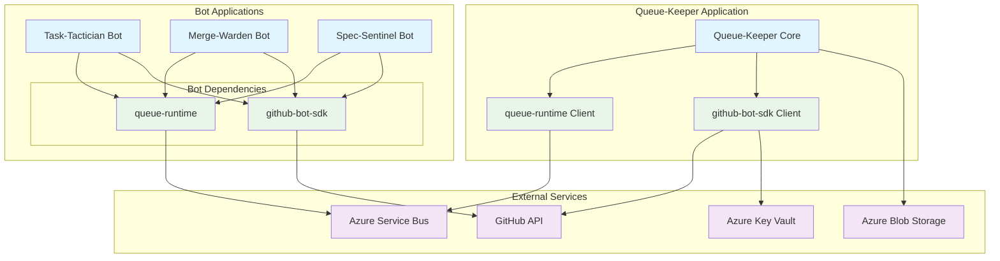
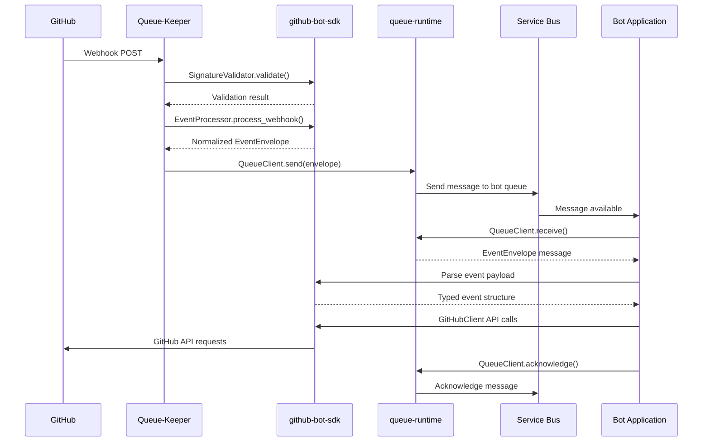

# Library Integration

This document explains how the `queue-runtime` and `github-bot-sdk` libraries integrate into the Queue-Keeper application and the broader bot ecosystem.

## System Architecture Overview



## Queue-Keeper Integration Pattern

### Library Usage in Queue-Keeper

Queue-Keeper uses both libraries for different aspects of webhook processing:

#### GitHub-Bot-SDK Integration

```rust
// Queue-Keeper uses github-bot-sdk for:
use github_bot_sdk::{
    events::{EventProcessor, SignatureValidator},
    auth::GitHubAppAuth,
    client::GitHubClient,
};

// 1. Webhook signature validation
let validator = SignatureValidator::new(secret_provider);
validator.validate(payload, signature, &repository).await?;

// 2. Event normalization (GitHub webhook → EventEnvelope)
let processor = EventProcessor::new(config);
let envelope = processor.process_webhook(event_type, payload, delivery_id).await?;

// 3. Optional: GitHub API calls for webhook registration/management
let auth = GitHubAppAuth::new(app_id, private_key).await?;
let client = GitHubClient::new(auth);
```

#### Queue-Runtime Integration

```rust
// Queue-Keeper uses queue-runtime for:
use queue_runtime::{
    QueueClient, AzureServiceBusClient, EventEnvelope,
    SendOptions, QueueConfig,
};

// 1. Sending normalized events to bot queues
let client = AzureServiceBusClient::new(config).await?;
let options = SendOptions {
    session_id: envelope.session_id.clone(),
    correlation_id: Some(envelope.event_id.to_string()),
    ..Default::default()
};

// 2. Routing to multiple bot queues
for bot_queue in &target_queues {
    client.send(bot_queue, &envelope, options.clone()).await?;
}
```

### Integration Architecture within Queue-Keeper

```rust
// Queue-Keeper application structure
pub struct QueueKeeper {
    // GitHub integration
    signature_validator: SignatureValidator,
    event_processor: EventProcessor,
    github_client: Option<GitHubClient>,

    // Queue integration
    queue_client: Arc<dyn QueueClient>,
    routing_config: RoutingConfig,

    // Storage and monitoring
    blob_storage: BlobStorageClient,
    telemetry: TelemetryClient,
}

impl QueueKeeper {
    pub async fn process_webhook(
        &self,
        headers: &HeaderMap,
        payload: &[u8],
    ) -> Result<(), ProcessingError> {
        // 1. Validate using github-bot-sdk
        let signature = headers.get("x-hub-signature-256")
            .ok_or(ProcessingError::MissingSignature)?;
        self.signature_validator
            .validate(payload, signature, &repository)
            .await?;

        // 2. Store raw payload
        self.blob_storage.store_payload(&payload).await?;

        // 3. Normalize using github-bot-sdk
        let event_type = headers.get("x-github-event")
            .ok_or(ProcessingError::MissingEventType)?;
        let envelope = self.event_processor
            .process_webhook(event_type, payload, delivery_id)
            .await?;

        // 4. Route using queue-runtime
        let target_queues = self.routing_config
            .get_target_queues(&envelope.event_type);

        for queue_name in target_queues {
            let options = SendOptions {
                session_id: envelope.session_id.clone(),
                correlation_id: Some(envelope.event_id.to_string()),
                ..Default::default()
            };

            self.queue_client
                .send(queue_name, &envelope, options)
                .await?;
        }

        Ok(())
    }
}
```

## Bot Application Integration Pattern

### Standard Bot Architecture

Each bot application follows a common pattern using both libraries:

```rust
// Standard bot main.rs structure
use queue_runtime::{QueueClient, AzureServiceBusClient, ReceiveOptions};
use github_bot_sdk::{auth::GitHubAppAuth, client::GitHubClient, events::EventEnvelope};

#[tokio::main]
async fn main() -> Result<(), Box<dyn std::error::Error>> {
    // 1. Initialize GitHub authentication
    let github_auth = GitHubAppAuth::builder()
        .app_id(std::env::var("GITHUB_APP_ID")?.parse()?)
        .private_key_from_env("GITHUB_PRIVATE_KEY")?
        .build()
        .await?;

    let github_client = GitHubClient::new(github_auth);

    // 2. Initialize queue client
    let queue_config = QueueConfig::from_env()?;
    let queue_client = AzureServiceBusClient::new(queue_config).await?;

    // 3. Initialize bot-specific logic
    let bot = TaskTacticianBot::new(github_client);

    // 4. Start processing loop
    let queue_name = "queue-keeper-task-tactician";

    loop {
        // Receive events from Queue-Keeper
        let messages = queue_client.receive(queue_name, ReceiveOptions {
            max_messages: Some(10),
            timeout: Some(Duration::from_secs(30)),
            accept_session: true,
            ..Default::default()
        }).await?;

        for received in messages {
            // Process event with bot logic
            match bot.process_event(&received.message).await {
                Ok(_) => {
                    queue_client.acknowledge(received.receipt).await?;
                }
                Err(e) => handle_processing_error(e, received, &queue_client).await?,
            }
        }
    }
}

async fn handle_processing_error(
    error: ProcessingError,
    received: ReceivedMessage<EventEnvelope, impl MessageReceipt>,
    queue_client: &impl QueueClient,
) -> Result<(), Box<dyn std::error::Error>> {
    match error {
        ProcessingError::Transient(_) if received.delivery_count < 3 => {
            // Retry with exponential backoff
            let delay = Duration::from_secs(2_u64.pow(received.delivery_count));
            queue_client.requeue(received.receipt, Some(delay)).await?;
        }
        _ => {
            // Send to dead letter queue
            queue_client.reject(received.receipt, &error.to_string()).await?;
        }
    }
    Ok(())
}
```

### Bot Processing Pattern

```rust
pub struct TaskTacticianBot {
    github_client: GitHubClient,
}

impl TaskTacticianBot {
    pub async fn process_event(
        &self,
        envelope: &EventEnvelope,
    ) -> Result<(), ProcessingError> {
        // 1. Parse event using github-bot-sdk event types
        match envelope.event_type.as_str() {
            "pull_request" => {
                let pr_event = envelope.payload.parse_pull_request()?;
                self.handle_pull_request(pr_event).await?;
            }
            "issues" => {
                let issue_event = envelope.payload.parse_issue()?;
                self.handle_issue(issue_event).await?;
            }
            _ => {
                // Ignore unknown event types
                info!("Ignoring event type: {}", envelope.event_type);
            }
        }

        Ok(())
    }

    async fn handle_pull_request(
        &self,
        event: PullRequestEvent,
    ) -> Result<(), ProcessingError> {
        // 2. Use github-bot-sdk client for GitHub API operations
        let installation = self.github_client
            .installation(&event.repository)
            .await?;

        match event.action {
            PullRequestAction::Opened => {
                // Create task tracking comment
                installation.issues().create_comment(
                    &event.repository.owner,
                    &event.repository.name,
                    event.number,
                    "🤖 Task-Tactician is tracking this PR",
                ).await?;
            }
            PullRequestAction::Closed => {
                // Update task status
                installation.issues().create_comment(
                    &event.repository.owner,
                    &event.repository.name,
                    event.number,
                    "✅ Task completed!",
                ).await?;
            }
            _ => {}
        }

        Ok(())
    }
}
```

## Library Interaction Patterns

### Event Flow Between Libraries



### Shared Type Definitions

Both libraries share common types through the `EventEnvelope` structure:

```rust
// Defined in github-bot-sdk, used by queue-runtime
#[derive(Debug, Clone, Serialize, Deserialize)]
pub struct EventEnvelope {
    pub event_id: EventId,
    pub event_type: String,
    pub repository: Repository,
    pub entity_type: EntityType,
    pub entity_id: Option<String>,
    pub session_id: Option<String>,
    pub payload: EventPayload,
    pub metadata: EventMetadata,
    pub trace_context: Option<TraceContext>,
}

// queue-runtime implements QueueMessage for EventEnvelope
impl QueueMessage for EventEnvelope {
    fn message_id(&self) -> &str { &self.event_id.0 }
    fn session_id(&self) -> Option<&str> { self.session_id.as_deref() }
    fn correlation_id(&self) -> Option<&str> {
        self.trace_context.as_ref().map(|tc| &tc.trace_id)
    }
    fn content_type(&self) -> &str { "application/json" }
    fn body(&self) -> &[u8] { /* serialized JSON */ }
    // ... other trait methods
}
```

## Configuration Integration

### Shared Configuration Patterns

Both applications and libraries follow consistent configuration patterns:

```rust
// Queue-Keeper configuration
#[derive(Debug, Clone)]
pub struct QueueKeeperConfig {
    // GitHub integration config
    pub github: GitHubConfig,

    // Queue integration config
    pub queue: QueueConfig,

    // Application-specific config
    pub routing: RoutingConfig,
    pub storage: StorageConfig,
}

// Bot configuration
#[derive(Debug, Clone)]
pub struct BotConfig {
    // GitHub integration config (reused)
    pub github: GitHubConfig,

    // Queue integration config (reused)
    pub queue: QueueConfig,

    // Bot-specific config
    pub processing: ProcessingConfig,
}

impl QueueKeeperConfig {
    pub fn from_env() -> Result<Self, ConfigError> {
        Ok(Self {
            github: GitHubConfig::from_env()?,
            queue: QueueConfig::from_env()?,
            routing: RoutingConfig::from_env()?,
            storage: StorageConfig::from_env()?,
        })
    }
}
```

## Error Handling Integration

### Consistent Error Propagation

```rust
// Unified error handling across the system
#[derive(Debug, thiserror::Error)]
pub enum SystemError {
    #[error("GitHub API error: {0}")]
    GitHub(#[from] github_bot_sdk::Error),

    #[error("Queue operation error: {0}")]
    Queue(#[from] queue_runtime::QueueError),

    #[error("Application error: {0}")]
    Application(#[from] ApplicationError),
}

// Error classification for retry decisions
impl SystemError {
    pub fn is_transient(&self) -> bool {
        match self {
            SystemError::GitHub(e) => e.is_transient(),
            SystemError::Queue(e) => e.is_transient(),
            SystemError::Application(e) => e.is_transient(),
        }
    }
}
```

## Testing Integration

### Shared Testing Utilities

```rust
// Integration test setup using both libraries
#[cfg(test)]
mod integration_tests {
    use github_bot_sdk::testing::{MockGitHubClient, sample_pull_request_event};
    use queue_runtime::testing::InMemoryQueueClient;

    #[tokio::test]
    async fn test_end_to_end_webhook_processing() {
        // Setup mock services
        let mock_github = MockGitHubClient::new();
        let mock_queue = InMemoryQueueClient::new();

        // Create Queue-Keeper with mocks
        let queue_keeper = QueueKeeper::new(mock_github, mock_queue);

        // Generate test webhook
        let webhook = sample_pull_request_event();
        let payload = serde_json::to_vec(&webhook)?;

        // Process webhook
        queue_keeper.process_webhook(&headers, &payload).await?;

        // Verify queue delivery
        let messages = mock_queue.get_sent_messages("task-tactician").await?;
        assert_eq!(messages.len(), 1);
        assert_eq!(messages[0].event_type, "pull_request");
    }
}
```

## Deployment Integration

### Container Deployment Pattern

```dockerfile
# Queue-Keeper Dockerfile
FROM rust:1.70 as builder

# Build with both library dependencies
COPY Cargo.toml Cargo.lock ./
COPY src/ ./src/
RUN cargo build --release

FROM debian:bookworm-slim
COPY --from=builder /app/target/release/queue-keeper /usr/local/bin/
EXPOSE 8080
CMD ["queue-keeper"]
```

```dockerfile
# Bot Dockerfile template
FROM rust:1.70 as builder

# Build with both library dependencies
COPY Cargo.toml Cargo.lock ./
COPY src/ ./src/
RUN cargo build --release

FROM debian:bookworm-slim
COPY --from=builder /app/target/release/task-tactician-bot /usr/local/bin/
CMD ["task-tactician-bot"]
```

## Monitoring Integration

### Unified Observability

```rust
// Shared telemetry integration
use tracing::{info, error, warn};
use opentelemetry::trace::TraceContextExt;

// Both libraries emit compatible telemetry
impl QueueKeeper {
    #[tracing::instrument(skip(self, payload))]
    pub async fn process_webhook(&self, payload: &[u8]) -> Result<(), ProcessingError> {
        let span = tracing::Span::current();

        // Libraries propagate trace context
        let envelope = self.event_processor
            .process_webhook_with_context(payload, span.context())
            .await?;

        self.queue_client
            .send_with_context(&envelope, span.context())
            .await?;

        info!(
            event_id = %envelope.event_id,
            event_type = %envelope.event_type,
            "Webhook processed successfully"
        );

        Ok(())
    }
}
```

This integration architecture ensures that:

1. **Queue-Keeper** acts as the central webhook processor using both libraries
2. **Bot applications** follow consistent patterns for queue consumption and GitHub API usage
3. **Shared types** enable seamless data flow between components
4. **Configuration patterns** are consistent across all applications
5. **Error handling** is unified and supports proper retry/failure decisions
6. **Testing** can be done end-to-end with mock implementations
7. **Observability** provides consistent tracing across the entire system

The libraries are designed to work together while maintaining clear separation of concerns and enabling independent testing and development.
