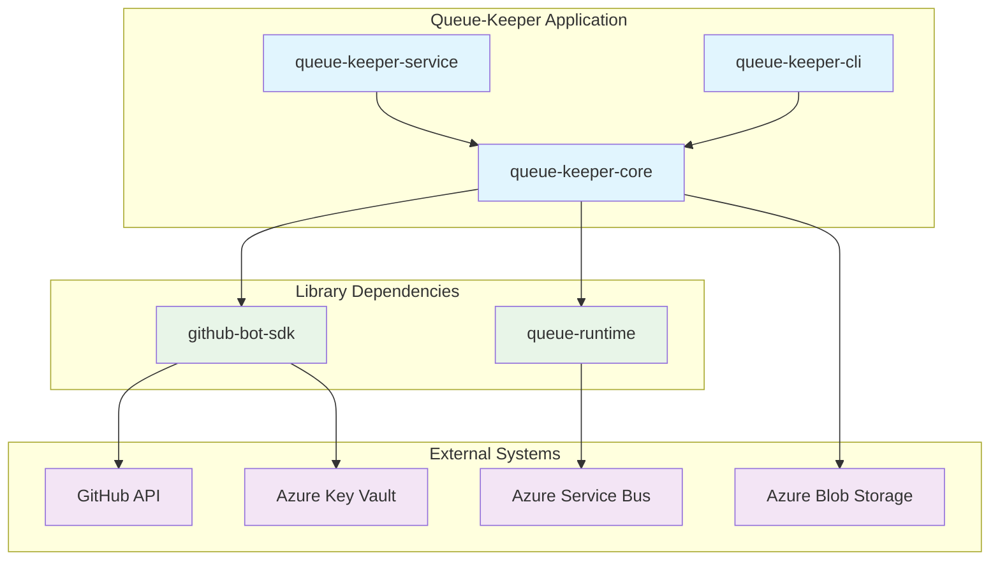

# Queue-Keeper Interface Specifications

This directory contains the complete interface definitions for the Queue-Keeper system, consisting of three main components:

1. **Queue-Keeper Core Application** - Webhook intake and routing service
2. **GitHub Bot SDK Library** - GitHub App integration and webhook processing
3. **Queue Runtime Library** - Provider-agnostic queue abstraction

## Architecture Overview



## Dependency Flow Rules

### Clean Architecture Boundaries

- **Business Logic** (queue-keeper-core) depends only on library interface traits
- **Libraries** (github-bot-sdk, queue-runtime) provide interface abstractions
- **Infrastructure** implementations are provided by libraries but selected at runtime
- **Applications** (service, CLI) compose and configure business logic

### Strict Dependency Rules

```
Applications → Core Business Logic → Library Interfaces → Infrastructure Implementations → External Systems
```

**Never Allowed:**

- Business logic importing infrastructure implementations directly
- Libraries importing each other (github-bot-sdk ↔ queue-runtime)
- Infrastructure details leaking into business logic

## Component Specifications

### Queue-Keeper Core Application

| Specification | Purpose |
|---------------|---------|
| [shared-types.md](shared-types.md) | Common types across all queue-keeper components |
| [webhook-processing.md](webhook-processing.md) | Webhook validation and normalization |
| [event-routing.md](event-routing.md) | Event routing and queue distribution |
| [storage-operations.md](storage-operations.md) | Blob storage for webhook persistence |
| [configuration.md](configuration.md) | Configuration management and validation |
| [error-handling.md](error-handling.md) | Error classification and retry policies |

### GitHub Bot SDK Library

| Specification | Purpose |
|---------------|---------|
| [github-auth.md](github-auth.md) | GitHub App authentication and token management |
| [github-api.md](github-api.md) | GitHub REST API operations and rate limiting |
| [github-events.md](github-events.md) | Webhook event processing and validation |
| [github-types.md](github-types.md) | GitHub-specific domain types and entities |

### Queue Runtime Library

| Specification | Purpose |
|---------------|---------|
| [queue-client.md](queue-client.md) | Provider-agnostic queue operations |
| [queue-sessions.md](queue-sessions.md) | Session management for ordered processing |
| [queue-providers.md](queue-providers.md) | Provider implementations (Azure, AWS) |
| [queue-types.md](queue-types.md) | Queue-specific domain types and errors |

## Interface Design Principles

### Type Safety

- All domain identifiers use newtype patterns (`EventId`, `SessionId`, `UserId`)
- All operations return `Result<T, E>` for error handling
- No raw primitives for domain concepts
- Strict typing prevents invalid states

### Error Handling

- Errors are values, not exceptions
- Transient vs permanent error classification
- Context preservation for debugging
- No sensitive data in error messages

### Async by Default

- All I/O operations are async
- Trait methods use `async fn` where appropriate
- Proper cancellation and timeout support
- Resource cleanup on operation cancellation

### Provider Agnostic

- Queue operations work with Azure Service Bus or AWS SQS
- Authentication works with various secret providers
- Configuration supports multiple deployment environments
- Testing doubles for all external dependencies

## Testing Strategy

### Unit Testing

- Core business logic tested with mock implementations
- Interface traits define testable contracts
- Mock implementations provided for all external dependencies
- Property-based testing for input validation

### Integration Testing

- Real provider implementations tested in integration tests
- Contract tests ensure all implementations behave consistently
- End-to-end testing with real external services
- Performance testing under realistic loads

### Contract Testing

- Interface trait implementations must pass contract tests
- GitHub API integration tested against real API
- Queue provider behavior verified across Azure and AWS
- Configuration loading tested across environments

## Performance Requirements

### Response Time Targets

- Webhook processing: < 1 second (95th percentile)
- Queue operations: < 100ms per operation
- Authentication: < 500ms including token refresh
- Configuration loading: < 50ms after startup

### Throughput Targets

- Webhook intake: 1000 webhooks/minute sustained
- Queue processing: 10,000 messages/minute
- Concurrent sessions: 100 sessions per queue
- Authentication: 1000 tokens/minute refresh rate

### Resource Usage Limits

- Memory: < 512MB per instance under normal load
- CPU: < 80% under sustained load
- Network connections: Proper connection pooling
- File descriptors: Automatic cleanup to prevent leaks

## Security Requirements

### Secret Management

- All secrets stored in secure key management (Azure Key Vault)
- No secrets in logs, error messages, or debug output
- Secret caching with maximum 5-minute TTL
- Automatic secret rotation support

### Input Validation

- All external input validated before processing
- Webhook signature validation using constant-time comparison
- Request size limits to prevent DoS attacks
- JSON parsing with depth limits for security

### Authentication

- GitHub App authentication with JWT signing
- Installation tokens with proper scope limitations
- Managed Identity for Azure service authentication
- TLS required for all external communications

## Observability Requirements

### Structured Logging

- JSON-formatted log entries with correlation IDs
- No PII or sensitive data in logs
- Configurable log levels per component
- Integration with centralized logging systems

### Distributed Tracing

- W3C Trace Context standard compliance
- Trace propagation across all async boundaries
- Performance span data for all operations
- Integration with Azure Monitor and similar systems

### Metrics and Monitoring

- Prometheus-compatible metrics exposure
- Health check endpoints for all components
- Circuit breaker state monitoring
- Queue depth and processing lag metrics

## Next Steps

1. **Review Specifications** - Validate interface completeness and consistency
2. **Generate Source Stubs** - Create Rust code stubs implementing these interfaces
3. **Validate Compilation** - Ensure all stubs compile successfully
4. **Plan Implementation** - Break work into manageable implementation tasks
5. **Begin Implementation** - Start with core types and work outward to infrastructure

Each specification document provides:

- Complete type definitions and trait signatures
- Behavior descriptions and error conditions
- Usage examples and integration patterns
- Performance and security requirements
- Testing strategies and mock implementations

**Important**: All source code implementations must reference these specifications as the source of truth. Never improvise interfaces - always consult the specification documents.
