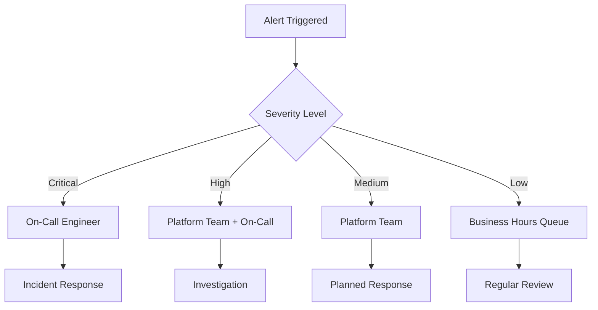

# Monitoring and Alerting Strategy

## Overview

Queue-Keeper's monitoring strategy ensures proactive detection of performance degradation, service failures, and SLA violations. The comprehensive approach combines application metrics, infrastructure monitoring, and business KPIs to provide complete operational visibility.

## SLA Monitoring

### Performance SLA Tracking

**Primary SLA Metrics**:

| Metric | SLA Target | Measurement Window | Alert Threshold | Business Impact |
|--------|------------|-------------------|-----------------|-----------------|
| **Webhook Response Time** | <1 second (95th percentile) | 5-minute rolling window | >800ms | GitHub webhook timeout risk |
| **Webhook Success Rate** | >99.9% | 15-minute rolling window | <99.5% | Failed webhook processing |
| **Queue Processing Rate** | <5 minute end-to-end latency | 10-minute rolling window | >3 minutes | Bot processing delays |
| **System Availability** | >99.9% uptime | 24-hour rolling window | <99.0% | Service outage impact |

### SLA Violation Response

**Response Time Escalation**:

1. **Warning (800ms-900ms)**: Platform team notification, performance investigation
2. **Critical (900ms-1000ms)**: Immediate scale-out trigger, on-call notification
3. **Emergency (>1000ms)**: Auto-scaling activation, incident commander engagement

**Availability Escalation**:

1. **Degraded (<99.9%)**: Health check investigation, potential failover preparation
2. **Outage (<99.0%)**: Immediate incident response, customer communication
3. **Extended Outage (>15 min)**: Disaster recovery procedures, executive notification

## Application Performance Monitoring

### Core Application Metrics

**Webhook Processing Metrics**:

| Metric Name | Type | Purpose | Alert Conditions |
|-------------|------|---------|------------------|
| `webhook_requests_total` | Counter | Total webhook requests received | Rate change >300% |
| `webhook_duration_seconds` | Histogram | Request processing time distribution | P95 >800ms |
| `webhook_validation_failures` | Counter | Invalid signature/payload count | Rate >5% of total |
| `webhook_queue_routing_duration` | Histogram | Time to route to all bot queues | P90 >200ms |

**Queue Management Metrics**:

| Metric Name | Type | Purpose | Alert Conditions |
|-------------|------|---------|------------------|
| `queue_depth_messages` | Gauge | Messages waiting in each bot queue | >10,000 messages |
| `queue_processing_rate` | Gauge | Messages processed per minute | <50% of ingestion rate |
| `dead_letter_queue_depth` | Gauge | Failed messages requiring attention | >100 messages |
| `session_ordering_violations` | Counter | Events processed out of order | Any violation detected |

**Error and Reliability Metrics**:

| Metric Name | Type | Purpose | Alert Conditions |
|-------------|------|---------|------------------|
| `error_rate_by_category` | Counter | Errors grouped by type (4xx, 5xx, network) | >1% sustained rate |
| `circuit_breaker_state` | Gauge | Service circuit breaker status | Any circuit open >10min |
| `retry_attempts_total` | Counter | Retry operations by service | >50% requests require retry |
| `blob_storage_failures` | Counter | Audit trail storage failures | >5% failure rate |

### Performance Monitoring Strategy

**Real-Time Dashboards**:

- **Operations Dashboard**: Current SLA status, error rates, queue depths
- **Performance Dashboard**: Response time trends, throughput patterns, resource utilization
- **Security Dashboard**: Authentication failures, rate limiting actions, suspicious activity

**Proactive Monitoring**:

- **Trend Analysis**: Week-over-week performance comparison for capacity planning
- **Anomaly Detection**: Statistical deviation alerts for unusual traffic patterns
- **Predictive Alerts**: Early warning when metrics approach SLA thresholds

## Infrastructure Monitoring

### Azure Service Monitoring

**Container Apps Monitoring**:

| Metric | Purpose | Alert Threshold | Auto-Scaling Impact |
|--------|---------|-----------------|-------------------|
| **CPU Utilization** | Resource saturation detection | >80% sustained | Scale-out trigger |
| **Memory Usage** | Memory leak detection | >90% of limit | Scale-out trigger |
| **Replica Count** | Scaling behavior tracking | >25 replicas | Capacity planning alert |
| **Request Queue Length** | Backpressure detection | >1000 queued requests | Immediate scale-out |

**Service Bus Monitoring**:

| Metric | Purpose | Alert Threshold | Response Action |
|--------|---------|-----------------|-----------------|
| **Active Messages** | Queue depth per bot queue | >10,000 messages | Bot scaling investigation |
| **Dead Letter Messages** | Failed message accumulation | >100 messages | Replay operation needed |
| **Throttled Requests** | Service Bus capacity limits | Any throttling detected | Circuit breaker validation |
| **Connection Count** | Namespace connection health | >800 connections | Connection pooling review |

**Storage and Key Vault Monitoring**:

| Service | Key Metrics | Alert Conditions | Operational Response |
|---------|-------------|------------------|---------------------|
| **Blob Storage** | Transaction rate, availability, latency | Latency >100ms, availability <99.9% | Investigate storage account health |
| **Key Vault** | Request count, availability, throttling | Any 429 responses detected | Review secret caching strategy |
| **Application Insights** | Telemetry ingestion rate, data volume | >90% quota usage | Adjust sampling rates |

### Resource Utilization Tracking

**Capacity Planning Metrics**:

- **Peak Load Analysis**: Daily/weekly peak identification for scaling decisions
- **Resource Growth Trends**: Month-over-month capacity requirement growth
- **Cost Efficiency**: Cost per processed webhook trending

**Performance Baselines**:

- **Normal Operation**: Baseline metrics during typical load conditions
- **Peak Traffic**: Performance during CI/CD bursts and high-activity periods
- **Recovery Patterns**: Time to recover from various failure scenarios

## Alerting Strategy

### Alert Severity Classification

**Critical Alerts (15-minute response)**:

- **SLA Violation**: Webhook response time >1 second sustained
- **Service Outage**: Queue-Keeper unavailable for >2 minutes
- **Data Loss Risk**: Blob storage failures affecting audit trail
- **Security Incident**: High-confidence attack pattern detected

**High Alerts (1-hour response)**:

- **Performance Degradation**: Response time approaching SLA limits
- **Error Rate Spike**: Sustained error rate >5% for >10 minutes
- **Circuit Breaker Open**: Any Azure service circuit breaker triggered
- **Queue Backup**: Dead letter queue depth >100 messages

**Medium Alerts (4-hour response)**:

- **Capacity Warning**: Resource utilization >80% sustained
- **Authentication Issues**: Elevated webhook signature failures
- **Configuration Drift**: Bot queue configuration inconsistencies
- **Trend Concerns**: Negative performance trends detected

**Low Alerts (Business hours response)**:

- **Optimization Opportunities**: Inefficient resource utilization patterns
- **Maintenance Notifications**: Planned Azure service maintenance impact
- **Audit Concerns**: Missing telemetry or logging gaps
- **Cost Anomalies**: Unexpected resource cost increases

### Alert Routing and Escalation

**Primary Routing**:

**Escalation Procedures**:

1. **Initial Response** (within SLA timeframe): Acknowledge and begin investigation
2. **15-Minute Check**: Update status, escalate if unresolved
3. **30-Minute Escalation**: Engage additional resources, consider incident declaration
4. **60-Minute Executive**: Notify management for critical outages

### Alert Suppression and Correlation

**Intelligent Alerting**:

- **Dependency Correlation**: Suppress downstream alerts when root cause identified
- **Maintenance Windows**: Automatic alert suppression during planned maintenance
- **Flapping Detection**: Prevent alert storms from oscillating conditions
- **Business Hours Awareness**: Adjust severity based on business impact timing

**Alert Tuning Process**:

- **Weekly Review**: Analyze false positive and alert effectiveness
- **Threshold Adjustment**: Tune alert thresholds based on operational experience
- **New Alert Creation**: Add alerts based on incident post-mortems
- **Alert Retirement**: Remove outdated or ineffective alerts

## Dashboards and Visualization

### Operations Center Dashboards

**Executive Dashboard**:

- **SLA Status**: Green/yellow/red indicators for all SLA metrics
- **Business Impact**: Number of webhooks processed, success rates, error trends
- **Cost Overview**: Daily operational costs and efficiency metrics
- **Incident Summary**: Current incidents and recent resolution trends

**Operations Dashboard**:

- **Real-Time Status**: Current system health across all components
- **Queue Status**: Live queue depths and processing rates for all bots
- **Error Tracking**: Recent errors with categorization and resolution status
- **Performance Trends**: Response time and throughput over last 24 hours

**Engineering Dashboard**:

- **System Metrics**: Detailed performance metrics and resource utilization
- **Debugging Information**: Correlation IDs, trace data, and error details
- **Capacity Planning**: Resource usage trends and scaling recommendations
- **Development Insights**: Code deployment impacts and feature performance

### Custom Visualization Strategy

**Time-Series Analysis**:

- **Multi-Timeframe Views**: 1-hour, 24-hour, 7-day, and 30-day perspectives
- **Comparative Analysis**: Current vs. previous period performance comparison
- **Correlation Views**: Multiple metrics overlaid to identify relationships
- **Anomaly Highlighting**: Visual indicators for statistical anomalies

**Geographic and Distribution Analysis**:

- **Traffic Source Analysis**: GitHub webhook origin patterns
- **Error Distribution**: Error patterns across different repositories/bots
- **Performance Distribution**: Response time percentile distributions
- **Load Distribution**: Traffic patterns across Container Apps replicas

## Runbook Integration

### Automated Response Procedures

**Self-Healing Actions**:

| Alert Condition | Automated Response | Manual Override |
|----------------|-------------------|-----------------|
| **High CPU/Memory** | Trigger Container Apps scale-out | Scale-out disabled during maintenance |
| **Circuit Breaker Open** | Reduce traffic rate, extend timeouts | Force circuit breaker reset |
| **Queue Backup** | Scale destination bot services | Drain queue to alternate processing |
| **Storage Throttling** | Enable blob storage circuit breaker | Temporarily disable audit logging |

**Investigation Runbooks**:

- **Performance Degradation**: Step-by-step diagnostic procedures
- **Error Rate Spike**: Common causes and resolution steps
- **Queue Processing Issues**: Bot service health check procedures
- **Authentication Failures**: GitHub integration troubleshooting

### Incident Response Integration

**Incident Lifecycle**:

1. **Detection**: Monitoring alert triggers incident creation
2. **Response**: On-call engineer follows runbook procedures
3. **Resolution**: Root cause identification and remediation
4. **Post-Mortem**: Analysis and monitoring improvement identification

**Documentation Requirements**:

- **Incident Timeline**: Complete chronology of events and responses
- **Root Cause Analysis**: Technical analysis and contributing factors
- **Lessons Learned**: Monitoring gaps and improvement recommendations
- **Action Items**: Follow-up tasks for monitoring and alerting improvements

This comprehensive monitoring strategy ensures Queue-Keeper maintains high reliability and performance while providing complete operational visibility for proactive issue resolution.
