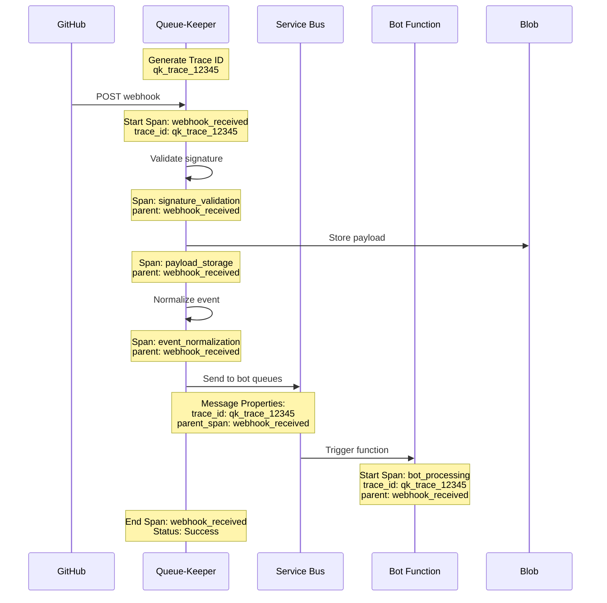

# Observability & Distributed Tracing

## Overview

Queue-Keeper implements comprehensive observability using OpenTelemetry for distributed tracing, metrics, and logging. This provides end-to-end visibility of webhook events from GitHub delivery through processing to downstream bot consumption.

## OpenTelemetry Integration

### Distributed Tracing with OpenTelemetry

**W3C Trace Context Propagation**

- Generate trace IDs using OpenTelemetry specification
- Propagate trace context through Service Bus message properties
- Maintain parent-child span relationships across service boundaries
- Support correlation across Queue-Keeper → Service Bus → Bot functions



### Trace ID Generation Strategy

**OpenTelemetry Trace Management Requirements**:

- Generate unique trace IDs for each webhook delivery using OpenTelemetry specification
- Prefix trace IDs with `qk_` to identify Queue-Keeper origin
- Include GitHub delivery ID and event type as span attributes
- Support Jaeger exporter for distributed tracing visualization

**Trace Context Propagation**:

- Inject W3C trace context into Service Bus message properties
- Maintain parent-child span relationships across async boundaries
- Enable correlation between webhook processing and bot execution
- Support sampling strategies for high-volume environments

**Required Span Attributes**:

- `github.delivery_id`: GitHub webhook delivery identifier
- `github.event_type`: Type of GitHub event (push, pull_request, etc.)
- `service.name`: Always "queue-keeper"
- `service.version`: Current deployment version
- `repository.full_name`: Repository identifier for filtering

### Enhanced Event Schema with Tracing

**Trace Context Integration Requirements**:

- Embed trace context in normalized event structure for end-to-end correlation
- Generate deterministic trace IDs based on GitHub delivery ID
- Support parent-child span relationships for nested operations
- Include baggage mechanism for cross-service context propagation

**Trace Context Structure**:

- Unique trace ID with `qk_` prefix for Queue-Keeper identification
- Span ID for current operation scope
- Optional parent span ID for hierarchical tracing
- Baggage key-value pairs for contextual information
- OpenTelemetry-compatible trace flags for sampling control

## Service Bus Message Tracing

### Trace Context Propagation Requirements

**Service Bus Message Properties Integration**:

- Inject trace context into Service Bus message properties for downstream correlation
- Include trace ID, parent span ID, and GitHub delivery ID in message metadata
- Propagate event type and repository information for filtering and routing
- Support baggage propagation using prefixed message properties (`baggage.*`)

**Queue Delivery Span Requirements**:

- Create child spans for queue delivery operations with appropriate naming
- Record span events for message send success/failure scenarios
- Include queue name and session ID as span attributes for debugging
- Set span status based on delivery operation outcome (OK/Error)
- Correlate delivery spans with parent webhook processing spans

### Bot Function Trace Context Consumption

**Bot Function Integration Requirements**:

- Extract trace context from Service Bus message properties upon trigger
- Start bot processing spans with inherited trace context from Queue-Keeper
- Record span events for bot lifecycle (triggered, processing, completed/failed)
- Include bot-specific attributes: bot name, message ID, session ID
- Set span status based on processing outcome (OK/Error) with error details

**Trace Context Extraction**:

- Parse trace ID and parent span ID from message properties
- Reconstruct baggage items using property key prefixes
- Generate new span ID for bot processing while maintaining trace correlation
- Handle missing trace context gracefully with error reporting

## Observability Stack Configuration

### OpenTelemetry Configuration Requirements

**OpenTelemetry Pipeline Setup**:

- Use W3C TraceContext propagator for standard trace header compatibility
- Configure OTLP exporter targeting Azure Application Insights endpoint
- Set service resource attributes: name ("queue-keeper"), version, environment
- Enable batch span processing for performance optimization

**Trace Configuration**:

- AlwaysOn sampling for development, ParentBased for production
- Service resource identification with deployment environment
- Authorization via Application Insights instrumentation key
- Async runtime support for Azure Functions environment

**Tracing Subscriber Integration**:

- JSON-formatted structured logging with trace correlation
- Include current span context in all log entries
- Environment-configurable log level filtering (default: info)
- OpenTelemetry layer integration with tracing subscriber registry

### Structured Logging with Trace Correlation

**Instrumentation Requirements**:

- Use tracing instrumentation macros for automatic span generation
- Include key fields: GitHub delivery ID, event type, trace ID, repository
- Record dynamic span fields during execution (trace ID, repository)
- Support structured logging with consistent field naming

**Logging Strategy**:

- Log key processing milestones with appropriate levels (info/warn/error)
- Include trace context in all log entries for correlation
- Record processing metrics: payload size, processing time, routing results
- Use structured fields for machine-readable log analysis

**Error Handling Integration**:

- Log signature validation outcomes with trace correlation
- Record processing errors with full error context
- Maintain span status consistency with log levels
- Enable troubleshooting through trace-to-log correlation

## Dashboard and Alerting

### Azure Monitor Workbooks Requirements

**Dashboard Components**:

- Webhook processing metrics panel showing request count, processing time (avg/P95), and error rates
- End-to-end trace summary panel displaying services involved, operations, duration, and success status
- Trace details panel for drill-down analysis with parameterized trace ID input
- Time-based filtering with configurable time ranges (1h, 4h, 24h, 7d)

**Key Performance Indicators**:

- Processing throughput (requests per minute)
- Average and P95 processing latency
- Error rate percentage with severity breakdown
- End-to-end trace completion rate
- Service availability and response times

**Query Requirements**:

- Filter traces by Queue-Keeper service name and trace ID prefix
- Aggregate metrics by time bins for trend analysis
- Support parameterized queries for trace investigation
- Enable cross-service correlation using trace context

### Enhanced Alerting with Trace Context

```yaml
# Azure Monitor Alert Rules with Trace Context
alert_rules:
  - name: "End-to-End Processing Failure"
    description: "Alert when traces show failures across multiple services"
    query: |
      traces
      | where customDimensions.['trace.id'] startswith 'qk_'
      | where timestamp > ago(15m)
      | summarize
          services = make_set(tostring(customDimensions.['service.name'])),
          has_error = max(severityLevel >= 3)
      by tostring(customDimensions.['trace.id'])
      | where array_length(services) > 1 and has_error == true
      | count
    threshold: "> 5"
    severity: "High"

  - name: "Trace Orphaning Detection"
    description: "Alert when traces start in Queue-Keeper but don't appear in bot processing"
    query: |
      let queue_keeper_traces = traces
          | where customDimensions.['service.name'] == 'queue-keeper'
          | where timestamp > ago(30m)
          | distinct tostring(customDimensions.['trace.id']);
      let bot_traces = traces
          | where customDimensions.['service.name'] in ('task-tactician', 'merge-warden', 'spec-sentinel')
          | where timestamp > ago(30m)
          | distinct tostring(customDimensions.['trace.id']);
      queue_keeper_traces
      | join kind=leftanti bot_traces on $left.trace_id == $right.trace_id
      | count
    threshold: "> 10"
    severity: "Medium"

  - name: "Excessive Trace Processing Time"
    description: "Alert when end-to-end trace processing exceeds SLA"
    query: |
      traces
      | where customDimensions.['trace.id'] startswith 'qk_'
      | where timestamp > ago(1h)
      | summarize
          start_time = min(timestamp),
          end_time = max(timestamp),
          services = make_set(tostring(customDimensions.['service.name']))
      by tostring(customDimensions.['trace.id'])
      | where array_length(services) > 1
      | extend end_to_end_duration = datetime_diff('second', end_time, start_time)
      | where end_to_end_duration > 300  // 5 minutes SLA breach
      | count
    threshold: "> 0"
    severity: "Critical"
```

## Performance Monitoring

### Trace-Based Performance Analysis

**Performance Metrics Requirements**:

- Trace-level performance analysis covering end-to-end request duration
- Span-level timing data for individual operation performance measurement
- Service involvement tracking for cross-service performance correlation
- Success/failure status tracking for reliability analysis

**Bottleneck Detection Requirements**:

- Slow operation identification based on configurable duration thresholds
- Queueing delay detection through span timing gap analysis
- Service-specific performance profiling with operation categorization
- Automated bottleneck classification (slow operations vs. queueing delays)

**Performance Analysis Capabilities**:

- Duration threshold configuration for bottleneck classification
- Cross-span timing analysis for end-to-end performance visibility
- Service performance comparison and trending analysis
- Integration with alerting systems for performance degradation detection

This comprehensive observability strategy ensures that every webhook event can be tracked from GitHub delivery through complete bot processing, enabling powerful debugging capabilities and performance optimization opportunities.
