# Performance Requirements and SLA Targets

## Overview

Queue-Keeper must meet stringent performance requirements to maintain GitHub webhook delivery reliability and provide responsive automation to development teams. These requirements define measurable SLA targets with clear rationales and monitoring strategies.

## Core Performance SLAs

### Response Time Requirements

**Primary SLA: GitHub Webhook Response**

| Metric | Target | Rationale | Measurement |
|--------|--------|-----------|-------------|
| **P95 Response Time** | < 1 second | GitHub 10-second timeout limit with safety margin | End-to-end webhook processing |
| **P99 Response Time** | < 2 seconds | Handle 99% of traffic within acceptable limits | Application Insights percentiles |
| **Mean Response Time** | < 500ms | Optimal user experience for interactive workflows | Average response time tracking |
| **Timeout Violations** | < 0.01% | Minimize GitHub webhook delivery failures | Count of >10 second responses |

**SLA Breakdown by Processing Stage:**

```mermaid
gantt
    title Webhook Processing SLA Allocation
    dateFormat X
    axisFormat %Lms

    section Signature Validation
    Validate HMAC     :0, 50

    section Payload Storage
    Blob Write        :50, 200

    section Event Normalization
    Parse & Transform :200, 350

    section Queue Routing
    Service Bus Send  :350, 500

    section Response Generation
    HTTP Response     :500, 550

    section SLA Buffer
    Safety Margin     :550, 1000
```



**Rationale**: GitHub has a 10-second timeout for webhook delivery. Target of 1 second provides 90% safety margin for network latency and allows for retry scenarios.

### Throughput Requirements

**Concurrent Request Handling**

| Metric | Target | Rationale | Scaling Behavior |
|--------|--------|-----------|------------------|
| **Baseline Throughput** | 100 requests/second | Handle typical repository activity | Single container instance |
| **Burst Throughput** | 1000 requests/second | Handle CI/CD pipeline bursts | Auto-scale to 5-10 instances |
| **Peak Throughput** | 2000 requests/second | Handle organization-wide events | Maximum scale-out capacity |
| **Concurrent Connections** | 1000 simultaneous | Support high-activity repositories | Per-instance connection limit |

**Traffic Pattern Analysis**:

- **Baseline Load**: Steady-state development activity (PRs, issues, commits)
- **Burst Load**: CI/CD pipeline execution, large PR merges, release workflows
- **Peak Load**: Organization-wide events (branch protection changes, mass repository updates)

### Resource Utilization Targets

**Container Resource Efficiency**

| Resource | Normal Load | Burst Load | Maximum | Rationale |
|----------|-------------|------------|---------|-----------|
| **CPU Usage** | < 60% | < 80% | 100% | Headroom for burst handling |
| **Memory Usage** | < 60% | < 80% | 512MB | GitHub payload size considerations |
| **Network I/O** | < 100 Mbps | < 500 Mbps | 1 Gbps | Blob storage and Service Bus traffic |
| **Storage I/O** | N/A | N/A | N/A | Stateless application |

## Availability and Reliability SLAs

### Uptime Requirements

**Service Availability Targets**

| Period | Target | Downtime Budget | Rationale |
|--------|--------|-----------------|-----------|
| **Monthly SLA** | 99.9% | 43.8 minutes | Industry standard for critical services |
| **Quarterly SLA** | 99.95% | 2.2 hours | Allows for planned maintenance windows |
| **Annual SLA** | 99.9% | 8.76 hours | Accommodates major Azure region issues |

**Availability Measurement**:

- **Uptime Definition**: Successful response to health check endpoint
- **Downtime Definition**: HTTP 5xx responses or connection failures
- **Planned Maintenance**: Excluded from SLA calculation with 24-hour notice
- **Partial Outages**: Proportional availability based on successful request percentage

### Error Rate Targets

**Error Budget Management**

| Error Type | Target | Budget | Response |
|------------|--------|--------|----------|
| **HTTP 4xx Client Errors** | < 1% | Expected (invalid requests) | Log and monitor patterns |
| **HTTP 5xx Server Errors** | < 0.1% | 99.9% success rate | Immediate investigation |
| **Signature Validation Failures** | < 0.01% | Security-related rejections | Security team notification |
| **Downstream Service Failures** | < 0.05% | Service Bus/Storage issues | Circuit breaker activation |

## Scalability Requirements

### Horizontal Scaling Targets

**Auto-Scaling Behavior**

```yaml
scaling_configuration:
  triggers:
    - metric: "concurrent_requests"
      threshold: 100
      action: "scale_out"
      cooldown: "60s"

    - metric: "cpu_utilization"
      threshold: 80
      action: "scale_out"
      cooldown: "60s"

    - metric: "memory_utilization"
      threshold: 80
      action: "scale_out"
      cooldown: "60s"

    - metric: "response_time_p95"
      threshold: "800ms"
      action: "scale_out"
      cooldown: "30s"

  scale_out:
    min_replicas: 1
    max_replicas: 10
    increment: 2              # Add 2 replicas per scale event

  scale_in:
    stabilization_window: "5m"  # Wait 5 minutes before scaling down
    decrement: 1              # Remove 1 replica per scale event
```

**Scaling Performance Targets**:

- **Scale-Out Time**: New instances ready within 60 seconds
- **Scale-In Delay**: 5-minute stabilization to prevent flapping
- **Maximum Scale**: 10 instances (cost control and Service Bus session limits)
- **Minimum Scale**: 1 instance (always-on requirement for SLA compliance)

### Vertical Scaling Considerations

**Resource Scaling Strategy**:

- **CPU Burst**: Container Apps automatic CPU bursting within limits
- **Memory Management**: Fixed 512MB limit based on GitHub payload analysis
- **Network Scaling**: Automatic based on Azure Container Apps platform
- **Storage**: N/A (stateless application with external blob storage)

## Load Testing Requirements

### Performance Test Scenarios

**Scenario 1: Baseline Load Test**

```yaml
baseline_load_test:
  duration: "1 hour"
  concurrent_users: 10
  requests_per_second: 50

  success_criteria:
    p95_response_time: "< 500ms"
    p99_response_time: "< 1000ms"
    error_rate: "< 0.1%"
    cpu_utilization: "< 60%"
    memory_utilization: "< 60%"
```

**Scenario 2: Burst Load Test**

```yaml
burst_load_test:
  ramp_up: "2 minutes"
  peak_duration: "10 minutes"
  ramp_down: "2 minutes"
  peak_concurrent_users: 100
  peak_requests_per_second: 500

  success_criteria:
    p95_response_time: "< 1000ms"
    p99_response_time: "< 2000ms"
    error_rate: "< 0.5%"
    auto_scaling: "triggers within 60s"
    recovery_time: "< 5 minutes"
```

**Scenario 3: Stress Test**

```yaml
stress_test:
  duration: "30 minutes"
  concurrent_users: 200
  requests_per_second: 1000
  payload_size: "variable (1KB-1MB)"

  success_criteria:
    system_stability: "no crashes or memory leaks"
    graceful_degradation: "response times increase predictably"
    circuit_breaker: "activates at appropriate thresholds"
    error_handling: "meaningful error responses"
```

### Synthetic Load Generation

**Realistic Webhook Patterns**:

```python
# Load test webhook patterns
webhook_patterns = {
    "pull_request_lifecycle": {
        "events": ["opened", "synchronize", "review_requested", "closed"],
        "timing": "sequential with 1-60 second delays",
        "payload_size": "50KB average",
        "frequency": "40% of total traffic"
    },

    "issue_management": {
        "events": ["opened", "labeled", "assigned", "closed"],
        "timing": "sequential with 5-300 second delays",
        "payload_size": "20KB average",
        "frequency": "30% of total traffic"
    },

    "push_events": {
        "events": ["push"],
        "timing": "random intervals",
        "payload_size": "100KB average (commit diffs)",
        "frequency": "20% of total traffic"
    },

    "administrative": {
        "events": ["repository", "organization", "team"],
        "timing": "infrequent bursts",
        "payload_size": "30KB average",
        "frequency": "10% of total traffic"
    }
}
```

## Capacity Planning

### Resource Capacity Modeling

**Instance Capacity Analysis**:

| Container Spec | Baseline RPS | Burst RPS | Concurrent Requests | Memory Usage |
|----------------|--------------|-----------|-------------------|--------------|
| 250m CPU, 256MB RAM | 50 RPS | 100 RPS | 100 | 200MB |
| 500m CPU, 512MB RAM | 100 RPS | 200 RPS | 200 | 400MB |
| 1000m CPU, 512MB RAM | 200 RPS | 400 RPS | 400 | 500MB |

**Growth Projections**:

```yaml
capacity_planning:
  current_requirements:
    repositories: 50
    active_developers: 200
    daily_webhooks: 10000
    peak_hourly_webhooks: 2000

  6_month_projection:
    repositories: 100
    active_developers: 500
    daily_webhooks: 25000
    peak_hourly_webhooks: 5000

  12_month_projection:
    repositories: 200
    active_developers: 1000
    daily_webhooks: 50000
    peak_hourly_webhooks: 10000

  scaling_strategy:
    baseline_instances: 2      # Handle current load + buffer
    max_instances: 15          # Handle 12-month projection
    cost_optimization: "aggressive scale-down during off-hours"
```

## Monitoring and Alerting SLAs

### Performance Monitoring Requirements

**Real-Time Metrics**:

```yaml
performance_metrics:
  response_time:
    collection_interval: "10s"
    retention: "90 days"
    alerting_thresholds:
      warning: "p95 > 800ms"
      critical: "p95 > 1500ms"

  throughput:
    collection_interval: "30s"
    retention: "90 days"
    alerting_thresholds:
      warning: "< 80% of expected baseline"
      critical: "< 60% of expected baseline"

  error_rate:
    collection_interval: "1m"
    retention: "1 year"
    alerting_thresholds:
      warning: "> 0.1% over 5 minutes"
      critical: "> 0.5% over 2 minutes"

  availability:
    collection_interval: "30s"
    retention: "1 year"
    alerting_thresholds:
      warning: "< 99.9% over 1 hour"
      critical: "< 99% over 15 minutes"
```

### SLA Monitoring Dashboards

**Executive Dashboard KPIs**:

- Monthly availability percentage with trend
- P95 response time with SLA threshold line
- Error budget consumption rate
- Throughput capacity utilization

**Operations Dashboard Metrics**:

- Real-time response time percentiles (P50, P95, P99)
- Request rate and error rate by endpoint
- Container resource utilization (CPU, memory, network)
- Auto-scaling events and replica count
- Service Bus queue depths and processing rates

**Alerting Escalation**:

```yaml
alert_escalation:
  sla_breach_warning:
    condition: "P95 response time > 800ms for 5 minutes"
    recipients: ["platform-team"]
    channels: ["slack"]

  sla_breach_critical:
    condition: "P95 response time > 1500ms for 2 minutes"
    recipients: ["platform-team", "on-call-engineer"]
    channels: ["slack", "pagerduty"]

  availability_degradation:
    condition: "Error rate > 0.5% for 2 minutes"
    recipients: ["platform-team", "on-call-engineer", "management"]
    channels: ["slack", "pagerduty", "email"]
```

## Performance Optimization Strategies

### Code-Level Optimizations

**Rust Performance Patterns**:

- **Zero-Copy Parsing**: Avoid unnecessary string allocations during JSON parsing
- **Connection Pooling**: Reuse HTTP connections to Azure services
- **Async/Await**: Non-blocking I/O for all external service calls
- **Memory Management**: Minimize heap allocations in hot paths
- **Caching**: Cache GitHub secrets and bot configuration in memory

**Service Integration Optimizations**:

- **Batch Operations**: Group Service Bus sends where possible
- **Parallel Processing**: Concurrent blob storage and queue operations
- **Circuit Breakers**: Fail fast on downstream service issues
- **Retry Logic**: Exponential backoff with jitter for Azure service calls

### Infrastructure Optimizations

**Azure Service Configuration**:

- **Service Bus**: Premium tier for higher throughput and lower latency
- **Blob Storage**: Hot tier with geo-redundant storage for performance
- **Container Apps**: CPU-optimized SKUs for compute-intensive workloads
- **Networking**: Private endpoints and VNet integration for reduced latency

This comprehensive performance specification ensures Queue-Keeper can meet the demanding requirements of GitHub webhook processing while providing clear measurement criteria and optimization strategies.
