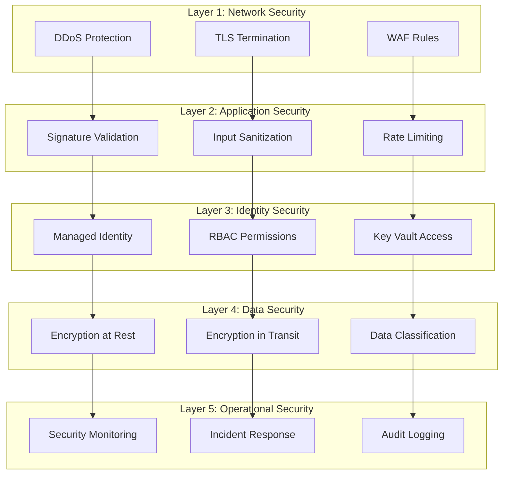

# Security Model

## Overview

Queue-Keeper implements a defense-in-depth security model to ensure webhook authenticity, data integrity, and system availability. Security controls span network, application, data, identity, and operational layers.

## Threat Model

### Assets to Protect

1. **GitHub Webhook Secrets** - Compromise enables webhook spoofing
2. **Raw Webhook Payloads** - May contain sensitive repository information
3. **Normalized Events** - Business logic depends on event integrity
4. **Service Bus Queues** - Disruption impacts downstream automation
5. **System Availability** - Webhook processing SLA requirements

### Threat Actors

1. **External Attackers** - Attempting to inject malicious webhooks
2. **Compromised GitHub Accounts** - Legitimate but compromised webhook sources
3. **Malicious Insiders** - Privileged users with system access
4. **Automated Attacks** - DDoS, credential stuffing, etc.

### Attack Vectors

1. **Webhook Spoofing** - Forged GitHub webhooks with invalid signatures
2. **Payload Injection** - Malicious content in webhook payloads
3. **Denial of Service** - Overwhelming system with invalid requests
4. **Credential Theft** - Unauthorized access to secrets or certificates
5. **Man-in-the-Middle** - Interception of webhook traffic
6. **Replay Attacks** - Reusing valid webhooks for malicious purposes

## Security Controls

### Network Security

#### TLS Encryption

- **Requirement**: All communications MUST use TLS 1.2 or higher
- **Implementation**: Azure Front Door terminates TLS with automatic certificate management
- **Cipher Suites**: Only strong cipher suites enabled (AEAD algorithms preferred)
- **Certificate Validation**: Strict certificate validation for all outbound connections

#### DDoS Protection

- **Implementation**: Azure Front Door with DDoS Protection Standard
- **Rate Limiting**: 1000 requests/minute per source IP
- **Geographic Filtering**: Optional geo-blocking for high-risk regions
- **Attack Mitigation**: Automatic detection and mitigation of Layer 3/4/7 attacks

#### Network Isolation

- **VNet Integration**: Function App integrated with Azure Virtual Network
- **Private Endpoints**: Service Bus and Storage accessed via private endpoints only
- **Network Security Groups**: Restrictive rules allowing only required traffic
- **Firewall Rules**: Storage and Key Vault restricted to Azure services only

### Application Security

#### Webhook Signature Validation

```rust
use hmac::{Hmac, Mac};
use sha2::Sha256;

type HmacSha256 = Hmac<Sha256>;

pub fn validate_github_signature(
    payload: &[u8],
    signature: &str,
    secret: &str,
) -> Result<bool, ValidationError> {
    // Remove 'sha256=' prefix from signature
    let signature_bytes = signature
        .strip_prefix("sha256=")
        .ok_or(ValidationError::InvalidFormat)?;

    let expected_signature = hex::decode(signature_bytes)
        .map_err(|_| ValidationError::InvalidHex)?;

    // Create HMAC instance with secret
    let mut mac = HmacSha256::new_from_slice(secret.as_bytes())
        .map_err(|_| ValidationError::InvalidSecret)?;

    // Update with payload
    mac.update(payload);

    // Verify signature using constant-time comparison
    mac.verify_slice(&expected_signature)
        .map(|_| true)
        .or(Ok(false))
}

#[derive(Debug, thiserror::Error)]
pub enum ValidationError {
    #[error("Invalid signature format")]
    InvalidFormat,
    #[error("Invalid hex encoding")]
    InvalidHex,
    #[error("Invalid secret")]
    InvalidSecret,
}
```

#### Input Validation & Sanitization

**Webhook Headers**:

- Validate required headers: `X-GitHub-Event`, `X-GitHub-Delivery`, `X-Hub-Signature-256`
- Sanitize header values to prevent injection attacks
- Enforce reasonable length limits (event type: 50 chars, delivery ID: 50 chars)

**Payload Validation**:

- Maximum payload size: 1MB (GitHub's limit)
- Valid JSON structure required
- Schema validation for known event types
- Sanitization of string fields in normalized events

**URL Validation**:

- Webhook endpoints MUST match expected GitHub patterns
- Validate repository names against GitHub naming conventions
- URL encoding/decoding performed safely

#### Error Handling

**Information Disclosure Prevention**:

- Generic error messages for authentication failures
- No stack traces or internal details in HTTP responses
- Detailed errors logged securely for operations team

**Rate Limiting**:

- Per-IP rate limiting: 1000 requests/hour
- Per-repository rate limiting: 10000 events/hour
- Exponential backoff for repeated failures from same source

### Identity & Access Management

#### Service Identity

**Azure Managed Identity**:

- System-assigned managed identity for Queue-Keeper Function
- No stored credentials or connection strings in code
- Automatic token refresh handled by Azure platform
- Scoped to minimum required permissions

#### Key Vault Access

**Access Policies**:

```yaml
key_vault_access_policy:
  object_id: "queue-keeper-function-identity"
  permissions:
    secrets: ["get", "list"]
    # No create, update, delete permissions
  network_rules:
    bypass: "AzureServices"
    default_action: "Deny"
    ip_rules: []  # No direct IP access
```

**Secret Management**:

- GitHub webhook secrets stored as Key Vault secrets
- Naming convention: `github-webhook-secret-{repo-id}`
- Automatic secret rotation supported (requires webhook reconfiguration)
- Secret caching limited to 5 minutes with secure memory handling

#### Service Bus Authentication

**Managed Identity Integration**:

```rust
use azure_service_bus::service_bus::ServiceBusClient;
use azure_identity::DefaultAzureCredential;

// Create client with managed identity
let credential = DefaultAzureCredential::default();
let client = ServiceBusClient::new(
    "offaxis-automation.servicebus.windows.net",
    credential,
).await?;
```

**RBAC Permissions**:

- `Azure Service Bus Data Sender` role for Queue-Keeper
- `Azure Service Bus Data Receiver` role for bot functions
- No admin or management permissions granted

### Data Security

#### Encryption at Rest

**Blob Storage**:

- Customer-managed keys (CMK) with Key Vault integration
- Encryption scope applied to webhook payloads container
- Immutable blob storage with legal hold capabilities
- Soft delete enabled with 30-day retention

**Service Bus**:

- Microsoft-managed encryption keys (MMK)
- Future enhancement: Customer-managed keys for sensitive payloads
- Message-level encryption for highly sensitive repositories

#### Encryption in Transit

**All Communications**:

- TLS 1.2 minimum for all HTTP/S traffic
- AMQP over TLS for Service Bus communications
- Certificate pinning for critical external services
- Perfect Forward Secrecy (PFS) enabled

#### Data Classification

**Payload Classification**:

- **Public Repository Events**: Standard encryption and retention
- **Private Repository Events**: Enhanced encryption with CMK
- **Sensitive Repository Events**: Message-level encryption + audit logging

#### Data Retention & Disposal

**Retention Policies**:

- Raw webhook payloads: 90 days retention in blob storage
- Normalized events: Processed immediately, not persisted
- Dead letter queue: 30 days retention
- Audit logs: 1 year retention for compliance

**Secure Disposal**:

- Automatic deletion after retention period
- Cryptographic erasure for CMK-encrypted data
- Certificate of destruction for compliance requirements

### Operational Security

#### Logging & Monitoring

**Security Event Logging**:

```rust
use tracing::{info, warn, error};
use serde_json::json;

// Log successful webhook processing
info!(
    event_id = %event.event_id,
    repository = %event.repository.full_name,
    event_type = %event.event_type.event,
    processing_time_ms = event.metadata.processing_time_ms,
    "Webhook processed successfully"
);

// Log signature validation failure
warn!(
    remote_ip = %remote_ip,
    user_agent = %user_agent,
    repository = %attempted_repo,
    "Webhook signature validation failed"
);

// Log security incidents
error!(
    incident_type = "signature_validation_failure",
    remote_ip = %remote_ip,
    failure_count = failure_count,
    "Multiple signature validation failures detected"
);
```

**Security Metrics**:

- Webhook signature validation success/failure rates
- Authentication failure patterns by IP/user-agent
- Unusual traffic patterns or spikes
- Key Vault access patterns and failures

#### Incident Response

**Automated Responses**:

- Circuit breaker activation on repeated signature failures
- Automatic IP blocking after 10 validation failures in 5 minutes
- Dead letter queue monitoring with automated alerts

**Manual Response Procedures**:

1. **Webhook Compromise**: Rotate affected webhook secrets immediately
2. **DDoS Attack**: Engage Azure DDoS protection team
3. **Data Breach**: Execute data breach response plan
4. **Service Disruption**: Activate disaster recovery procedures

#### Vulnerability Management

**Dependency Management**:

- Automated security scanning of Rust dependencies with `cargo-audit`
- Weekly dependency update reviews and testing
- Security advisory subscriptions for Azure services

**Security Testing**:

- Static code analysis with security rules (Clippy + security lints)
- Dynamic security testing of webhook endpoints
- Penetration testing annually by third-party security firm

### Compliance & Governance

#### Audit Requirements

**Audit Trail**:

- All webhook processing activities logged with immutable timestamps
- Audit logs include: user identity, action performed, timestamp, outcome
- Correlation IDs enable end-to-end request tracing
- Tamper-evident logging with cryptographic integrity checks

**Compliance Standards**:

- SOC 2 Type II controls for security and availability
- ISO 27001 information security management
- GitHub's webhook security best practices
- Azure Security Benchmark compliance

#### Data Governance

**Data Classification**:

- Public repository data: Internal use only
- Private repository data: Confidential classification
- Personal identifiable information: Restricted access with encryption

**Privacy Controls**:

- Data minimization: Only collect necessary webhook data
- Purpose limitation: Use webhook data only for automation purposes
- Access controls: Role-based access to webhook data and logs

## Security Architecture Patterns

### Defense in Depth



### Zero Trust Principles

1. **Never Trust, Always Verify**: Every webhook signature validated regardless of source
2. **Least Privilege Access**: Minimal required permissions for all service identities
3. **Assume Breach**: Design assumes compromise and implements containment
4. **Verify Explicitly**: Authentication and authorization for every service call
5. **Continuous Monitoring**: Real-time security monitoring and threat detection

### Secure Development Lifecycle

**Development Phase**:

- Threat modeling for new features
- Security code reviews with security team
- Static analysis with security-focused tools
- Dependency vulnerability scanning

**Testing Phase**:

- Security test cases for authentication and authorization
- Fuzzing of webhook payload parsing
- Load testing with malicious traffic patterns
- Penetration testing of webhook endpoints

**Deployment Phase**:

- Infrastructure as Code security scanning
- Deployment approval from security team
- Blue-green deployment with security validation
- Production security monitoring activation

**Operations Phase**:

- Continuous security monitoring and alerting
- Regular security assessments and reviews
- Incident response and lessons learned
- Security metrics reporting and improvement

## Emergency Procedures

### Security Incident Response

**Severity Levels**:

- **Critical**: Active attack or data breach in progress
- **High**: Potential security compromise detected
- **Medium**: Suspicious activity requiring investigation
- **Low**: Security policy violation or minor vulnerability

**Response Team**:

- Security Incident Commander
- Platform Engineering (Queue-Keeper maintainers)
- DevOps/SRE (Infrastructure and monitoring)
- Legal/Compliance (if data breach suspected)

**Response Procedures**:

1. **Immediate**: Isolate affected systems, preserve evidence
2. **Short-term**: Implement containment measures, notify stakeholders
3. **Medium-term**: Investigate root cause, implement fixes
4. **Long-term**: Lessons learned, process improvements

### Webhook Secret Rotation

**Emergency Rotation** (Compromise Suspected):

1. Generate new webhook secret in Key Vault
2. Update GitHub webhook configuration immediately
3. Update Queue-Keeper configuration to use new secret
4. Monitor for continued unauthorized webhook attempts
5. Investigate source of compromise

**Planned Rotation** (Quarterly):

1. Schedule maintenance window with downstream bots
2. Generate new webhook secret in Key Vault
3. Test webhook processing with new secret in staging
4. Deploy to production during maintenance window
5. Update GitHub webhook configuration
6. Verify processing resumes normally
