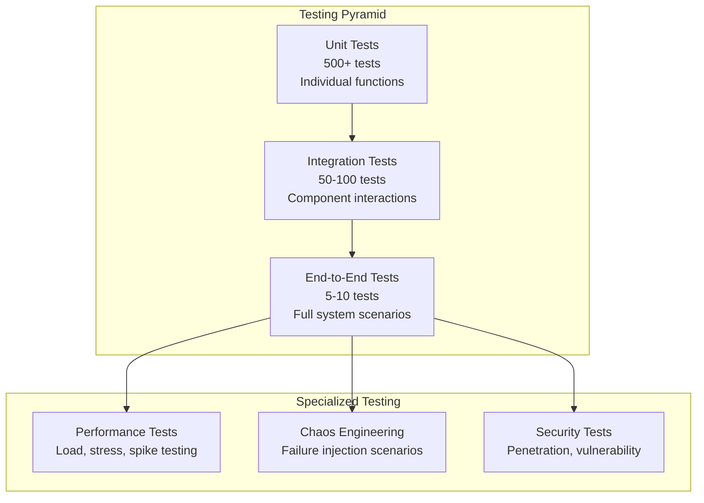

# Testing Strategy

## Overview

Queue-Keeper requires comprehensive testing at multiple levels to ensure reliability, correctness, and performance. This document defines **what** must be tested to validate system behavior, not implementation details of how tests are written.

## Testing Pyramid



## Unit Testing

### Coverage Requirements

- **Minimum Coverage**: 85% line coverage, 90% branch coverage
- **Critical Path Coverage**: 100% coverage for webhook validation, event normalization, and queue routing
- **Error Path Coverage**: All error conditions and edge cases must be tested

### Components to Test

#### Webhook Validation

- **Valid GitHub Signatures**: Correctly validate SHA256 HMAC signatures
- **Invalid Signature Formats**: Reject malformed signature headers
- **Tampered Payloads**: Detect payload modifications through signature mismatch
- **Timing Attack Resistance**: Use constant-time comparison for signatures
- **Missing Headers**: Handle absent or empty signature headers
- **Algorithm Validation**: Only accept SHA256, reject SHA1 or other algorithms

#### Event Normalization

- **Standard Event Types**: Transform pull_request, issues, push events correctly
- **Session ID Consistency**: Same entity generates identical session IDs across events
- **Unknown Event Handling**: Gracefully process unrecognized GitHub event types
- **Payload Structure Validation**: Handle missing or malformed event data
- **Repository Information**: Extract owner, name, and metadata accurately
- **Entity Type Detection**: Correctly identify PRs, issues, branches, releases

#### Configuration Validation

- **Valid Configurations**: Accept properly structured bot configurations
- **Duplicate Detection**: Reject configurations with duplicate bot names
- **Event Type Validation**: Verify event patterns match GitHub event schema
- **Queue Name Format**: Ensure queue names follow Azure Service Bus constraints
- **Environment Settings**: Validate environment-specific configurations

```

## Integration Testing

### Test Environment Setup

Integration tests must run against realistic Azure services or high-fidelity emulators to validate component interactions.

### Component Integration Scenarios

#### End-to-End Webhook Processing
- **Full Pipeline**: Webhook receipt → validation → normalization → storage → queue routing
- **Storage Verification**: Payload correctly stored in blob storage with proper metadata
- **Queue Message Validation**: Normalized events arrive in correct bot queues
- **Session ID Propagation**: Session identifiers maintained throughout pipeline
- **Ordering Preservation**: Events for same entity maintain chronological order

#### Service Bus Integration
- **Connection Management**: Proper connection pooling and recovery
- **Session-Based Messaging**: Messages with same session ID delivered in order
- **Dead Letter Handling**: Failed messages automatically routed to DLQ
- **Retry Behavior**: Exponential backoff applied to transient failures
- **Queue Creation**: Dynamic queue creation based on bot configuration

#### Azure Storage Integration
- **Blob Operations**: Store, retrieve, and manage webhook payload blobs
- **Metadata Handling**: Proper tagging and categorization of stored events
- **Cleanup Processes**: Automated removal of expired event data
- **Access Patterns**: Efficient retrieval for replay and debugging

#### Configuration Integration
- **Runtime Updates**: Configuration changes applied without service restart
- **Validation Chain**: End-to-end validation of configuration changes
- **Bot Registration**: New bot configurations automatically create queues
- **Event Filtering**: Bot-specific event filtering operates correctly

### Contract Testing

#### GitHub Webhook Contract
- **Event Schema Validation**: All supported GitHub events conform to expected schema
- **Header Requirements**: Required headers (signature, event type, delivery ID) present
- **Response Format**: Consistent response structure for success and error cases
- **Rate Limiting**: Proper HTTP status codes for rate limit scenarios
```

## End-to-End Testing

### System Behavior Validation

#### Happy Path Scenarios

**Complete Pull Request Lifecycle**

- PR opened → PR updated → PR closed sequence maintains ordering
- All configured bots receive appropriate events for their subscriptions
- Session-based ordering ensures events for same PR processed sequentially
- Cross-PR events can be processed concurrently without interference

**Concurrent Processing**

- Multiple PRs processed simultaneously without ordering violations
- System maintains session isolation between different entities
- No resource contention between concurrent webhook processing
- Queue delivery maintains ordering guarantees per session

#### Error Recovery Scenarios

**Authentication Failures**

- Invalid signatures immediately rejected with 401 response
- No processing occurs for unauthenticated webhooks
- No storage or queue operations attempted for rejected requests
- Proper audit logging of authentication failures

**Service Outage Handling**

- Service Bus unavailability doesn't prevent GitHub response
- Webhook payloads stored for later replay during outages
- Failed events routed to dead letter queue after retry exhaustion
- System automatically recovers when services restore
- Dead letter queue replay restores normal processing

```

## Performance Testing

### Load Testing Requirements

**Throughput Benchmarks**
- Concurrent request handling: 1, 10, 50, 100, 500, 1000 simultaneous requests
- Target: 95th percentile response time under 500ms at 100 concurrent requests
- Sustained load: Handle 10 requests/second for 1 hour without degradation
- Peak load: Handle 100 requests/second for 5 minutes without failure

**Memory Usage Validation**
- Large payload handling: Process 1MB payloads without excessive memory usage
- Memory leak detection: No memory growth during sustained load testing
- Garbage collection impact: Memory pressure doesn't cause request timeouts

**Latency Requirements**
- P50 latency: < 100ms for webhook processing
- P95 latency: < 500ms under normal load
- P99 latency: < 1000ms under peak load
- Timeout behavior: Graceful degradation when limits exceeded

### Stress Testing Scenarios

**Realistic GitHub Load Simulation**
- Event distribution matching real GitHub webhook patterns
- Repository size variation (small teams vs large organizations)
- Time-based patterns (business hours vs off-hours traffic spikes)
- Event clustering (multiple events from CI/CD pipeline runs)

## Chaos Engineering

### Resilience Validation

**Azure Service Failures**
- Random Key Vault outages (5% failure rate, 30-second duration)
- Service Bus intermittent failures (3% failure rate, 60-second duration)
- Blob Storage temporary unavailability (2% failure rate, 45-second duration)
- **Success Criteria**: >99% overall success rate, zero data loss, <5 second response times

**Network Partition Scenarios**
- Queue-Keeper to Service Bus connectivity loss (2-minute partition)
- System must respond to GitHub with 200 status during outages
- Circuit breaker should open when Service Bus unavailable
- Automatic recovery when network partitions heal
- Dead letter queue capture during extended outages

## Security Testing

### Attack Surface Validation

**Authentication Bypass Attempts**
- Missing signature headers → 401 Unauthorized
- Empty signature values → 401 Unauthorized
- Wrong signature algorithms (SHA1) → 401 Unauthorized
- Signatures for different payloads → 401 Unauthorized
- Malformed signature injection attempts → 401 Unauthorized
- Buffer overflow signature attacks → 401 Unauthorized

**Rate Limiting Behavior**
- Excessive invalid requests from single IP → 429 Rate Limited
- First 10 failures per IP window → 401 Unauthorized
- Subsequent failures within window → 429 Rate Limited
- Rate limit reset after time window expires

**Payload Size Protection**
- Requests exceeding 1MB limit → 413 Payload Too Large
- Memory usage remains bounded during large payload attacks
- No denial of service from oversized payload submissions
```

## Test Automation

### CI/CD Integration Requirements

**Pipeline Stages**

- **Unit Tests**: Every pull request and push to main branch
- **Integration Tests**: Pull requests with Azure service emulators
- **Performance Tests**: Main branch pushes only (resource intensive)
- **Security Scans**: Every pull request for dependency vulnerabilities
- **Chaos Tests**: Scheduled runs and main branch pushes

**Quality Gates**

- **Coverage Threshold**: 85% line coverage, 90% branch coverage required
- **Performance Regression**: Latency increases >20% fail the build
- **Security Vulnerabilities**: High or critical vulnerabilities block deployment
- **Chaos Resilience**: <99% success rate fails the chaos test gate

**Test Environment Management**

- **Service Emulation**: Azurite for local Azure Storage testing
- **Container Orchestration**: Docker Compose for integration test dependencies
- **Kubernetes Deployment**: Test clusters for performance and chaos testing
- **Environment Isolation**: Separate test namespaces prevent interference

## Test Data Management

### Test Data Requirements

**Realistic Event Generation**

- Pull request lifecycle events: opened → commits → reviews → merged
- Issue lifecycle events: opened → labeled → assigned → closed
- Repository events: push, release, workflow runs
- Time-based patterns: business hours vs off-hours event clustering
- Scale variations: small team repositories vs large organization repositories

**Data Consistency**

- Session ID consistency across related events for same entity
- Repository information consistency within event sequences
- User identity consistency across events from same actor
- Timestamp chronological ordering within event sequences

## Test Metrics and Reporting

### Success Criteria Tracking

**Test Coverage Metrics**

- Line coverage percentage with 85% minimum threshold
- Branch coverage percentage with 90% minimum threshold
- Critical path coverage with 100% requirement
- Regression test coverage for all previously found bugs

**Performance Benchmarks**

- Response time percentiles (P50, P95, P99) under various load conditions
- Memory usage patterns during sustained operations
- Throughput measurements at different concurrency levels
- Performance regression detection against baseline measurements

**Security Assessment Results**

- Vulnerability scan results with risk classifications
- Penetration test findings and remediation status
- Authentication bypass attempt blocking effectiveness
- Rate limiting and DDoS protection validation

This testing strategy ensures Queue-Keeper meets all reliability, performance, and security requirements while providing confidence for continuous deployment to production.
